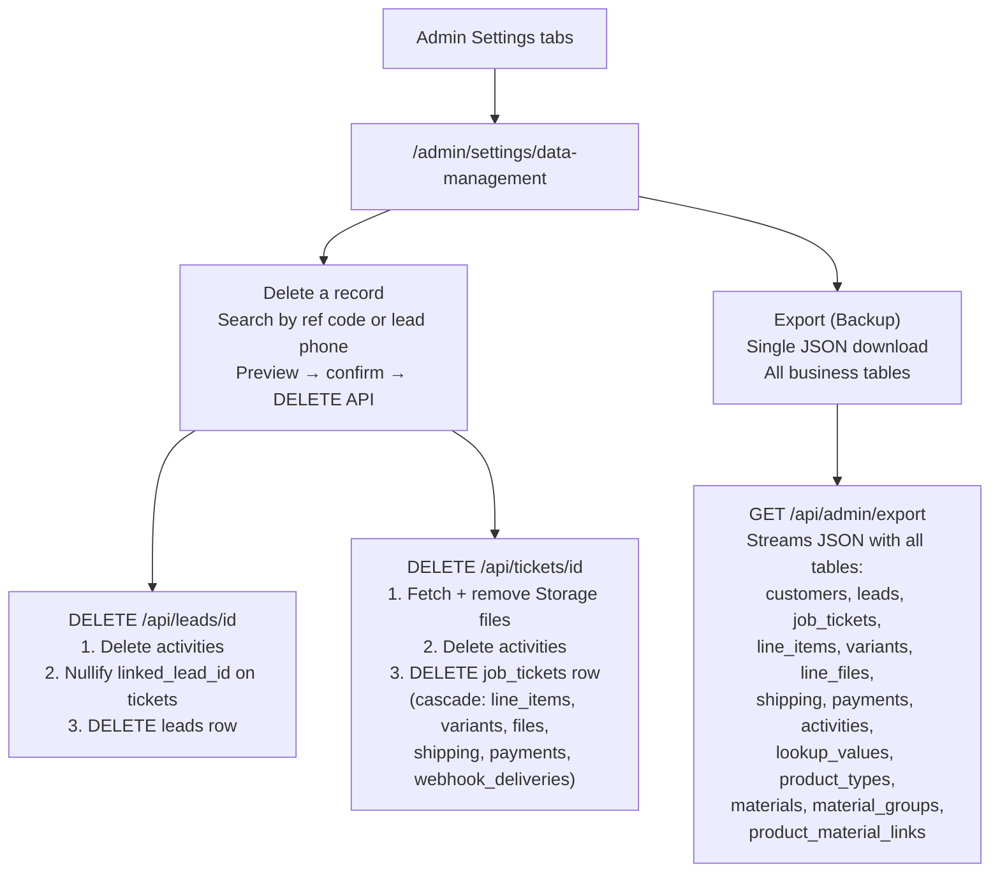

# Data Management — Delete & Export / Backup

## Decision summary

- Delete and export actions live in **one dedicated admin tab** — `/admin/settings/data-management`
- No delete buttons on the lead drawer or quote/order detail pages
- Export covers all business data accessible via the admin client; auth users and Storage files require separate Supabase tooling

---

## Architecture



---

## 1. SQL patch — `supabase/patches/YYYY-MM-DD-add-delete-permissions.sql`

```sql
insert into public.permissions (key, display_name, area, description, sort_order) values
  ('leads.delete',  'Delete a lead',  'leads',  'Permanently delete a lead and its activity history', 180),
  ('quotes.delete', 'Delete a quote', 'quotes', 'Permanently delete a draft or sent quote',           70),
  ('orders.delete', 'Delete an order','orders', 'Permanently delete an order and all related data',   70)
on conflict (key) do nothing;

-- Register the new settings page so it appears in nav
insert into public.pages (route, label, icon, section, sort_order) values
  ('/admin/settings/data-management', 'Data Management', 'Database', 'admin-sub', 80)
on conflict (route) do nothing;
```

Admin role gets all three permissions automatically via the existing "admin gets all permissions" rule — no grant rows needed.

---

## 2. New settings tab — `app/(app)/admin/settings/data-management/page.tsx`

Thin server component that imports and renders `DataManagementSection`. Add the tab entry to `components/admin/settings-tab-nav.tsx` alongside the existing 13 tabs.

---

## 3. New section component — `components/admin/data-management-section.tsx`

Two clearly separated sub-sections inside one page:

### 3a. Delete a record

- Search input: type a reference code (`ORD-2026-xxx`, `QUO-2026-xxx`) or a lead phone number
- Hits a lightweight `GET /api/admin/data-management/find?q=...` that returns the matching record type + key fields (reference, customer name, status, payment status)
- Shows a preview card — same danger-styled card as used in the bulk import error rows
- "Delete permanently" button opens a confirmation modal:
  - **Leads / Quotes**: single-click confirm with warning text
  - **Orders**: must type the reference code (`ORD-2026-xxx`) to unlock the button — extra friction because orders may have file attachments
- On confirm → calls the appropriate DELETE API → shows success/error toast → clears the search

**Guards baked into the API (not just the UI):**
- Orders with `payment_status = paid` or `partial` → API returns `422` "Cannot delete a paid order — cancel it instead"
- Admin role check via `requireAdmin()` — anyone else gets `403`

### 3b. Export (Backup)

- Single "Download full export (JSON)" button
- Shows a clear list of what IS included vs. what is NOT:
  - **Included**: customers, leads, job_tickets, ticket_line_items, ticket_line_variants, ticket_line_files (metadata only), ticket_shipping_destinations, ticket_payments, activities, lookup_values, product_types, materials, material_groups, product_material_links
  - **Not included — handle via Supabase Dashboard/CLI**:
    - Auth users (passwords, MFA) — export from Supabase Dashboard → Authentication → Users
    - Storage files (artwork, PDFs, permits) — migrate via `supabase storage cp` CLI or Supabase Dashboard
- A "Migration guide" collapsible that explains the 4-step process to move to a new Supabase instance
- Calls `GET /api/admin/export` which responds as a file download

---

## 4. Lead delete API — `app/api/leads/[id]/route.ts`

Add `DELETE` handler with these steps in order:

1. `requireAdmin()` — 403 if not admin
2. Verify lead exists
3. `DELETE FROM activities WHERE lead_id = id`
4. `UPDATE job_tickets SET linked_lead_id = NULL WHERE linked_lead_id = id`
5. `DELETE FROM leads WHERE id = id`
6. Return `{ ok: true }`

No storage files are linked directly to leads — no Storage cleanup needed.

---

## 5. Ticket delete API — `app/api/tickets/[id]/route.ts`

Add `DELETE` handler with these steps in order:

1. `requireAdmin()` — 403 if not admin
2. Check `payment_status` — return `422` if `paid` or `partial` (cannot delete paid orders)
3. Fetch all `storage_path` values from `ticket_line_files WHERE ticket_id = id`
4. Fetch `sales_permit_storage_path` from the ticket row
5. Bulk-remove all collected paths from the `ticket-attachments` Storage bucket via `deleteTicketAttachment` in `lib/utils/ticket-line-files.ts`
6. `DELETE FROM activities WHERE ticket_id = id`
7. `DELETE FROM job_tickets WHERE id = id` — DB cascade handles: `ticket_line_items`, `ticket_line_variants`, `ticket_line_files`, `ticket_shipping_destinations`, `ticket_payments`, `webhook_deliveries`
8. Return `{ ok: true }`

---

## 6. Export API — `app/api/admin/export/route.ts` (new)

`GET` handler, admin only:

1. `requireAdmin()` — 403 if not admin
2. Query all business tables in parallel (`select("*")` with no limit — export must be complete)
3. Assemble and stream a single JSON object:

```json
{
  "export_version": "1",
  "exported_at": "ISO timestamp",
  "app": "BazarCRM",
  "not_included": ["auth.users", "storage_files"],
  "tables": {
    "customers": [],
    "leads": [],
    "job_tickets": [],
    "ticket_line_items": [],
    "ticket_line_variants": [],
    "ticket_line_files": [],
    "ticket_shipping_destinations": [],
    "ticket_payments": [],
    "activities": [],
    "lookup_values": [],
    "product_types": [],
    "materials": [],
    "material_groups": [],
    "product_material_links": []
  }
}
```

4. Return with:
   - `Content-Disposition: attachment; filename="bazarcrm-export-YYYY-MM-DD.json"`
   - `Content-Type: application/json`
   - `export const runtime = "nodejs"` to avoid Edge runtime memory limits

**Size note:** With 8,000+ orders + line items, the export may be 50–100 MB. The route streams the response rather than buffering the full JSON in memory.

---

## Supabase migration guide (shown in-app as a collapsible)

To move BazarCRM to a new Supabase project:

1. **Schema** — run `supabase/schema.sql` + all files in `supabase/patches/` on the new project using the SQL Editor
2. **Business data** — download the JSON export from this page, then use the Supabase SQL Editor to run bulk `INSERT` statements, or use the existing Lead / Customer / Order import tabs for their respective data
3. **Auth users** — go to Supabase Dashboard → Authentication → Users and export manually. Re-invite team members on the new project (they will reset their passwords via email)
4. **Storage files** — use `supabase storage cp --recursive` via the Supabase CLI to copy the `ticket-attachments` bucket to the new project

---

## Files to create / change

| File | Action |
|---|---|
| `supabase/patches/YYYY-MM-DD-add-delete-permissions.sql` | NEW |
| `app/(app)/admin/settings/data-management/page.tsx` | NEW |
| `components/admin/data-management-section.tsx` | NEW |
| `app/api/admin/data-management/find/route.ts` | NEW |
| `app/api/admin/export/route.ts` | NEW |
| `app/api/leads/[id]/route.ts` | Add `DELETE` handler |
| `app/api/tickets/[id]/route.ts` | Add `DELETE` handler |
| `components/admin/settings-tab-nav.tsx` | Add Data Management tab |
| `docs/CHANGELOG.md` | Update |
