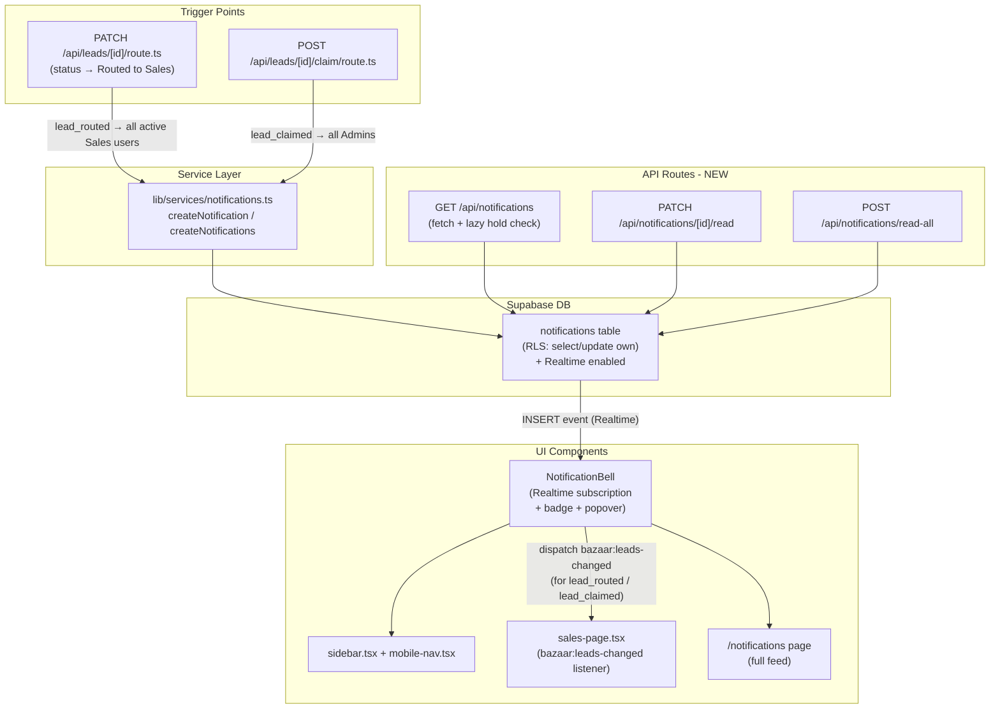

# Notifications System + Smart Sales Pipeline Refresh

## Overview

Build a full in-app notification system with a real-time bell in the sidebar, plus automatic live updates to the Sales Pipeline page — without requiring the user to manually refresh.

---

## Architecture



---

## How it works end-to-end

```
1. SDR routes a lead to Sales
   → API fires "lead_routed" notification to all active Sales users
   → Each sales rep's bell badge increments instantly (Supabase Realtime)
   → Sales Pipeline page auto-refreshes in the background

2. Sales rep claims a lead
   → API fires "lead_claimed" notification to all Admins
   → Admin's bell badge increments instantly
   → Sales Pipeline page auto-refreshes for other users viewing it

3. Lead has been on hold past its hold_until date
   → Lazy check on notification fetch creates a "hold_expired" reminder
   → Assigned SDR or sales rep gets a bell notification
```

---

## Notification Bell (Sidebar)

- Bell icon in the sidebar bottom cluster (above Sign Out)
- Red badge with unread count, capped at 99+
- Clicking the bell opens a popover with the 20 most recent notifications
- Each row: icon, title, body (2 lines), relative time, unread indicator (colored left border)
- Clicking a row marks it read and navigates to the relevant page (`/sales`, `/leads`, etc.)
- "Mark all read" button visible when unread notifications exist
- "View all notifications" link opens the full `/notifications` page
- Updates in real-time via Supabase Realtime — no polling needed

---

## Smart Sales Pipeline Refresh (Option C — drawer-aware)

When the notification bell receives a `lead_routed` or `lead_claimed` Realtime event:

- **Drawer closed** → Sales Pipeline table re-fetches immediately and silently in the background
- **Drawer open (user actively editing)** → refresh is deferred until the drawer is closed — no data loss, no interruption

---

## Notification Types

| Type | Trigger | Recipients | Link |
|---|---|---|---|
| `lead_routed` | SDR routes lead to Sales | All active Sales users | `/sales` |
| `lead_claimed` | Sales rep claims a lead | All Admins | `/sales` |
| `lead_held_reminder` | `hold_until` has passed | Lead's SDR or Sales owner | `/leads` or `/sales` |
| `follow_up_due` | Follow-up date reached | Ticket creator | `/tickets` |
| `system` | Admin broadcast | All users (or by role) | Optional |

---

## Files and Changes

### Phase 1 — DB & Service Layer

**New migration `032_enable_notifications_realtime.sql`**

Enable Realtime on the `notifications` table so the client can subscribe:

```sql
ALTER TABLE public.notifications REPLICA IDENTITY FULL;
ALTER PUBLICATION supabase_realtime ADD TABLE public.notifications;
```

**New file `lib/services/notifications.ts`**

- `createNotification(payload)` — single insert via admin client
- `createNotifications(payloads[])` — batch insert for fan-out (e.g. notify all Sales)
- Both are server-only (import `createAdminClient`)

**Modify `lib/types/index.ts`**

- Add `'lead_claimed'` to `NotificationType` union (admins get notified when sales rep claims)

---

### Phase 2 — API Routes (all new)

**`app/api/notifications/route.ts` (GET)**

- Auth gate via `requireSession`
- Lazy hold check: query `leads` where `hold_until <= now()` and `status = 'On Hold'` and lead owner = current user; create `lead_held_reminder` notifications if not already present
- Fetch `notifications` for `user_id = userId` ordered by `created_at DESC`, limit 20, support `?offset=N` pagination
- Return `{ notifications, unreadCount }`

**`app/api/notifications/[id]/read/route.ts` (PATCH)**

- Update `read = true` where `id = id AND user_id = userId`

**`app/api/notifications/read-all/route.ts` (POST)**

- Update `read = true` where `user_id = userId AND read = false`

---

### Phase 3 — Trigger Wiring

**Modify `app/api/leads/[id]/route.ts`**

After the existing `body.status === "Routed to Sales"` activity log (line ~95):

```typescript
// Notify all active Sales users
const { data: salesUsers } = await admin
  .from("user_profiles")
  .select("id")
  .eq("is_active", true)
  .eq("roles.name", "sales"); // via join

await createNotifications(salesUsers.map(u => ({
  user_id: u.id,
  type: "lead_routed",
  title: "New lead routed to Sales",
  body: `${lead.customer?.full_name} — ${lead.channel}, $${lead.quote_total ?? 0}`,
  payload: { href: "/sales", lead_id: lead.id },
})));
```

**Modify `app/api/leads/[id]/claim/route.ts`**

After successful claim, notify all admins:

```typescript
// Notify all active admins
await createNotifications(adminUsers.map(u => ({
  user_id: u.id,
  type: "lead_claimed",
  title: "Lead claimed",
  body: `${lead.customer?.full_name} claimed by [sales rep name]`,
  payload: { href: "/sales", lead_id: lead.id },
})));
```

---

### Phase 4 — NotificationBell Component (new)

**New file `components/notification-bell.tsx`**

- On mount: `GET /api/notifications` → sets `unreadCount` and `notifications[]`
- Supabase Realtime: subscribe to `notifications` table `INSERT` events filtered to `user_id=eq.{userId}` — on new row, increment badge and prepend to feed
- On `lead_routed` or `lead_claimed` notification INSERT: also dispatch `window.dispatchEvent(new Event("bazaar:leads-changed"))`
- Bell icon (lucide `Bell`) with a red pill badge (capped at `99+`) when `unreadCount > 0`
- Clicking opens a `Popover`-style dropdown anchored to the bell, showing:
  - Rows: icon, title, body (2-line truncate), relative time, unread left-border
  - Click row → `PATCH .../read` + navigate to `payload.href`
  - "Mark all read" button (visible only when unread > 0) → `POST .../read-all`
  - "View all notifications" link → `/notifications`
  - Collapsed sidebar mode: show icon + badge only (no label)

**Modify `components/sidebar.tsx`**

- Add `<NotificationBell collapsed={collapsed} />` in the bottom cluster, above Sign Out

**Modify `components/mobile-nav.tsx`**

- Add `<NotificationBell />` in the bottom cluster of the mobile drawer

---

### Phase 5 — Smart Sales Pipeline Refresh

**Modify `components/sales-page.tsx`**

- Add `pendingLeadsRefresh` ref (boolean)
- On mount: listen to new custom event `bazaar:leads-changed`
  - If `drawerLead === null` (drawer closed): call `fetchRoutedLeads()` + `fetchTabCounts()`
  - If drawer is open: set `pendingLeadsRefresh.current = true`
- In drawer's `onClose` handler: if `pendingLeadsRefresh.current === true`, clear flag and call `fetchRoutedLeads()` + `fetchTabCounts()`

---

### Phase 6 — Notifications Feed Page

**Modify `app/(app)/notifications/page.tsx`**

Replace spec preview with a real `"use client"` feed:

- Fetches `GET /api/notifications?offset=0`, supports "Load more" (pagination)
- Renders full notification list with same row design as the popover
- "Mark all read" button in page header
- Empty state when no notifications

---

### Phase 7 — Supabase Dashboard Step

- In Supabase dashboard → Table Editor → `notifications` → Realtime toggle: **ON**
- (The migration also handles this via SQL, but manual toggle confirms it)

---

### Phase 8 — Changelog

Update `docs/CHANGELOG.md` with all new files and changes.

---

## Infrastructure Notes

- No Vercel changes required — works on the free plan
- Supabase Realtime must be enabled on the `notifications` table (toggle in Supabase dashboard, or via migration SQL)
- The `notifications` table already exists in the DB with RLS policies
- No additional cost on Supabase free tier for this usage level

---

## Estimated Effort

Medium — roughly 1 session of focused implementation. All backend infrastructure (DB table, types, RLS) is already in place.
