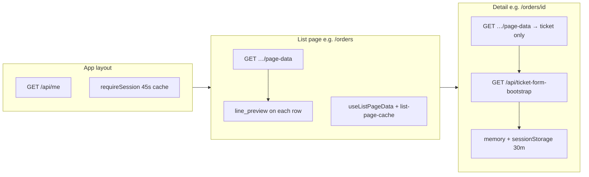

# Page loading — what we built & what’s next

> **Last updated:** 2026-06-02  
> **Status:** Phase 1–3 core + Jun 2026 UX perf shipped. Remainder is optional / ops / scale.

This doc is the **single place** to understand how BazarCRM loads data today and what to improve next. See also [`performance-optimization.md`](./performance-optimization.md), [`session-and-api-auth-cache.md`](./session-and-api-auth-cache.md), [`vercel-supabase-region.md`](./vercel-supabase-region.md), and [`../../api-contract.md`](../../api-contract.md).

---

## How pages load today

### Layout (every authenticated page)

| Piece | What it does |
|-------|----------------|
| `proxy.ts` | Session gate; redirects unauthenticated users |
| `AppSessionProvider` | One `GET /api/me` — role, nav pages, `allowedRoutes` |
| `requireSession()` | Server: 45s in-memory cache per cookie fingerprint |
| Sidebar badges | `GET /api/sidebar-counts?routes=…` on mount + `bazaar:refresh-counts` |

### Tabbed list pages (Orders, Quotes, Payments, Completed, Leads, Sales, CRM)

| Piece | What it does |
|-------|----------------|
| **Mount** | `GET /api/{feature}/page-data` — slim list + **all tab counts** + pagination |
| **SWR** | `hooks/use-list-page-data.ts` — 5 min in-memory cache per URL; instant tab/back |
| **Realtime** | `REALTIME_REFETCH_MS = 0` — refetch starts immediately on `bazaar:*-changed` |
| **Nav return** | Cached rows show instantly; background revalidate after 300ms if no realtime |
| **Row expand** | `line_preview` bundled in page-data (3 DB queries for whole page); client seeds `ticket-line-items-quick-preview` cache — **no extra API** for rows on current page |
| **Fallback** | `GET /api/tickets/[id]/line-preview` on cache miss / stale row |

### Detail pages (`QuoteDetail` — quotes, orders, payments, completed)

| Piece | What it does |
|-------|----------------|
| **Parallel load** | `Promise.all([getTicketFormBootstrap(), page-data])` |
| **page-data** | `{ ticket }` only — one `job_tickets` lookup + profile |
| **ticket-form-bootstrap** | Company settings, edit/action lookups, products — **5 min server cache** |
| **Client bootstrap cache** | 30 min memory + `sessionStorage`; second detail open in same tab often **skips bootstrap network** |
| **Warm from new quote** | `/quotes/new` form-bootstrap seeds ticket-form cache |
| **Silent refresh** | After save / realtime: `GET /api/tickets/[id]` only (no bootstrap) |

### Leads / Sales (drawer pattern)

- List: slim `page-data` row
- Full lead: `fetchLeadById()` when drawer opens
- Lookups / admin users: lazy on modal open (not page mount)

---

## How to measure (DevTools → Network)

| Scenario | What to watch | “Good” signal |
|----------|----------------|---------------|
| Cold list open | `page-data` TTFB | One request; ≤2 with sidebar-counts |
| Tab switch (visited) | Often **no** `page-data` | Cached rows from SWR |
| Expand row (same page) | **No** `line-preview` | Preview from `line_preview` in page-data |
| First detail open | `page-data` + `ticket-form-bootstrap` | Parallel; bootstrap ~200–400ms |
| Second detail (same tab) | Often **only** `page-data` | Bootstrap from sessionStorage |
| After region fix | All API TTFB | ~80–150ms lower warm invocations (see region doc) |

Use **Disable cache** only for baseline cold tests. Production (`npm run build && npm start`) avoids React Strict Mode double-mount in dev.

---

## Shipped (Jun 2026) — reference

| Area | Files / routes |
|------|----------------|
| Session + layout | `GET /api/me`, `lib/auth/session-cache.ts` (45s), `app-session-provider.tsx` |
| List SWR | `use-list-page-data.ts`, `list-page-cache.ts`, `realtime-refetch.ts` |
| List line expand | `fetch-ticket-line-previews-batch.ts`, `seed-line-preview-from-page-data.ts`, `ticket-list-expand.tsx` |
| Line-preview API | `GET /api/tickets/[id]/line-preview`, in-flight dedupe in quick-preview component |
| Detail split bootstrap | `GET /api/ticket-form-bootstrap`, slim `GET /api/tickets/[id]/page-data`, `ticket-form-bootstrap-cache.ts` |
| New quote warm cache | `seedTicketFormBootstrapFromQuotesBootstrap` |

Changelog entries: `docs/CHANGELOG.md` (2026-06-02 sections).

---

## What to improve next (prioritized)

### P0 — Operations (no code, high impact)

| Item | Effort | Impact |
|------|--------|--------|
| **Vercel region = `pdx1` or `sfo1`** to match Supabase Oregon | Settings + redeploy | ~80–150ms off every API hop |
| **Apply migration `107_performance_indexes.sql`** if not in prod | SQL Editor | Faster filtered lists as data grows |
| **Supabase compute** (if sustained >500ms TTFB) | Dashboard upgrade | DB CPU, not app architecture |

### P1 — Code (medium effort, noticeable UX)

| Item | Why | Approach |
|------|-----|----------|
| **Reuse `useAppSession()` on list pages** | Some pages still call Supabase `getUser()` + profile for role UI | Read role from context; remove duplicate client auth |
| **Prefetch ticket-form-bootstrap on list mount** | First detail open still waits for bootstrap | Fire `getTicketFormBootstrap()` after page-data succeeds (low priority idle) |
| **Hover prefetch detail `page-data`** | View click still waits for ticket payload | `onMouseEnter` on View / row link with in-flight dedupe |
| **Slimmer ticket detail select** | Full `*` + nested lead/customer on every open | Explicit column list in `fetch-ticket-detail.ts` (match list slim pattern) |
| **Dashboard KPI bundle** | Admin home may still fan out multiple routes | Single `GET /api/dashboard/page-data` (if not already bundled) |

### P2 — Scale / polish (defer until pain is felt)

| Item | When |
|------|------|
| CRM materialized aggregates | Customer count > ~1000 |
| Postgres RPC `get_ticket_line_preview(ticket_id)` | If page-data JSON too large with 100 rows/page |
| TanStack Query | Optional; custom SWR covers back-nav today |
| Edge cache for `ticket-form-bootstrap` | Only with careful cache invalidation on settings/lookup admin edits |
| Server keep-warm / Pro cron | Cold serverless starts on first request after idle |

### Do not do (security)

- Trust client `roleName` / `allowedRoutes` on APIs
- Skip `requireSession()` because `/api/me` succeeded
- Expose service role to the browser

---

## Cold-load budget (realistic)

On Supabase free/small tier + cross-region, **~300–600ms TTFB per API** is normal. With optimizations above:

| Page | Target calls (warm) | Notes |
|------|---------------------|-------|
| List (first visit) | 1× `page-data` + 1× sidebar-counts | `/api/me` from layout |
| List (return / tab) | 0–1× `page-data` | SWR hit or 300ms revalidate |
| Detail (first in tab) | 1× `page-data` + 0–1× bootstrap | Parallel |
| Detail (second in tab) | 1× `page-data` | Bootstrap cached |

Firebase felt faster because the client read Firestore directly with local cache and fewer server hops. BazarCRM keeps **server-validated APIs**; perceived speed comes from **bundling, caching, and region alignment**—not skipping auth.

---

## Related docs

- [`../../api-contract.md`](../../api-contract.md) — request/response shapes
- [`../../architecture.md`](../../architecture.md) — route tree + patterns
- [`../../component-architecture.md`](../../component-architecture.md) — per-page mount flows
- [`performance-anydoer-roadmap.md`](./performance-anydoer-roadmap.md) — historical P0 checklist
