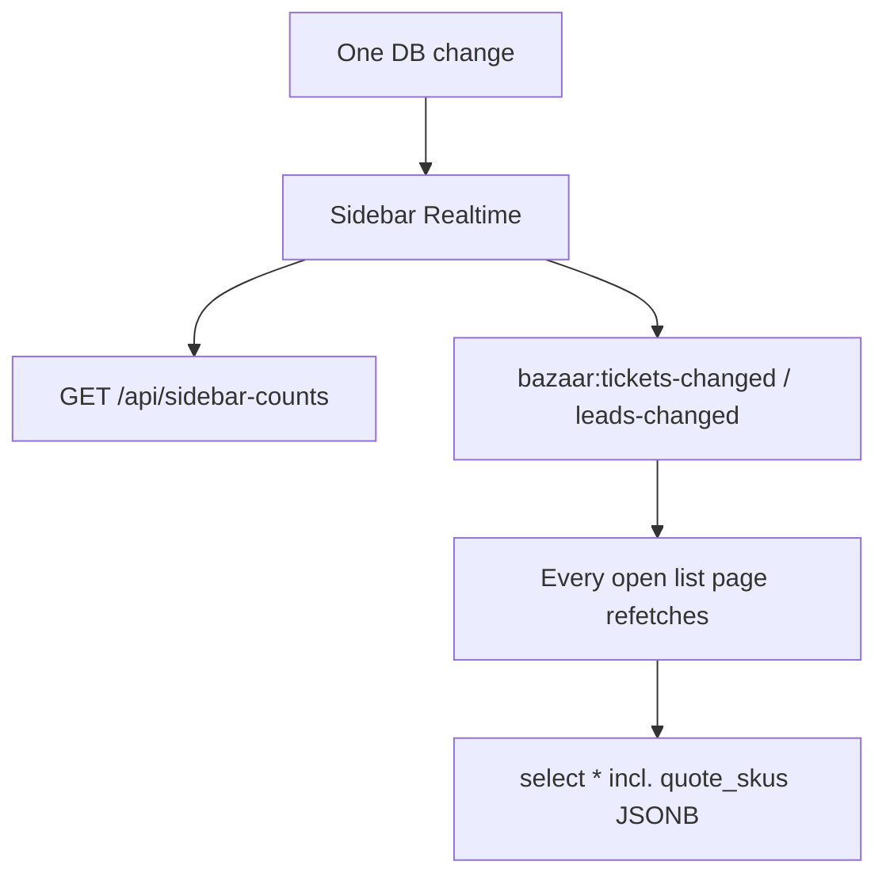

# Performance Optimization — Scoped Lists & Faster Queries

> **Status: Planned — deferred**
> **Priority:** Medium (after customer follow-up reminder cron)
> **Prerequisite:** [TODO-006](../../TODO.md#todo-006-follow-up-reminders--sending-logic-not-built) — Vercel Cron / `app/api/cron/follow-ups/route.ts` for quote follow-up reminders to customers
> **Goal:** Same UI (columns, tabs, badges, drawers) — faster loads and fewer redundant API calls

---

## Why defer until after the reminder cron?

The follow-up reminder job is a **net-new feature** with its own route, cron schedule, and send logic. Doing performance refactors first would increase merge/conflict risk and split testing focus. Ship reminders first, then optimize list/query patterns in a dedicated pass.

**Suggested order:**

1. Build [TODO-006](../../TODO.md#todo-006-follow-up-reminders--sending-logic-not-built) — customer follow-up reminder cron
2. Execute this plan — Phase 1, then Phase 2
3. Phase 3 (pagination / SWR) only if lists exceed ~500 rows

---

## Problem summary

Slowness is **not** from storing quotes/orders in one `job_tickets` table — it is from **how data is fetched**:



**Reference pattern (already fast):**

- `app/api/production/orders/route.ts`
- `app/api/payments/pending/route.ts`
- `app/api/completed/orders/route.ts`

Scoped status filter + explicit column list (no `quote_skus` on lists).

**Worst offenders today:**

| Area | File | Issue |
|------|------|-------|
| Orders list | `components/orders/orders-page.tsx` | `fetch("/api/tickets")` — all lifecycle stages, client-side filter |
| Tickets API | `app/api/tickets/route.ts` GET | `select *` + joins, no pagination |
| Count badges | `app/api/tickets/counts/route.ts`, `app/api/sidebar-counts/route.ts`, leads count routes | Fetch rows, count in JavaScript |
| Quotes realtime | `components/quotes/quotes-page.tsx` | Duplicate Supabase channel → 2× refetch per change |

---

## Guiding principles

- **Zero UI changes** — same table columns, tabs, badges, drawers
- **Follow existing conventions** — scoped routes under `app/api/{feature}/`, tab counts via dedicated `counts` endpoints, realtime via sidebar events
- **DRY** — shared select fragments + count helpers in `lib/utils/`

---

## Phase 1 — Highest impact, lowest risk

### 1A. Scoped Orders API (biggest single win)

Create `app/api/orders/orders/route.ts` mirroring production:

- Filter: `ticket_status IN ('order', 'cancelled')`
- Exclude payment-review rows server-side (same logic as `orders-page.tsx` + `isPaymentEvidencePending` from `lib/utils/invoice-payment-summary.ts`)
- Slim select (~15 fields + slim customer join) — **no `quote_skus`**
- Role scope: match `app/api/tickets/route.ts` (`created_by_id` / `routed_by_id` / admin)

Update `components/orders/orders-page.tsx`: `fetch("/api/tickets")` → `fetch("/api/orders/orders")`. Client-side tab filter stays.

### 1B. SQL counts instead of JS row scans

Refactor to parallel `{ count: "exact", head: true }` queries (pattern: `app/api/payments/counts/route.ts`):

| File | Fix |
|------|-----|
| `app/api/tickets/counts/route.ts` | One head count per tab status |
| `app/api/sidebar-counts/route.ts` | Quotes/orders badges via head counts (not `.length` on rows) |
| `app/api/production/counts/route.ts` | `all` + `balance_due` |
| `app/api/leads/workspace/counts/route.ts` | `all`, `hold`, `routed`, `rejected` |
| `app/api/leads/sales-counts/route.ts` | `pipeline`, `hold` |

Add `lib/utils/db-counts.ts` — shared `countExact()` wrapper.

### 1C. Remove duplicate realtime on Quotes page

Remove page-level Supabase channel in `components/quotes/quotes-page.tsx` (lines ~166–182). Keep `bazaar:tickets-changed` only — sidebar already broadcasts cross-session updates.

### 1D. Debounce sidebar badge refetch

In `components/layout/sidebar.tsx`, debounce `fetchBadges()` (~300ms) so burst realtime events trigger one sidebar-count request.

### 1E. DB indexes (migration `073_performance_indexes.sql`)

```sql
CREATE INDEX IF NOT EXISTS job_tickets_payment_evidence_pending_idx
  ON job_tickets (ticket_status)
  WHERE payment_evidence_url IS NOT NULL AND payment_paid_at IS NULL;

CREATE INDEX IF NOT EXISTS job_tickets_in_production_released_idx
  ON job_tickets (production_released_at DESC)
  WHERE ticket_status = 'in_production';

CREATE INDEX IF NOT EXISTS leads_prev_status_idx
  ON leads (prev_status) WHERE prev_status IS NOT NULL;

CREATE INDEX IF NOT EXISTS job_tickets_order_status_idx
  ON job_tickets (created_at DESC)
  WHERE ticket_status IN ('order', 'cancelled');
```

---

## Phase 2 — Slim list payloads (same rows, smaller JSON)

### 2A. Shared ticket list columns

Add `lib/utils/ticket-list-select.ts`:

- `TICKET_LIST_COLUMNS` — quotes/orders table fields
- `TICKET_QUOTE_LIST_COLUMNS` — quote extras (`quote_reminder_date`, `routed_by_id`, …)
- `isPaymentEvidencePendingFilter()` — reusable PostgREST filter for orders exclusion

### 2B. Slim Quotes list

Extend `app/api/tickets/route.ts` GET when `kind=quote`:

- Slim select (no `quote_skus`, no `notes`, no payment-config blobs)
- Server filter: `ticket_status IN ('draft','sent','approved','routed')`

### 2C. Slim Leads workspace

Update `app/api/leads/workspace/route.ts` — explicit lead + customer columns for table UIs only.

**Required mitigation:** Drawers receive list row data directly (`setDrawerLead(lead)` in `leads-page.tsx` / `sales-page.tsx`). Before slimming the list API, **fetch full lead on drawer open** via `GET /api/leads/[id]` so Verify/Sales drawers still show interests, quantities, website, etc.

### 2D. Slim CRM list

Update `app/api/customers/route.ts` — slim customer fields + SQL aggregates for `lead_count`, `last_activity`, `customer_status`. Silent realtime refetch (no full-page skeleton).

---

## Phase 3 — Optional (defer unless lists exceed ~500 rows)

- Pagination (`limit` + cursor) on orders/quotes/leads
- SWR / React Query for deduped fetches
- Session memoization in `lib/auth/require-session.ts` during burst refetches

---

## Risk & regression testing

| Phase | Risk | What could break |
|-------|------|------------------|
| Phase 1 | Low–medium (~15–20%) | Wrong tab badge counts; orders missing/extra rows; quotes realtime delay |
| Phase 2 (without drawer refetch) | Medium–high (~30–40%) | Lead/Sales drawers open with empty fields |
| Phase 2 (with drawer refetch) | Low–medium (~10–15%) | Same as Phase 1 |
| Indexes | Very low | None (read performance only) |

**No data corruption risk** — only wrong/missing UI display or badge mismatches.

### Smoke checklist (run after each phase)

- [ ] Every tab on Leads, Sales, Quotes, Orders — badge count matches visible rows
- [ ] Open lead drawer — all fields populated (interests, contact, SDR comment)
- [ ] Realtime: change in tab A → list updates in tab B
- [ ] Order with pending payment evidence appears on `/payments`, not `/orders`
- [ ] `npm run build` passes
- [ ] Network tab: list payload KB dropped vs baseline

---

## Expected impact

| Change | Effect |
|--------|--------|
| Orders scoped API | ~80–95% smaller orders page fetch |
| SQL counts | Count endpoints O(1) vs O(n) |
| Remove quotes duplicate channel | ~50% fewer refetches on `/quotes` |
| Debounced sidebar | Fewer concurrent `/api/sidebar-counts` |
| Slim quotes/leads/CRM | 50–70% smaller list JSON |
| Indexes | Faster filtered queries as tables grow |

---

## Implementation todos

- [ ] **Phase 1A** — `GET /api/orders/orders` + wire `orders-page.tsx`
- [ ] **Phase 1B** — SQL counts + `lib/utils/db-counts.ts`
- [ ] **Phase 1C** — Remove quotes-page duplicate channel
- [ ] **Phase 1D** — Debounce sidebar `fetchBadges`
- [ ] **Phase 1E** — Migration `073_performance_indexes.sql`
- [ ] **Phase 2A–D** — Slim selects + drawer refetch on open
- [ ] **Verify** — Build + smoke checklist; update `CHANGELOG.md` and `docs/architecture.md`

---

## Related docs

- `docs/TODO.md` — [TODO-006](../TODO.md) follow-up reminder cron (do first)
- `docs/architecture.md` — add scoped-list API pattern when implemented
- `docs/realtime-live-updates.md` — current realtime event bus behaviour
