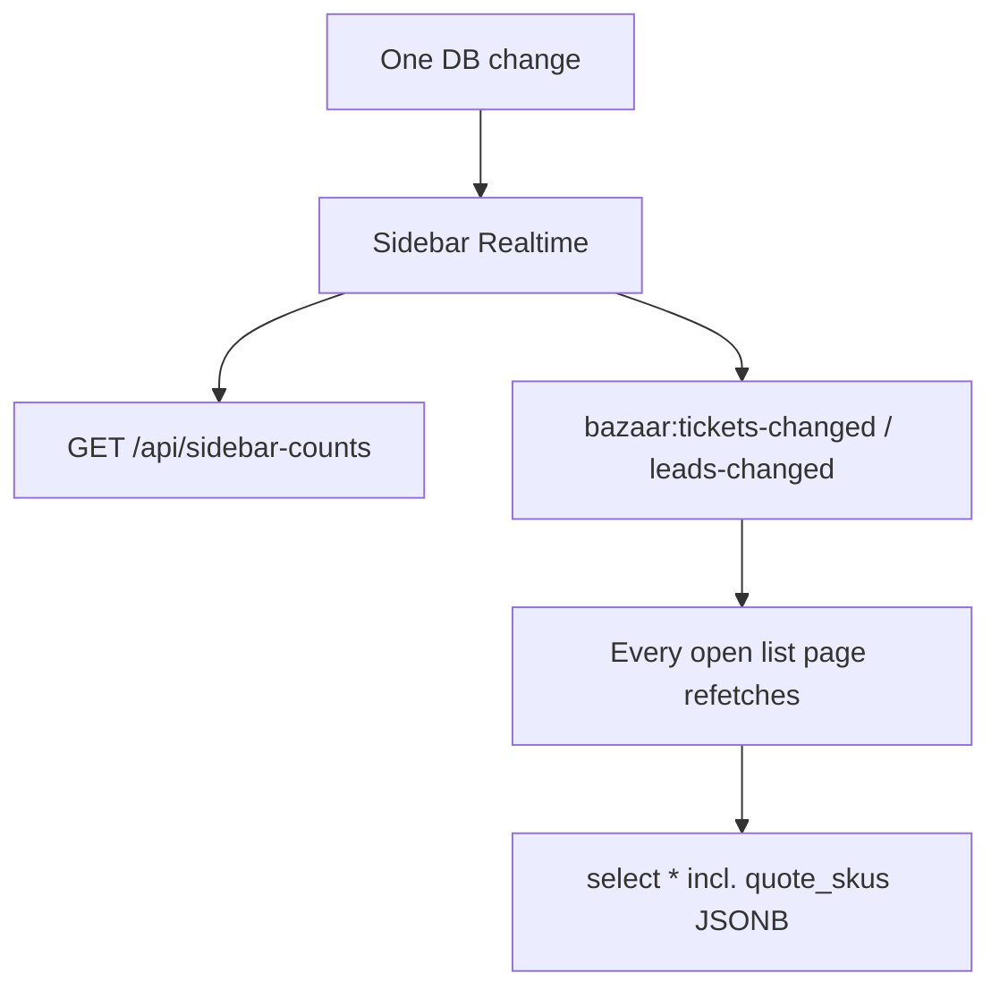

# Performance Optimization — Scoped Lists & Faster Queries

> **Status: Phase 1–3 core complete (2026-05-26)**
> **Phase 1–2:** 2026-05-22 · **Phase 3:** 2026-05-26 (page-data bundling, session cache)
> **Goal:** Same UI (columns, tabs, badges, drawers) — faster loads and fewer redundant API calls

---

## Summary of what was built

| Phase | Delivered |
|-------|-----------|
| **1A** | `GET /api/orders/orders` — scoped orders list; `orders-page.tsx` wired |
| **1B** | SQL head counts in all tab/sidebar count routes via `lib/utils/db-counts.ts` |
| **1C** | Removed duplicate Supabase channel on `quotes-page.tsx` (sidebar broadcasts `bazaar:tickets-changed`) |
| **1D** | Debounced sidebar badge refetch (~300 ms) in `sidebar.tsx` |
| **1E** | Migration `073_performance_indexes.sql` — partial indexes on orders, production, leads |
| **2A** | `lib/utils/ticket-list-select.ts`, `lib/utils/lead-list-select.ts` — shared column definitions |
| **2B** | Slim quote list in `GET /api/tickets?kind=quote` (no `quote_skus` / notes on list) |
| **2C** | Slim leads workspace list + full lead fetch on drawer open (`lib/utils/fetch-lead.ts`) |
| **2D** | Slim CRM customer list with lightweight lead/ticket aggregates; silent CRM refresh |
| **Extra** | `production-page.tsx` coalesced refetch (fixes duplicate `orders` + `counts` in dev Strict Mode) |
| **3A** | Combined `GET /api/{feature}/page-data` — list + counts in one auth pass |
| **3B** | `lib/auth/session-cache.ts` — 3 s `requireSession()` memoization |
| **3C** | `hooks/use-coalesced-refresh.ts` on all tabbed list pages |
| **3D** | `GET /api/orders/counts`, `GET /api/quotes/counts` — slim per-page count routes |
| **3E** | Role-scoped `GET /api/sidebar-counts?routes=…` |
| **3F** | Leads/Sales lazy-load lookups + admin user lists on modal/drawer open |

---

## Problem (before optimization)

Slowness was **not** from storing quotes/orders in one `job_tickets` table — it was from **how data was fetched**:



**Reference pattern (already fast, now used everywhere for lists):**

- `app/api/production/orders/route.ts`
- `app/api/payments/pending/route.ts`
- `app/api/completed/orders/route.ts`
- `app/api/orders/orders/route.ts` *(added Phase 1)*

Scoped status filter + explicit column list (no `quote_skus` on lists).

---

## Guiding principles (unchanged)

- **Zero UI changes** — same table columns, tabs, badges, drawers
- **Follow existing conventions** — scoped routes under `app/api/{feature}/`, tab counts via dedicated `counts` endpoints, realtime via sidebar events
- **DRY** — shared helpers in `lib/utils/`

---

## Phase 1 — ✅ Complete

### 1A. Scoped Orders API

- **Route:** `app/api/orders/orders/route.ts`
- Filter: `ticket_status IN ('order', 'cancelled')`
- Excludes payment-evidence-pending rows server-side
- Slim select (~15 fields + slim customer join) — **no `quote_skus`**
- Role scope: matches `GET /api/tickets` — SDR `created_by_id` only; Sales `created_by_id` or `routed`; admin unscoped

### 1B. SQL counts

Refactored to parallel `{ count: "exact", head: true }` via `lib/utils/db-counts.ts`:

| File | Status |
|------|--------|
| `app/api/tickets/counts/route.ts` | ✅ |
| `app/api/sidebar-counts/route.ts` | ✅ |
| `app/api/production/counts/route.ts` | ✅ |
| `app/api/leads/workspace/counts/route.ts` | ✅ |
| `app/api/leads/sales-counts/route.ts` | ✅ |

### 1C. Quotes realtime dedup

- Removed page-level Supabase channel from `quotes-page.tsx`
- Cross-session updates via sidebar `tickets-realtime` → `bazaar:tickets-changed`

### 1D. Debounced sidebar badges

- `components/layout/sidebar.tsx` — `fetchBadges()` debounced ~300 ms on realtime bursts

### 1E. DB indexes — migration `073_performance_indexes.sql`

```sql
CREATE INDEX IF NOT EXISTS job_tickets_payment_evidence_pending_idx
  ON job_tickets (ticket_status)
  WHERE payment_evidence_url IS NOT NULL AND payment_evidence_reviewed_at IS NULL;

CREATE INDEX IF NOT EXISTS job_tickets_in_production_released_idx
  ON job_tickets (production_released_at DESC)
  WHERE ticket_status = 'in_production';

CREATE INDEX IF NOT EXISTS leads_prev_status_idx
  ON leads (prev_status) WHERE prev_status IS NOT NULL;

CREATE INDEX IF NOT EXISTS job_tickets_order_status_idx
  ON job_tickets (created_at DESC)
  WHERE ticket_status IN ('order', 'cancelled');
```

**Deploy note:** Run this migration in Supabase SQL Editor before production deploy if not already applied.

---

## Phase 2 — ✅ Complete

### 2A. Shared list column helpers

- `lib/utils/ticket-list-select.ts` — quote list statuses + slim select string
- `lib/utils/lead-list-select.ts` — workspace/won list column definitions (reference)
- `lib/utils/lead-access.ts` — `canReadLead()` for `GET /api/leads/[id]`
- `lib/utils/fetch-lead.ts` — client helper for drawer full-record fetch

### 2B. Slim Quotes list

`GET /api/tickets?kind=quote` (list use only — no `linked_lead_id`, `customer_id`, or `period`):

- Slim select — no `quote_skus`, notes, or payment-config blobs
- Server filter: `ticket_status IN ('draft','sent','approved','routed')`
- Detail pages still use `GET /api/tickets/[id]` for full record

### 2C. Slim Leads workspace

- `GET /api/leads/workspace` — explicit lead + customer columns for table UIs
- **Drawer mitigation:** `leads-page.tsx` and `sales-page.tsx` call `fetchLeadById()` on drawer open
- `GET /api/leads/[id]` — full record + `sales_owner` / `locked_by` joins; expanded sales-pipeline read access

### 2D. Slim CRM list

- `GET /api/customers` — slim customer fields + lightweight lead/ticket row aggregates (no nested `customers(*)`)
- `crm-page.tsx` — silent refresh on `bazaar:leads-changed` (no skeleton flash)

---

## Phase 3 — ✅ Core complete (2026-05-26)

- **Page-data routes:** `/api/production/page-data`, `/api/orders/page-data`, `/api/quotes/page-data`, `/api/payments/page-data`, `/api/completed/page-data`, `/api/crm/page-data`, `/api/leads/workspace/page-data`, `/api/leads/sales/page-data`
- **Session cache:** `requireSession()` hits in-memory cache for ~3 s (same warm serverless instance)
- **Coalesced refetch:** all ticket + lead list pages
- **List pagination (May 2026):** Orders, Quotes, Completed, Production, CRM, Leads — default 25 rows, server-side filters, `ListPagination`
- **Optional remainder:** SWR/React Query, Sales/Payments pagination, CRM aggregate caching at scale

---

## Phase 3 — Optional (defer unless lists exceed ~500 rows)

- SWR / React Query for deduped fetches and back-navigation cache
- Sales pipeline + Payments tab pagination
- CRM materialized aggregates when customer count > ~1000
- Bundle ticket + company into a detail bootstrap endpoint for first paint

---

## Dev vs production expectations

| Observation | Cause |
|-------------|--------|
| Duplicate API calls on page open in `npm run dev` | React Strict Mode double-mounts effects — **mitigated** by `useCoalescedRefresh` on all tabbed list pages |
| ~400–600 ms per API call on Supabase free tier | Normal — auth + serverless + shared DB CPU; indexes + page-data bundling help |
| Production build (`npm run build && npm start`) | Mount effects run once; generally faster than dev |
| `/leads` infinite reload loop (fixed May 2026) | Unstable inline callback in coalesced-refresh effect deps — use stable `fetchPageData` + hook ref pattern |

---

## Smoke checklist (run before deploy)

- [ ] Every tab on Leads, Sales, Quotes, Orders — badge count matches visible rows
- [ ] Open lead drawer — all fields populated (interests, contact, SDR comment)
- [ ] Realtime: change in tab A → list updates in tab B
- [ ] Order with pending payment evidence appears on `/payments`, not `/orders`
- [ ] `npm run build` passes
- [ ] Network tab: list pages use ≤2 API calls on cold load (ideally 1 `page-data` + scoped sidebar-counts)
- [ ] Migration `073` applied in Supabase

---

## Expected impact (achieved)

| Change | Effect |
|--------|--------|
| Orders scoped API | ~80–95% smaller orders page fetch |
| SQL counts | Count endpoints O(1) vs O(n) row scans |
| Remove quotes duplicate channel | ~50% fewer refetches on `/quotes` |
| Debounced sidebar | Fewer concurrent `/api/sidebar-counts` |
| Slim quotes/leads/CRM | 50–70% smaller list JSON |
| Indexes (073) | Faster filtered queries as tables grow |
| Production + all list pages coalesced refetch | 1× page-data per mount in dev |
| Page-data bundling | ~40% fewer auth round-trips on tabbed pages |
| Session cache | Dedupes `requireSession()` during burst loads |

---

## Implementation todos

- [x] **Phase 1A–E**
- [x] **Phase 2A–D**
- [x] **Phase 3 core** — page-data routes, session cache, coalesced refetch on all tabbed list pages
- [x] **List pagination** — Orders, Quotes, Completed, Production, CRM, Leads (May 2026)
- [x] **Build passes**
- [ ] **Phase 3 optional** — SWR / Sales+Payments pagination (only if needed at scale)

---

## Related docs

- `docs/TODO.md` — [TODO-007](../TODO.md) Phase 3 core done; optional remainder in any-doer roadmap
- [performance-anydoer-roadmap.md](./performance-anydoer-roadmap.md) — SWR, pagination, CRM search, infra
- `docs/architecture.md` — scoped-list API pattern + new utils
- `docs/api-contract.md` — `GET /api/orders/orders`, updated tickets/leads/customers contracts
- `docs/realtime-live-updates.md` — event bus + dedup conventions
