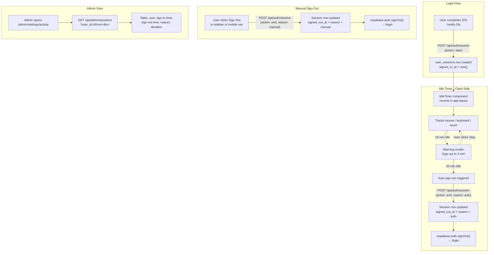

# User Session Tracking + Auto Sign-Out

> **Status: ✅ BUILT — 2026-05-17**
> See `docs/CHANGELOG.md` for the full change list.
> Key files: `components/layout/idle-timer.tsx`, `app/api/auth/session/route.ts`, `app/api/admin/sessions/route.ts`, `components/admin/user-activity-section.tsx`, `app/(public)/policy/page.tsx`

## Overview

Three connected features:

1. **Auto sign-out** — user is automatically signed out after 20 minutes of inactivity
2. **Session logging** — every login, logout, and auto-logout is recorded with timestamps
3. **Admin activity view** — admin can see per-user session history and total working time

---

## How it works end-to-end



---

## Feature 1 — Idle Auto Sign-Out

### Behavior

| Time | Action |
|---|---|
| 0–18 min | Normal use — timer resets on any mouse, keyboard, or touch event |
| 18 min | Warning modal appears: "You've been inactive. You'll be signed out in 2 minutes." |
| 20 min | Auto sign-out fires, session logged as `auto`, user sent to `/login` |
| Any time | Clicking "Stay signed in" resets the timer back to 0 |

### Warning Modal

- Overlay modal (cannot be dismissed by clicking outside)
- Countdown: "Signing out in **1:47**..." updating every second
- "Stay signed in" button — resets idle timer
- If user does nothing, auto sign-out fires at 20 min

### Implementation

New `components/layout/idle-timer.tsx` client component:

```typescript
// Listens to: mousemove, mousedown, keydown, touchstart, scroll
// Mounted in: app/(app)/layout.tsx (wraps all app pages)
// On 18 min: show warning modal with countdown
// On 20 min: POST /api/auth/session (end, auto) → signOut → /login
```

---

## Feature 2 — Session Logging

### New DB Table: `user_sessions`

```sql
create table public.user_sessions (
  id             uuid        primary key default gen_random_uuid(),
  user_id        uuid        not null references auth.users(id) on delete cascade,
  signed_in_at   timestamptz not null default now(),
  signed_out_at  timestamptz,
  sign_out_reason text       check (sign_out_reason in ('manual', 'auto', 'deactivated', 'unknown')),
  created_at     timestamptz not null default now()
);

create index user_sessions_user_id_idx on public.user_sessions(user_id);
create index user_sessions_signed_in_at_idx on public.user_sessions(signed_in_at);
```

**Note:** Duration is calculated at query time (`signed_out_at - signed_in_at`) rather than stored, so it's always accurate even for sessions still in progress.

### Sign-out reason values

| Value | When |
|---|---|
| `manual` | User clicked Sign Out |
| `auto` | Idle timer fired after 20 min |
| `deactivated` | Admin deactivated account (proxy.ts forced sign-out) |
| `unknown` | Session ended but reason not recorded (e.g. browser closed, token expired) |

### Session Start

Triggered in `app/(auth)/verify-2fa/page.tsx` after `supabase.auth.refreshSession()` succeeds:

```typescript
// After successful MFA verify:
await fetch("/api/auth/session", {
  method: "POST",
  body: JSON.stringify({ action: "start" }),
});
window.location.assign(next);
```

### Session End

Triggered in three places before calling `supabase.auth.signOut()`:

1. `components/layout/sidebar.tsx` — handleSignOut (reason: `manual`)
2. `components/layout/mobile-nav.tsx` — handleSignOut (reason: `manual`)
3. `components/layout/idle-timer.tsx` — auto sign-out (reason: `auto`)

```typescript
// Before every sign-out call:
await fetch("/api/auth/session", {
  method: "POST",
  body: JSON.stringify({ action: "end", reason: "manual" | "auto" }),
});
await supabase.auth.signOut();
window.location.assign("/login");
```

### New API Route: `app/api/auth/session/route.ts`

**POST** — session start or end:
- `action: "start"` → insert new row with `user_id` and `signed_in_at = now()`
- `action: "end", reason` → update the latest open row for `user_id` (where `signed_out_at IS NULL`), set `signed_out_at = now()` and `sign_out_reason`

---

## Feature 3 — Admin Activity View

### Where it lives

New tab in the existing Admin Settings area: `/admin/settings/activity-log`

Or integrated into the existing `/admin/settings/audit` tab (already planned but not yet built).

### What the admin sees

**Per-user summary card** (at a glance):

| Field | Example |
|---|---|
| Name + role | John Smith — Sales |
| Total sessions this week | 12 |
| Total time this week | 38h 14m |
| Last sign-in | Today, 8:42 AM |
| Last sign-out | Today, 5:01 PM |

**Session history table** (filterable by user and date range):

| Column | Notes |
|---|---|
| User | Name + role |
| Signed in | Date + time |
| Signed out | Date + time (or "Active" if still logged in) |
| Duration | e.g. "4h 23m" |
| Sign-out reason | Manual / Auto (idle) / Deactivated |

### New API Route: `app/api/admin/sessions/route.ts`

**GET** with query params:
- `?user_id=` — filter by specific user (optional)
- `?from=` and `?to=` — date range (default: last 7 days)
- Returns: sessions joined with `user_profiles` (name, role), duration calculated

---

## Files to Create / Modify

### Phase 1 — DB

| File | Change |
|---|---|
| `supabase/migrations/032_user_sessions.sql` | Create `user_sessions` table + indexes + RLS |

### Phase 2 — API

| File | Change |
|---|---|
| `app/api/auth/session/route.ts` | POST — start or end a session |
| `app/api/admin/sessions/route.ts` | GET — session history for admin view |

### Phase 3 — Idle Timer

| File | Change |
|---|---|
| `components/layout/idle-timer.tsx` | New component — idle detection, warning modal, auto sign-out |
| `app/(app)/layout.tsx` | Mount `<IdleTimer />` inside the app shell |

### Phase 4 — Sign-Out Wiring

| File | Change |
|---|---|
| `app/(auth)/verify-2fa/page.tsx` | Call `POST /api/auth/session` (start) after refreshSession |
| `components/layout/sidebar.tsx` | Call `POST /api/auth/session` (end, manual) before signOut |
| `components/layout/mobile-nav.tsx` | Same as sidebar |
| `proxy.ts` | Optional: when deactivated user is force-signed-out, log reason as `deactivated` |

### Phase 5 — Admin View

| File | Change |
|---|---|
| `app/(app)/admin/settings/[tab]/page.tsx` | Add `activity-log` tab case |
| `components/admin/activity-log-section.tsx` | New — per-user summary cards + filterable session table |

---

## Edge Cases to Handle

| Case | How we handle it |
|---|---|
| Browser tab closed / phone locked | Session row stays open (`signed_out_at IS NULL`); on next login, the previous open row is closed with reason `unknown` |
| Multiple tabs open | Idle timer runs per tab; first tab to idle fires sign-out; Supabase invalidates session for all tabs |
| User is on a video call / reading | "Stay signed in" button resets the timer; no accidental sign-out |
| Admin is also using the app | Same idle timer applies to admins too |

---

## Infrastructure Notes

- No Vercel changes required — works on the free plan
- No additional Supabase features needed beyond the existing Postgres DB
- `user_sessions` table is small — one row per login session; minimal storage impact
- RLS: users can only read their own sessions; admins can read all via service-role API

---

## Estimated Effort

Medium — roughly 1 session. Idle timer and warning modal are the most involved pieces. DB and API are straightforward.
