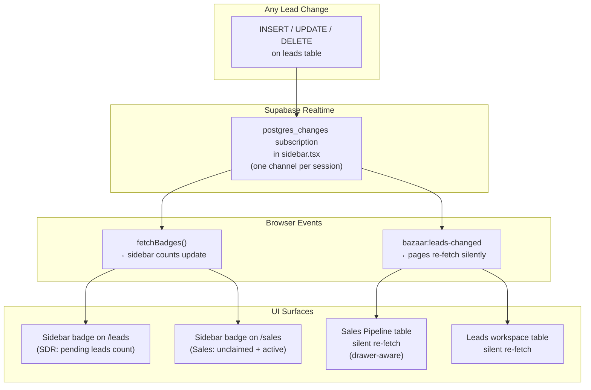

# Notifications System — V1 Implementation

## What was built (V1)

BazaarPrinting CRM uses **sidebar badge counts** + **Supabase Realtime** instead of a traditional bell/feed notification system. This is intentional — the badge approach is simpler, always visible, and requires no user interaction to see that something changed.

---

## Architecture



---

## Sidebar Badge Counts

**File: `app/api/sidebar-counts/route.ts`**

Role-aware counts returned on every badge refresh:

| Role | `/leads` badge | `/sales` badge |
|------|---------------|----------------|
| SDR | Leads with `status IN ('Pending', 'Validated')` | — |
| Sales | — | Unclaimed routed leads + own active deals |
| Admin | Same as SDR | Total active deals across all reps |

---

## Realtime Subscription

**File: `components/sidebar.tsx`**

The sidebar owns a single Supabase Realtime channel for the `leads` table. On any INSERT, UPDATE, or DELETE:

1. `fetchBadges()` is called → sidebar count updates instantly
2. `bazaar:leads-changed` browser event is dispatched → all listening pages silently re-fetch

```typescript
const channel = supabase
  .channel("leads-realtime")
  .on("postgres_changes", { event: "*", schema: "public", table: "leads" }, () => {
    fetchBadges();
    window.dispatchEvent(new Event("bazaar:leads-changed"));
  })
  .subscribe();
```

---

## Page Table Refresh

### Sales Pipeline (`components/sales-page.tsx`)

Drawer-aware — if a lead drawer is open, refresh is deferred until the drawer closes:

```typescript
const pendingLeadsRefresh = useRef(false);

useEffect(() => {
  function onLeadsChanged() {
    if (drawerLead) {
      pendingLeadsRefresh.current = true; // defer
    } else {
      // Silent re-fetch without loading skeleton
      fetch("/api/leads/workspace?status=Routed+to+Sales")
        .then(r => r.json())
        .then(d => { setRoutedLeads(d.leads ?? []); });
      fetchTabCounts();
    }
  }
  window.addEventListener("bazaar:leads-changed", onLeadsChanged);
  return () => window.removeEventListener("bazaar:leads-changed", onLeadsChanged);
}, [drawerLead]);
```

In the drawer `onClose`:
```typescript
if (pendingLeadsRefresh.current) {
  pendingLeadsRefresh.current = false;
  fetchRoutedLeads();
  fetchTabCounts();
}
```

### Leads Workspace (`components/leads-page.tsx`)

Same pattern — skips refresh if drawer is open, otherwise silently re-fetches current tab:

```typescript
useEffect(() => {
  function onLeadsChanged() {
    if (drawerLead) return;
    // inline silent fetch for current tab...
  }
  window.addEventListener("bazaar:leads-changed", onLeadsChanged);
  return () => window.removeEventListener("bazaar:leads-changed", onLeadsChanged);
}, [drawerLead, activeTab, search]);
```

---

## Admin Activity Log

**File: `components/admin/activity-log-section.tsx`**
**API: `app/api/admin/activity-log/route.ts`**

Admin-only view at `/admin/settings/notifications` showing all system activity:
- Who (user name + role badge)
- Action (human-readable label from the `activities` table `type`)
- Lead / Customer name
- When (relative time, absolute on hover)

Paginated (50 per page), uses the existing `activities` table that is already populated by all API routes.

---

## DB Migration

**`supabase/migrations/035_enable_leads_realtime.sql`**

```sql
ALTER TABLE public.leads REPLICA IDENTITY FULL;
ALTER PUBLICATION supabase_realtime ADD TABLE public.leads;
```

> Also toggle Realtime ON for the `leads` table in the Supabase dashboard (Table Editor → leads → Realtime).

---

## What is NOT built in V1

- Bell icon / notification popover
- Per-user notification feed (`/notifications` page is still a spec preview)
- The `notifications` table exists in the DB but is unused — reserved for a future bell system if needed
- Admin broadcast system

---

## Adding a new entity (e.g. orders)

See `docs/realtime-live-updates.md` for the full step-by-step checklist.
