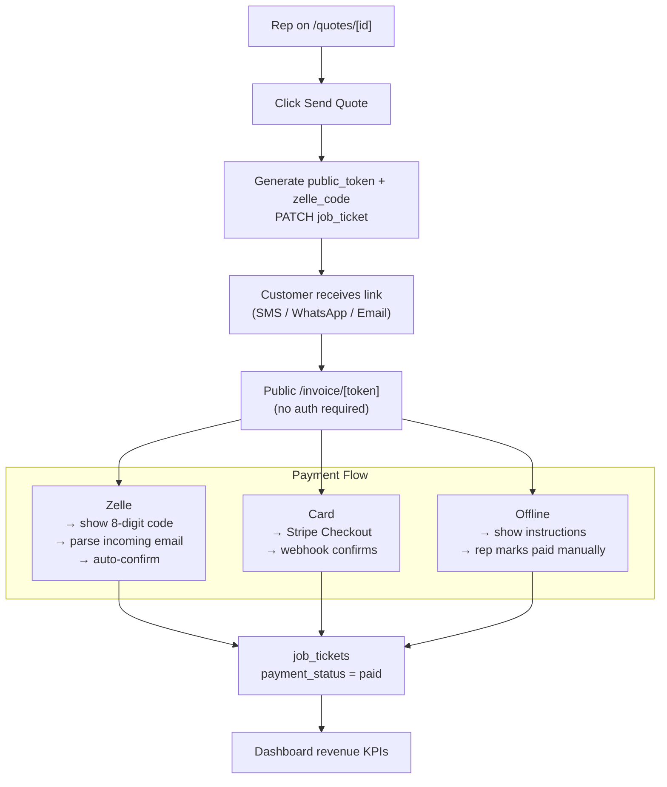

# Feature Spec — Invoice & Payment Flow

> **Status: Planned — not yet built.**
> Prereqs (Phases 0–7 of the Tickets module) are complete as of 2026-05-12.
> This spec covers the next major build: public invoice page + Stripe, Zelle, and Offline payment flows.

---

## Overview

When a rep clicks **Send Quote**, the customer should receive a link to a beautifully designed
public invoice page. From that page, the customer can view all order details, print it, and pay
using whichever payment method the rep selected on the quote.

Three payment methods are supported:

| Method | Integration | How it works |
|---|---|---|
| Card | Stripe Checkout | Customer clicks Pay Now → Stripe hosted page → webhook confirms |
| Zelle | Inbound email parsing | Customer uses an 8-digit code in the Zelle memo → email is parsed to auto-confirm |
| Offline | None | Customer pays at the office; rep marks paid manually in the CRM |

Payment data (amount received, date paid, method) is stored on the `job_tickets` record and
feeds into the Dashboard revenue KPIs.

---

## Architecture



---

## Phase A — Database + Public Token

### Migration `050_payment_fields.sql`

New columns on `job_tickets`:

```sql
alter table public.job_tickets
  add column if not exists public_token          text unique,
  add column if not exists zelle_code            text,
  add column if not exists payment_status        text,   -- null | 'pending_zelle' | 'paid' | 'failed'
  add column if not exists payment_amount_received numeric,
  add column if not exists payment_paid_at       timestamptz,
  add column if not exists payment_method_used   text,
  add column if not exists stripe_session_id     text,
  add column if not exists stripe_payment_intent_id text;
```

RLS: add an anon-safe SELECT policy on `job_tickets` scoped to `public_token IS NOT NULL`
so the public invoice page can fetch the ticket without auth (service-role client is the
cleaner alternative — either works).

Update `supabase/schema.sql` to include the new columns.

### Token generation

In `PATCH /api/tickets/[id]`:
- When `ticket_status` is set to `'sent'` **and** `public_token` is currently null:
  - Generate `public_token = crypto.randomUUID()`
  - Generate `zelle_code = 8 random alphanumeric chars` (e.g. `Z-38291047`)
  - Save both to the ticket in the same PATCH
- Return the `invoice_url` (`${NEXT_PUBLIC_APP_URL}/invoice/${public_token}`) in the response

New route: `GET /api/tickets/[id]/public-link`
- Returns `{ public_token, invoice_url }` for the "Copy Link" button in the CRM
- Scoped: rep must own the ticket or be admin

---

## Phase B — Public Invoice Page

### Route

`app/(app)/invoice/[token]/page.tsx`

- **No auth required** — standalone page outside the `(app)` layout shell (no sidebar)
- Server component — fetches ticket by `public_token` using the admin/service-role client
- If not found or `ticket_status = 'draft'` → 404 page: *"This quote is not available."*

### Component: `components/invoice-page.tsx`

Layout sections:

1. **Header** — company logo + name + address (from `company_settings`)
2. **Quote / Order info** — reference code, title, date, status
3. **Contact info** — customer name, company, email, phone
4. **Line items table** — product, material, size, qty × unit price = line total
5. **Pricing summary** — subtotal → shipping → discount → pre-tax → tax → **Total**
6. **Payment section** — rendered based on `quote_payment_types`:
   - **Offline**: *"Please pay at our office. Reference: [zelle_code]"*
   - **Zelle**: *"Send to [company Zelle email]. Memo: **Z-38291047**"* — large copy button
   - **Card**: *"Pay Now"* button → Stripe Checkout
7. **Footer** — follow-up date if set; "Print this page" button (`window.print()`)

Print CSS: hide action buttons, expand table to full width.

### CRM changes (`components/quote-detail.tsx`)

- After Send Quote succeeds, show a **Copy Link** icon next to the status pill
- `navigator.clipboard.writeText(invoice_url)` with toast *"Invoice link copied"*
- Rep pastes the link into SMS / WhatsApp / email manually

---

## Phase C — Stripe Card Payment

### Dependencies

```
npm install stripe @stripe/stripe-js
```

### Environment variables

```
STRIPE_SECRET_KEY=sk_live_...          # server only
STRIPE_WEBHOOK_SECRET=whsec_...        # server only
NEXT_PUBLIC_STRIPE_PUBLISHABLE_KEY=pk_live_...
```

### API routes

**`POST /api/payments/stripe/create-session`**

- Creates a Stripe Checkout Session from the ticket's line items and total
- `metadata: { ticket_id, public_token }` — used by webhook to match the payment
- Success URL: `/invoice/[token]?paid=1`
- Cancel URL: `/invoice/[token]`
- Returns `{ session_url }` — invoice page redirects the customer there

**`POST /api/payments/stripe/webhook`**

- Receives `checkout.session.completed` event from Stripe
- Verifies signature with `STRIPE_WEBHOOK_SECRET`
- Matches ticket via `metadata.ticket_id`
- Updates `job_tickets`:
  - `payment_status = 'paid'`
  - `payment_amount_received` (from Stripe amount)
  - `payment_paid_at = now()`
  - `payment_method_used = 'card_default'`
  - `stripe_session_id`
  - `ticket_status = 'approved'` (quote auto-converts to order on payment)
- Logs `activity: order_payment_received`

### Invoice page

- "Pay Now" button calls `create-session` → redirects to Stripe Checkout URL
- On return with `?paid=1` query param: show a green success banner *"Payment received — thank you!"*

---

## Phase D — Zelle Code Matching

### Concept

Every quote sent with Zelle as a payment method shows an 8-character code (e.g. `Z-38291047`).
The customer includes this code in the Zelle memo field when they send payment.
Zelle sends a payment confirmation email. That email is parsed to extract the code and
automatically mark the order as paid.

### Email parsing setup (Postmark or Mailgun)

1. Company sets their Zelle-receiving email as the Postmark inbound address
   (or set up a `payments@` alias that forwards there)
2. Postmark parses the raw email and POSTs JSON to a webhook URL
3. The webhook extracts the memo code and matches it to a ticket

### API route: `POST /api/payments/zelle/inbound`

- Receives Postmark (or Mailgun) inbound email webhook
- Verifies a shared secret header to prevent spoofing
- Parses the email text body with regex: `/Z[-\s]?([A-Z0-9]{8})/i`
- Looks up `job_tickets` where `zelle_code = extracted_code`
- If found:
  - `payment_status = 'paid'`
  - `payment_paid_at = now()`
  - `payment_method_used = 'zelle'`
  - `ticket_status = 'approved'`
  - Logs `activity: order_payment_received`
- Responds `200` always (to prevent email provider retries)

### Manual fallback

Always available — the automated parsing depends on consistent email forwarding.

In `components/quote-detail.tsx` action bar:
- **"Mark as Paid (Zelle)"** button — shown when `quote_payment_types` includes `zelle` and `payment_status` is not yet `paid`
- Prompts for amount received (number input in a small modal)
- Calls `PATCH /api/tickets/[id]` with `payment_status`, `payment_amount_received`, `payment_method_used`

---

## Phase E — Dashboard Revenue Integration

Update `app/api/dashboard/kpis/route.ts`:

```typescript
// Revenue total
const { data: revenue } = await admin
  .from('job_tickets')
  .select('payment_amount_received, payment_method_used, created_by_id')
  .eq('payment_status', 'paid')
  // non-admin: add .eq('created_by_id', userId)

// Compute: total revenue, breakdown by payment_method_used
```

Dashboard KPI cards:
- **Total Revenue** (period-scoped, same as other KPIs)
- **Revenue by Method** (Card / Zelle / Offline) — bar or donut chart

---

## File Inventory

| File | Phase | Notes |
|---|---|---|
| `supabase/migrations/050_payment_fields.sql` | A | New columns on job_tickets |
| `supabase/schema.sql` | A | Update with new columns |
| `app/(app)/invoice/[token]/page.tsx` | B | Public invoice page (no auth shell) |
| `components/invoice-page.tsx` | B | Invoice UI component |
| `app/api/tickets/[id]/route.ts` | A | Token generation on send |
| `app/api/tickets/[id]/public-link/route.ts` | A | Copy link endpoint |
| `components/quote-detail.tsx` | B, D | Copy Link + Mark as Paid buttons |
| `app/api/payments/stripe/create-session/route.ts` | C | Stripe Checkout session |
| `app/api/payments/stripe/webhook/route.ts` | C | Stripe payment confirmation |
| `app/api/payments/zelle/inbound/route.ts` | D | Inbound email parsing |
| `app/api/dashboard/kpis/route.ts` | E | Revenue from paid tickets |
| `docs/CHANGELOG.md` | each phase | Update as built |

---

## Build Order

1. **Phase A** — DB migration + token generation (unblocks B, C, D)
2. **Phase B** — Public invoice page (customer can see the quote immediately)
3. **Phase C** — Stripe (highest-value payment method, clean integration)
4. **Phase D** — Zelle (email infra setup required; manual fallback covers gap)
5. **Phase E** — Dashboard (last, needs payment data to exist)

---

## Open Questions / Decisions Needed Before Building

| # | Question | Default if not decided |
|---|---|---|
| 1 | Which email provider for Zelle inbound parsing — Postmark or Mailgun? | Postmark (simpler API) |
| 2 | Zelle code format — plain 8 digits (`38291047`) or prefixed (`Z-38291047`)? | `Z-XXXXXXXX` for uniqueness |
| 3 | Should card payment via Stripe auto-approve the ticket (`ticket_status = 'approved'`)? | Yes |
| 4 | Should the invoice page be accessible at any ticket status or only `sent` + `approved`? | `sent` and `approved` only |
| 5 | Company Stripe account — live or test mode to start? | Test mode first |
