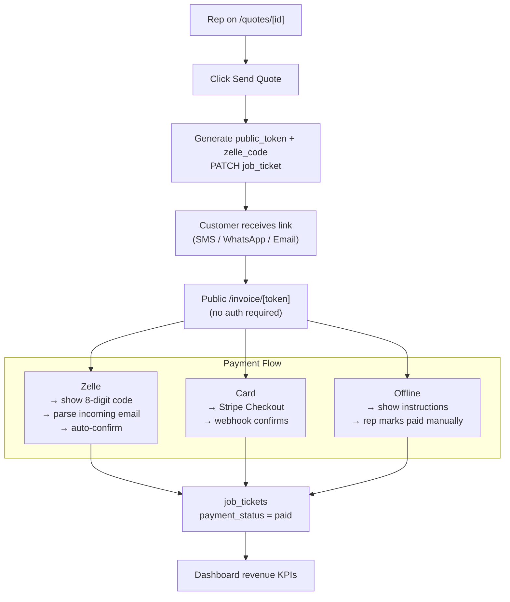

# Feature Spec — Invoice & Payment Flow

> **Status: Phases A + B + B+ + B++ + accountant review queue + production lifecycle built. Phases C–E deferred.**
>
> | Phase | What | Status |
> |-------|------|--------|
> | A | DB columns + public token | ✅ Built (migrations 052, 053, 054) |
> | B | Public quote/invoice page at `/q/[token]` | ✅ Built — customer views + confirms quote |
> | B+ | Prepayment / Deposit display on public page | ✅ Built — Payment Schedule block for partial prepayments |
> | B++ | Per-ticket payment config (`QuotePaymentConfig`) + checkout stepper + payment recording | ✅ Built (migrations 065, 066) |
> | B++ | Admin → Payment tab (Wire/ACH/Zelle remittance settings) | ✅ Built — `components/admin/payment-section.tsx`, migration 065 |
> | B+++ | Payment evidence queue + accountant role | ✅ Built (migrations 068, 071) — `/payments`, `record_payment`, customer proof upload |
> | B+++ | Production / completed lifecycle + net terms auto-release | ✅ Built (migrations 069, 072) — `/production`, `/completed`, `maybe-auto-release-production.ts` |
> | B+++ | Customer notifications (payment confirmed, invoice link, pickup ready) | ✅ Built — `payment-confirmed-template.ts`, `invoice-link-template.ts`, `order-ready-template.ts` |
> | C | Stripe Card payment | ⏳ Deferred — DB ready, API wiring not started |
> | D | Zelle code matching | ⏳ Deferred |
> | E | Dashboard revenue KPIs | ⏳ Deferred |

---

## Overview

When a rep clicks **Send Quote**, the customer should receive a link to a beautifully designed
public invoice page. From that page, the customer can view all order details, print it, and pay
using whichever payment method the rep selected on the quote.

Three payment methods are supported:

| Method | Integration | How it works |
|---|---|---|
| Card | Stripe Checkout | Customer clicks Pay Now → Stripe hosted page → webhook confirms |
| Zelle | Inbound email parsing | Customer uses an 8-digit code in the Zelle memo → email is parsed to auto-confirm |
| Offline | None | Customer pays at the office; rep marks paid manually in the CRM |

Payment data (amount received, date paid, method) is stored on the `job_tickets` record and
feeds into the Dashboard revenue KPIs.

---

## Architecture



---

## Phase A — Database + Public Token ✅ BUILT

### Migrations applied

| Migration | File | What it adds |
|-----------|------|-------------|
| 052 | `add_public_token_to_tickets.sql` | `public_token UUID DEFAULT gen_random_uuid()` + unique index |
| 053 | `add_payment_status_to_tickets.sql` | `payment_status TEXT NOT NULL DEFAULT 'unpaid'` — `'unpaid'` \| `'partial'` \| `'paid'` |
| 054 | `add_prepayment_status_to_tickets.sql` | `prepayment_status TEXT NOT NULL DEFAULT 'pending'` — `'pending'` \| `'paid'` — Stripe webhook will update this |

> Columns added for the future: `zelle_code`, `payment_amount_received`, `payment_paid_at`, `payment_method_used`, `stripe_session_id`, `stripe_payment_intent_id` — **not yet added to DB**. Add them in a future migration when Stripe/Zelle is wired.

### Token generation

`public_token` is set as a DB default (`gen_random_uuid()`) so every ticket has one from creation. The public URL is `{NEXT_PUBLIC_APP_URL}/q/{public_token}`.

`sendQuoteToCustomer()` in `lib/integrations/send-quote.ts` reads `ticket.public_token` to build the link included in every email/SMS delivery.

---

## Phase B — Public Quote Page ✅ BUILT

### Route

`app/(public)/q/[token]/page.tsx`

- **No auth required** — `proxy.ts` allows `/q/` paths without authentication
- Client component — fetches via `GET /api/public/quotes/[token]` (uses admin client server-side, returns safe public fields only)
- Not found or draft → "Quote Not Found" screen
- Already confirmed → "Order Confirmed" screen with reference code

### Layout sections (as built)

1. **Header** — company logo or name + "PROFESSIONAL PRINTING SERVICES" sub-label (navy background)
2. **Greeting** — "Hi [Customer Name], your quote is ready" (or order variant)
3. **Reference card** — reference code + status badge (Awaiting Approval / Order / Cancelled)
4. **Rush Order banner** — amber, shown when `rush = true`
5. **Line items** — desktop table (Product, Qty, Unit Price, Total) + mobile card layout
6. **Pricing Summary** — subtotal → shipping → discount → tax → **Order Total** (gold)
7. **Payment Schedule** *(partial prepayment only)*:
   - Amber box: **Deposit Due Now** + amount + "Required to begin your order"
   - **Balance Remaining** + "Due upon completion / delivery"
   - Gold border wrapping the entire block for prominence
   - Hidden entirely for Full Payment orders
8. **Accepted Payment Methods** — green badge block
9. **Special Requirements** — amber block (if set)
10. **"Confirm & Accept Quote"** CTA — gold button, only when `ticket_status = "sent"`
11. **Footer** — company name, address, phone, email, website

### On Confirm

`POST /api/public/quotes/[token]/confirm`:
- Sets `client_confirmed = true`, `ticket_status = "order"`, `ticket_kind = "order"`
- Generates `ORD-YYYY-NNN` reference code via `increment_order_sequence()`
- Logs `order_ticket_status_changed` activity (`by_user_id = null` — customer action)
- May auto-release to `in_production` when net terms / payment gates are satisfied (`maybeAutoReleaseProduction`)
- Returns `{ ok: true, reference_code }`
- Page transitions to payment stepper or success state depending on payment config

### Public portal phases (as of 2026-05-21)

The customer page derives a **portal phase** from ticket status + payment state:

| Phase | When | Customer sees |
|-------|------|---------------|
| `confirm` | `sent`, not yet confirmed | "Confirm & Accept Quote" CTA |
| `pay` | Confirmed or direct order, balance due | Payment method panels + checkout stepper |
| `evidence_pending` | Wire/ACH/Zelle/check/card proof uploaded, accountant not yet confirmed | Amber **under review** banner — not marked paid |
| `in_production` | `ticket_status = in_production`, not completed | Production progress messaging |
| `order_ready` | `ticket_status = completed` | Green **Ready for pickup** banner with shop address + phone |

Additional UX:
- Addresses (company + pickup) open **Google Maps** on click (`components/public/address-map-link.tsx`)
- Phone, email, website are clickable (`tel:` / `mailto:` / link) with no visual style change
- PDF download does not show paid rows until accountant confirms evidence
- Staff logged in can preview `/q/{token}` — `proxy.ts` skips RBAC on public paths

### Payment evidence workflow (Accountant)

1. Customer submits proof via `POST /api/public/quotes/[token]/submit-payment` (multipart: `method`, `amount`, optional `file`, optional `receiptId`)
2. For wire / ACH / Zelle / check / card: file stored in Supabase Storage `payment-evidence` bucket; `payment_evidence_url`, `payment_evidence_submitted_at`, `payment_evidence_amount` set; **payment totals are NOT updated**
3. Ticket appears on **`/payments`** only (excluded from `/orders` until confirmed)
4. Accountant opens `/payments/[id]`, reviews evidence (`GET /api/tickets/[id]/evidence` signed URL), clicks **Confirm**
5. `PATCH /api/tickets/[id]` with `{ record_payment: true, payment_mode, payment_method, payment_amount }` records payment, clears evidence fields, may auto-release production, sends **payment confirmed** email/SMS
6. Cash / in-person channels without evidence file may still auto-record and auto-release when gates pass

### Net terms auto-production

When `ticket_payment_strategy = 'net'` and production gates are met (price set, client confirm satisfied if required), the order moves to `in_production` **without requiring full payment**.

Triggered from:
- Ticket create/update (rep saves payment config)
- Public confirm (`POST …/confirm`)
- Public submit-payment (cash channels only — not while evidence is pending review)
- Accountant `record_payment` confirm

Shared helper: `lib/utils/maybe-auto-release-production.ts` (migration 072 adds net-terms support flag if needed).

### Resend invoice link & pickup notification

| Action | API | Customer receives |
|--------|-----|-------------------|
| Resend invoice link | `PATCH { resend_invoice: true, invoice_channel?, invoice_destination? }` | Email/SMS with permanent `/q/{token}` link (works paid or unpaid) |
| Mark completed | Normal PATCH `{ ticket_status: "completed" }` on in-production order | Email/SMS **order ready for pickup** via `sendOrderReadyToCustomer()` |

History logs: `ticket_invoice_resent`, `ticket_order_ready_sent`, `ticket_order_ready_failed`, `ticket_payment_confirmed_sent`.

**Mark Completed rules:**
- Admin — always on in-production orders
- Accountant — only when `isTicketPaidInFull()` (`lib/utils/invoice-payment-summary.ts`)

### Public & staff API routes

| Route | Auth | Purpose |
|-------|------|---------|
| `GET /api/public/quotes/[token]` | None | Safe public ticket fields + company settings + payment/evidence state |
| `POST /api/public/quotes/[token]/confirm` | None | Customer confirms → converts to order |
| `POST /api/public/quotes/[token]/submit-payment` | None | Customer payment proof / cash submission |
| `GET /api/public/quotes/[token]/pdf` | None | Customer PDF download |
| `GET /api/payments/pending` | Accountant + Admin | Evidence-pending queue |
| `GET /api/payments/counts` | Accountant + Admin | Tab badge counts |
| `GET /api/production/orders` | Authenticated | In-production list |
| `GET /api/production/counts` | Authenticated | Production tab counts |
| `GET /api/completed/orders` | Authenticated | Completed list |
| `GET /api/completed/counts` | Authenticated | Completed tab counts |
| `GET /api/tickets/[id]/evidence` | Staff with ticket access | Signed URL for evidence file |

---

## Phase B+ — Prepayment / Deposit on Public Page ✅ BUILT

**Prepayment / Deposit section in CRM (New Quote + Quote Detail):**

- **Full Payment / Partial Payment** toggle (segmented button, default Full Payment)
- When Partial selected: % / $ type toggle + amount input + "Due now / Balance" summary
- Saves to `prepayment_type` (`"full"` | `"percent"` | `"fixed"`) and `prepayment_value`

**Deposit status bar on Order detail (read-only mode):**

- Visible when `ticket_status = "order"` AND `prepayment_type IN ('percent', 'fixed')`
- Shows calculated deposit amount
- **Pending / Paid** toggle — saves `prepayment_status` via `PATCH /api/tickets/[id]`
- "Will be auto-updated by Stripe" note
- `payment_status` bar (Unpaid / Partial / Paid) shown for all orders

---

## Phase C — Stripe Card Payment

### Dependencies

```
npm install stripe @stripe/stripe-js
```

### Environment variables

```
STRIPE_SECRET_KEY=sk_live_...          # server only
STRIPE_WEBHOOK_SECRET=whsec_...        # server only
NEXT_PUBLIC_STRIPE_PUBLISHABLE_KEY=pk_live_...
```

### API routes

**`POST /api/payments/stripe/create-session`**

- Creates a Stripe Checkout Session from the ticket's line items and total
- `metadata: { ticket_id, public_token }` — used by webhook to match the payment
- Success URL: `/invoice/[token]?paid=1`
- Cancel URL: `/invoice/[token]`
- Returns `{ session_url }` — invoice page redirects the customer there

**`POST /api/payments/stripe/webhook`**

- Receives `checkout.session.completed` event from Stripe
- Verifies signature with `STRIPE_WEBHOOK_SECRET`
- Matches ticket via `metadata.ticket_id`
- Updates `job_tickets`:
  - `payment_status = 'paid'`
  - `payment_amount_received` (from Stripe amount)
  - `payment_paid_at = now()`
  - `payment_method_used = 'card_default'`
  - `stripe_session_id`
  - `ticket_status = 'approved'` (quote auto-converts to order on payment)
- Logs `activity: order_payment_received`

### Invoice page

- "Pay Now" button calls `create-session` → redirects to Stripe Checkout URL
- On return with `?paid=1` query param: show a green success banner *"Payment received — thank you!"*

---

## Phase D — Zelle Code Matching

### Concept

Every quote sent with Zelle as a payment method shows an 8-character code (e.g. `Z-38291047`).
The customer includes this code in the Zelle memo field when they send payment.
Zelle sends a payment confirmation email. That email is parsed to extract the code and
automatically mark the order as paid.

### Email parsing setup (Postmark or Mailgun)

1. Company sets their Zelle-receiving email as the Postmark inbound address
   (or set up a `payments@` alias that forwards there)
2. Postmark parses the raw email and POSTs JSON to a webhook URL
3. The webhook extracts the memo code and matches it to a ticket

### API route: `POST /api/payments/zelle/inbound`

- Receives Postmark (or Mailgun) inbound email webhook
- Verifies a shared secret header to prevent spoofing
- Parses the email text body with regex: `/Z[-\s]?([A-Z0-9]{8})/i`
- Looks up `job_tickets` where `zelle_code = extracted_code`
- If found:
  - `payment_status = 'paid'`
  - `payment_paid_at = now()`
  - `payment_method_used = 'zelle'`
  - `ticket_status = 'approved'`
  - Logs `activity: order_payment_received`
- Responds `200` always (to prevent email provider retries)

### Manual fallback

Always available — the automated parsing depends on consistent email forwarding.

In `components/quotes/quote-detail.tsx` action bar:
- **"Mark as Paid (Zelle)"** button — shown when `quote_payment_types` includes `zelle` and `payment_status` is not yet `paid`
- Prompts for amount received (number input in a small modal)
- Calls `PATCH /api/tickets/[id]` with `payment_status`, `payment_amount_received`, `payment_method_used`

---

## Phase E — Dashboard Revenue Integration

Update `app/api/dashboard/kpis/route.ts`:

```typescript
// Revenue total
const { data: revenue } = await admin
  .from('job_tickets')
  .select('payment_amount_received, payment_method_used, created_by_id')
  .eq('payment_status', 'paid')
  // non-admin: add .eq('created_by_id', userId)

// Compute: total revenue, breakdown by payment_method_used
```

Dashboard KPI cards:
- **Total Revenue** (period-scoped, same as other KPIs)
- **Revenue by Method** (Card / Zelle / Offline) — bar or donut chart

---

## File Inventory

| File | Phase | Status | Notes |
|---|---|---|---|
| `supabase/migrations/065_payment_remittance.sql` | B++ | ✅ Built | Company wire/ACH/Zelle remittance settings |
| `supabase/migrations/066_per_ticket_payment_config.sql` | B++ | ✅ Built | Per-ticket payment strategy + recording columns |
| `supabase/migrations/068_accountant_role_and_payment_evidence.sql` | B+++ | ✅ Built | Accountant role + `payment_evidence_*` columns |
| `supabase/migrations/069_production_and_completed_pages.sql` | B+++ | ✅ Built | Production/completed page permissions |
| `supabase/migrations/071_payment_evidence_amount.sql` | B+++ | ✅ Built | `payment_evidence_amount` while pending review |
| `supabase/migrations/072_net_terms_auto_production.sql` | B+++ | ✅ Built | Net terms auto-release support |
| `lib/integrations/send-quote.ts` | A | ✅ Built | Channel router — quote send, payment reminder, invoice link, order ready, payment confirmed |
| `lib/integrations/quote-email-template.ts` | A | ✅ Built | HTML email template builder |
| `lib/integrations/payment-confirmed-template.ts` | B+++ | ✅ Built | Email after accountant confirms evidence |
| `lib/integrations/invoice-link-template.ts` | B+++ | ✅ Built | Resend customer portal link |
| `lib/integrations/order-ready-template.ts` | B+++ | ✅ Built | Pickup-ready notification |
| `lib/utils/compute-checkout.ts` | B++ | ✅ Built | Payment stepper + production gate evaluation |
| `lib/utils/maybe-auto-release-production.ts` | B+++ | ✅ Built | Shared auto-release to in_production |
| `lib/utils/invoice-payment-summary.ts` | B+++ | ✅ Built | Paid-in-full + evidence-pending helpers |
| `app/(public)/layout.tsx` | B | ✅ Built | Minimal public layout (no auth) |
| `app/(public)/q/[token]/page.tsx` | B | ✅ Built | Customer-facing quote/order/payment portal |
| `app/api/public/quotes/[token]/route.ts` | B | ✅ Built | Public GET — safe ticket fields |
| `app/api/public/quotes/[token]/confirm/route.ts` | B | ✅ Built | Customer confirm → convert to order |
| `app/api/public/quotes/[token]/submit-payment/route.ts` | B+++ | ✅ Built | Customer payment proof upload |
| `app/(app)/payments/page.tsx` | B+++ | ✅ Built | Accountant payment review queue |
| `app/(app)/payments/[id]/page.tsx` | B+++ | ✅ Built | Payment review detail |
| `app/(app)/production/page.tsx` | B+++ | ✅ Built | In-production queue |
| `app/(app)/production/[id]/page.tsx` | B+++ | ✅ Built | Production detail |
| `app/(app)/completed/page.tsx` | B+++ | ✅ Built | Completed orders list |
| `app/(app)/completed/[id]/page.tsx` | B+++ | ✅ Built | Completed order detail |
| `components/orders/payments-page.tsx` | B+++ | ✅ Built | Payments list |
| `components/orders/payment-detail-overview.tsx` | B+++ | ✅ Built | Payment review overview card |
| `components/orders/production-page.tsx` | B+++ | ✅ Built | Production list |
| `components/orders/production-detail-overview.tsx` | B+++ | ✅ Built | Production overview + Mark Completed |
| `components/orders/completed-page.tsx` | B+++ | ✅ Built | Completed list |
| `app/api/tickets/[id]/route.ts` | A | ✅ Built | `record_payment`, `resend_invoice`, mark completed, send triggers |
| `app/api/tickets/[id]/evidence/route.ts` | B+++ | ✅ Built | Signed evidence file URL |
| `components/quotes/quote-detail.tsx` | B+ | ✅ Built | Unified Overview + History across all contexts |
| `components/quotes/quote-detail/ticket-detail-overview.tsx` | B+++ | ✅ Built | Context-aware overview router |
| `components/quotes/quote-detail/quote-stage-overview.tsx` | B+++ | ✅ Built | Customer link + Copy on quote stage |
| `components/quotes/new-quote-form.tsx` | B+ | ✅ Built | Full/Partial prepayment toggle |
| `app/api/payments/stripe/create-session/route.ts` | C | ⏳ Deferred | Stripe Checkout session |
| `app/api/payments/stripe/webhook/route.ts` | C | ⏳ Deferred | Stripe payment confirmation |
| `app/api/payments/zelle/inbound/route.ts` | D | ⏳ Deferred | Inbound email parsing |
| `app/api/dashboard/kpis/route.ts` | E | ⏳ Deferred | Revenue from paid tickets |

---

## Build Order

1. **Phase A** — DB migration + token generation (unblocks B, C, D)
2. **Phase B** — Public invoice page (customer can see the quote immediately)
3. **Phase C** — Stripe (highest-value payment method, clean integration)
4. **Phase D** — Zelle (email infra setup required; manual fallback covers gap)
5. **Phase E** — Dashboard (last, needs payment data to exist)

---

## Open Questions / Decisions Needed Before Building

| # | Question | Default if not decided |
|---|---|---|
| 1 | Which email provider for Zelle inbound parsing — Postmark or Mailgun? | Postmark (simpler API) |
| 2 | Zelle code format — plain 8 digits (`38291047`) or prefixed (`Z-38291047`)? | `Z-XXXXXXXX` for uniqueness |
| 3 | Should card payment via Stripe auto-approve the ticket (`ticket_status = 'approved'`)? | Yes |
| 4 | Should the invoice page be accessible at any ticket status or only `sent` + `approved`? | `sent` and `approved` only |
| 5 | Company Stripe account — live or test mode to start? | Test mode first |
