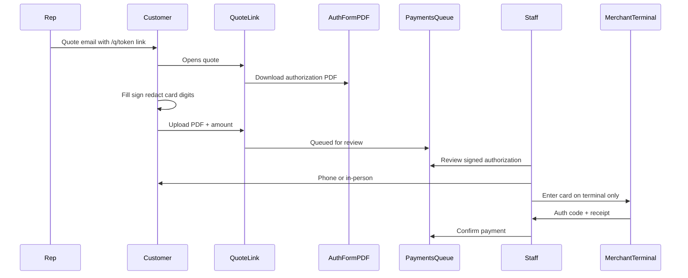

# Feature Spec — Offline Card Payment (Merchant Terminal)

> **Status: Planned — not yet implemented. Revisit before build.**
>
> | Item | Status |
> |------|--------|
> | Compliance & workflow design | ✅ Documented (this file) |
> | DB migration (authorization metadata) | ⏳ Not started |
> | Public quote page — card authorization | ⏳ Not started |
> | `/payments` queue + staff confirm flow | ⏳ Not started |
> | Payment Authorization terms page + PDF form | ⏳ Not started |
> | Stripe Checkout (online card) | ⏳ Separate — see [`invoice-payment.md`](./invoice-payment.md) Phase C |

**Related specs:** [`invoice-payment.md`](./invoice-payment.md) (wire/ACH/Zelle/cash evidence queue, accountant review, production gates)

**Last updated:** 2026-05-24

---

## Overview

BazaarPrinting charges cards on a **physical merchant terminal** at the shop (or over the phone into the terminal). BazarCRM does **not** integrate with Stripe/Square APIs for this flow.

The CRM’s job is to:

1. Capture **customer authorization** to charge (not full card data)
2. Queue the request in **`/payments`** (same as wire/Zelle evidence today)
3. Let staff **confirm** after a successful terminal charge (auth code + receipt)

**Core rule:** Full card numbers and CVV must **never** be stored in Supabase — not in columns, not in Storage, not in ticket notes, not even temporarily.

---

## Business model (confirmed)

| Step | Who | Where |
|------|-----|-------|
| Customer authorizes amount | Customer | Public quote link `/q/[token]` or signed PDF |
| Full card entered | Staff + customer | **Merchant terminal only** |
| Charge processed | Staff | On-premise terminal device |
| Payment recorded | Accountant/admin | `/payments` → Confirm payment |

No payment processor API connection in CRM for this phase.

---

## PCI & legal — what you can and cannot store

| Data | Store in BazarCRM? | Notes |
|------|-------------------|-------|
| **CVV / CVC** | **Never** | PCI DSS — prohibited under all circumstances |
| **Full card number (PAN)** | **No** | Unless fully PCI DSS compliant (not planned) |
| **Scanned PDF/photo with full PAN** | **No** | Still PAN storage in Supabase Storage |
| **Last 4 digits, card brand, expiry** | Yes | Reference for staff verification |
| **Cardholder name, billing ZIP** | Yes | Safe without full PAN |
| **Authorization consent** | Yes (required) | Timestamp, IP, terms version, amount |
| **Terminal auth code / transaction ID** | Yes | Proof charge occurred |
| **Terminal receipt (photo/PDF)** | Yes | Same as wire/Zelle evidence |

**Customer consent is required** before charging — for chargeback protection and card-network rules:

- Checkbox: *“I authorize [BazaarPrinting] to charge $[amount] to my card. Payment will be processed on your secure in-store terminal.”*
- Link to Payment Authorization terms page
- For deposit + balance: consent must cover both amounts (or “up to order total $X”)

> This document is not legal advice. Confirm authorization wording with your merchant services provider.

---

## How staff charges without the card number in the CRM

The authorization in `/payments` is **permission to charge** — not the source of card digits.

### In person (simplest)

1. Customer brings physical card to the shop
2. Staff swipes/taps/inserts on the **terminal** — no typing in CRM
3. Staff uploads terminal receipt and confirms in `/payments`

### Over the phone (remote customer)

1. Staff sees authorization in `/payments` (name, last 4, amount)
2. Staff **calls the customer**
3. Customer reads card number aloud
4. Staff types it **only into the merchant terminal**
5. CVV entered on terminal if prompted — never in CRM
6. Terminal approves → staff enters auth code in CRM → Confirm payment

### After PDF upload (customer visits later)

1. Customer uploaded signed authorization remotely
2. Customer visits with card
3. Staff runs terminal → confirms with auth code

**What staff sees in CRM vs terminal:**

| In `/payments` | On merchant terminal |
|----------------|----------------------|
| Customer name, order ref | — |
| Authorized amount | Charge amount |
| Last 4 (verify correct card) | Full number (card or phone) |
| Signed PDF or digital consent | CVV if required |
| — | Generates auth code + receipt |

---

## Customer authorization options

### Option A — In person at location

Terminal receipt (+ optional paper authorization). CRM stores receipt and auth code only.

### Option B — Over the phone (MOTO)

Verbal card entry into terminal only. Best practice: get written/digital authorization **before** the call (Option C or D).

### Option C — Online authorization on quote link (recommended remote path)

Customer submits on `/q/[token]`:

| Field | Purpose |
|-------|---------|
| Cardholder name | Match card on terminal |
| Last 4 digits | Staff verification |
| Billing ZIP | AVS reference |
| Authorized amount | Deposit or balance due |
| Consent checkbox | Legal authorization |
| Link to terms | Full disclosure |

→ Queues in `/payments` → staff calls or waits for visit → terminal charge → confirm.

### Option D — Signed PDF authorization form (send, fill, return)

For customers who prefer a formal signed document.

**PCI rule for returned PDFs:**

| Return method | Full card on document? | CRM stores PDF? |
|---------------|------------------------|-----------------|
| Upload on quote link | Only if **redacted** (last 4 visible) | Yes — `payment-evidence` bucket |
| Email to `payments@` | Possible briefly in email | No — keep out of Supabase |
| Hand-delivered paper | Full number on paper OK | No — file physically in office |
| Upload unredacted scan | Full number visible | **Do not allow** |

**CVV must never** appear on PDF, email, or uploads.

#### PDF flow (CRM-integrated)



1. **Send** — Quote link includes “Download Card Authorization Form (PDF)”
2. **Fill** — Name, reference, amounts, signature, date, last 4 (full number only on paper if hand-delivered)
3. **Return** — Upload redacted scan on quote page + amount
4. **Queue** — `POST /api/public/quotes/[token]/submit-payment` with `method=card`
5. **Charge** — Staff uses terminal (phone or in person)
6. **Confirm** — Auth code + terminal receipt → `record_payment`
7. **Retain** — Redacted PDF + receipt in CRM; original paper in filing cabinet

**Offer both Option C and D** on the quote page: authorize online **or** download PDF, sign, upload.

---

## What is NOT acceptable

| Method | Problem |
|--------|---------|
| Full card + CVV on quote page → DB | PCI violation |
| Email/text card number to rep | PAN in email = breach liability |
| Card number in ticket notes | PAN storage |
| Photo of credit card uploaded | PAN in Storage |
| “Delete after charging” | In scope while stored; CVV never allowed |

---

## Legal documents checklist (owner action)

| Document | Owner | Location |
|----------|-------|----------|
| Payment Authorization Terms (web) | Owner + processor review | `/payment-authorization` |
| Digital consent record | Auto on submit | `job_tickets` columns |
| Card Authorization Form PDF | Template from merchant bank | `public/forms/card-authorization-form.pdf` |
| Terminal receipt | Merchant device | `payment-evidence` bucket |
| Privacy policy note | Owner | Website — authorization metadata only |

Before launch, confirm with merchant processor:

1. MOTO / card-not-present allowed on your terminal
2. Authorization form wording matches processor requirements
3. Chargeback retention (180+ days): terminal receipts + CRM authorization

---

## Current codebase (why card is blocked today)

Public page explicitly excludes card from evidence upload:

```tsx
// app/(public)/q/[token]/page.tsx
const EVIDENCE_CHANNELS = new Set(["wire", "ach", "zelle", "check"]);
// Card → CardContactPanel only (“contact us”) — no submit
```

- API lists `card` in `EVIDENCE_REQUIRED_CHANNELS` but UI never sends it
- Existing **`/payments`** queue + `record_payment` is the right shell to extend

**Key files today:**

| File | Role |
|------|------|
| `app/(public)/q/[token]/page.tsx` | Public pay modal — card blocked |
| `app/api/public/quotes/[token]/submit-payment/route.ts` | Customer payment submission |
| `app/api/payments/pending/route.ts` | Accountant queue |
| `components/orders/payments-page.tsx` | Payments list |
| `components/orders/payment-detail-overview.tsx` | Confirm payment UI |
| `app/api/tickets/[id]/route.ts` | `record_payment` handler |

---

## Implementation plan (when ready to build)

### Phase 1 — Database

Migration on `job_tickets`:

- `payment_cardholder_name` — text
- `payment_card_last4` — text (4 chars)
- `payment_card_brand` — text (optional)
- `payment_card_exp_month` / `payment_card_exp_year` — smallint (optional)
- `payment_billing_zip` — text
- `payment_authorization_accepted_at` — timestamptz
- `payment_authorization_ip` — text
- `payment_authorization_version` — text (e.g. `"2026-05-24-v1"`)
- `payment_terminal_auth_code` — text (staff on confirm)
- `payment_terminal_reference` — text (optional)

Reuse: `payment_evidence_url`, `payment_evidence_amount`, `payment_method_used = 'card'`.

**Do not add** PAN, CVV, or encrypted card columns.

### Phase 2 — Public quote page

Replace `CardContactPanel` with dual path:

- **Path 1:** Online authorization (name, last 4, ZIP, amount, consent)
- **Path 2:** Download PDF → upload redacted signed scan + amount

Both submit via `submit-payment` → `/payments` queue.

### Phase 3 — API

Extend `POST /api/public/quotes/[token]/submit-payment`:

- `method === "card"`: online fields + consent **or** PDF upload + amount
- Reject PAN/CVV fields server-side (regex)
- Set evidence + metadata; do **not** set `payment_amount_received`

### Phase 4 — Payments UI

- Pending API: include card metadata
- List: “Card · ending 4242 · $X authorized”
- Detail: staff instructions panel — *“Charge $X on merchant terminal. Call customer or wait for in-person visit. Enter auth code below.”*
- Confirm: require `terminal_auth_code` for card; optional receipt upload

### Phase 5 — Terms + PDF

- `app/(public)/payment-authorization/page.tsx` — static terms
- `public/forms/card-authorization-form.pdf` — owner-supplied template
- Link from consent checkbox and quote page

### Phase 6 — Docs & labels

- Cross-link from `invoice-payment.md` (Phase C-alt vs Stripe Phase C)
- Rename `"Card on File (Square)"` → `"Card (in-store terminal)"` in `compute-checkout.ts`

---

## What NOT to build

- Full card number / CVV fields in CRM (customer or staff)
- Copy-card-from-CRM-to-terminal workflow
- Stripe/Square API for this offline flow
- Unredacted full-PAN PDF upload

---

## Testing checklist

- [ ] Card authorization submits → appears in `/payments` without marking paid
- [ ] Server rejects PAN/CVV in request body
- [ ] PDF upload path queues correctly
- [ ] Confirm with auth code updates `payment_amount_received`
- [ ] Production gates + confirmation email unchanged
- [ ] Consent timestamp + terms version stored
- [ ] `bazaar:refresh-counts` after confirm

---

## Future options

| Option | When | Spec |
|--------|------|------|
| **Stripe Checkout** | Customer pays online; card never in DB | `invoice-payment.md` Phase C |
| **Square terminal API** | Sync charges from terminal to CRM | New spec if needed |

---

## Open questions (revisit before build)

1. Final PDF template wording — get from merchant bank
2. Is phone MOTO allowed on your terminal account?
3. Require terminal auth code on every card confirm, or optional?
4. Attach PDF to quote email on Send Quote, or link only?
5. Deposit + balance: one authorization or separate submissions?

---

## Revision history

| Date | Change |
|------|--------|
| 2026-05-24 | Initial plan — offline terminal card authorization, PCI constraints, PDF + online paths, staff workflow |
