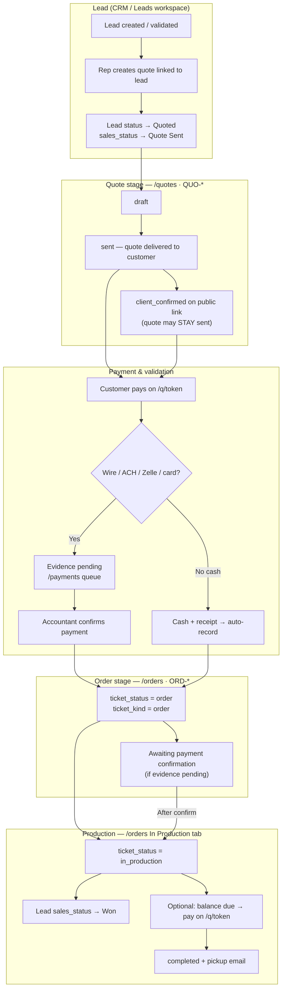
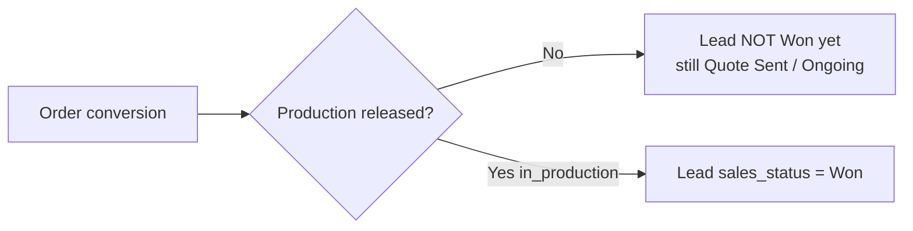
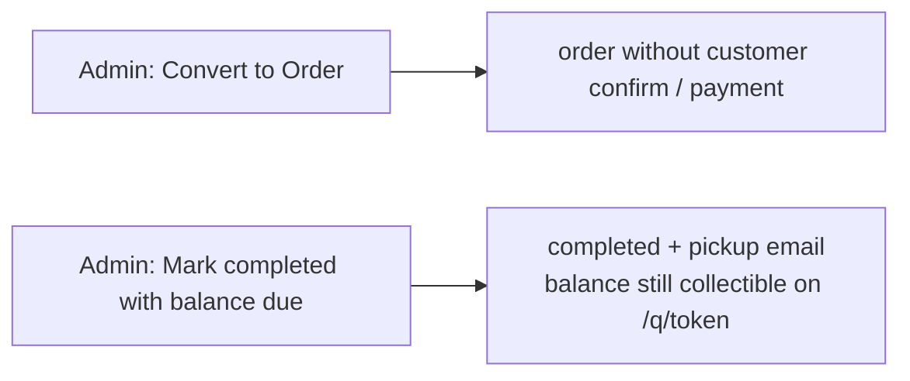

# Lead → Quote → Order → In Production — Full Flow

> **As built in BazarCRM (May 2026)** — matches `maybe-convert-quote-to-order.ts`, `maybe-auto-release-production.ts`, and public `/q/{token}` portal.

Use this when explaining the lifecycle to the team. For API details see `docs/feature-specs/tickets.md` and `docs/feature-specs/invoice-payment.md`.

---

## 1. Bird’s-eye view



---

## 2. Detailed flow (like the whiteboard sketch)

This mirrors the hand-drawn **Quote Sent → confirm → pay → Order → In Production** logic.

```mermaid
flowchart TD
  START([Rep sends quote]) --> SENT["Quote Sent<br/>Status: sent · QUO-*<br/>Page: /quotes"]

  SENT --> CONFREQ{Require client<br/>confirmation?}

  CONFREQ -->|No| PRICEOK["Price gate open<br/>Step 1: Not required"]
  CONFREQ -->|Yes| CONFWAIT["Public /q/token<br/>Step 1: Confirm quote price"]

  CONFWAIT --> CONFCLICK{Customer clicked<br/>Confirm & Accept?}
  CONFCLICK -->|Not yet| CONFWAIT
  CONFCLICK -->|Yes| CONFYES["client_confirmed = true<br/>Tag: Confirmed — awaiting deposit<br/>Still on /quotes until payment"]

  CONFYES --> STRAT
  PRICEOK --> STRAT

  STRAT{Payment strategy?}

  STRAT -->|Full payment| FULL
  STRAT -->|Partial deposit| PART
  STRAT -->|Net terms| NET

  FULL --> PAYFULL["Customer pays full amount<br/>on /q/token"]
  PART --> PAYDEP["Customer pays deposit<br/>on /q/token"]
  NET --> NETGATE{Price gate OK?}

  NETGATE -->|Yes| NETCONV["Convert + may auto-release<br/>no upfront payment"]

  PAYFULL --> PAYMETHOD
  PAYDEP --> PAYMETHOD

  PAYMETHOD{Payment channel?}

  PAYMETHOD -->|Cash + receipt ID| CASH["Payment recorded immediately"]
  PAYMETHOD -->|Wire / ACH / Zelle / card| EVID["Evidence uploaded<br/>NOT paid yet"]

  EVID --> EVIDPEND["Awaiting payment confirmation<br/>/payments + /orders for owner"]
  EVIDPEND --> ACCT{Accountant<br/>confirms?}
  ACCT -->|No| EVIDPEND
  ACCT -->|Yes| PAIDRECORD["Payment recorded<br/>Email: payment confirmed"]

  CASH --> GATES
  PAIDRECORD --> GATES

  GATES{Convert gates met?<br/>payment + confirm if required}

  GATES -->|No| SENT
  GATES -->|Yes| ORDER["ORDER<br/>ticket_status = order · ORD-*<br/>Page: /orders"]

  NETCONV --> PRODCHK

  ORDER --> PRODCHK{Production gates met?<br/>price + deposit/full or net}

  PRODCHK -->|No — partial paid, balance due| ORDERPART["Order stays pending payment<br/>Deposit paid · balance later"]
  PRODCHK -->|Yes| INPROD["IN PRODUCTION<br/>ticket_status = in_production<br/>Page: /orders · In Production"]

  ORDERPART --> INPRODPART["May enter production<br/>after deposit confirmed"]

  INPRODPART --> INPROD
  INPROD --> WON["Linked lead → sales_status Won<br/>(SDR Won tab / dashboard)"]

  INPROD --> BAL{balance<br/>remaining?}
  BAL -->|Yes| BALPAY["Customer pays balance on /q/token<br/>Same evidence → accountant flow"]
  BALPAY --> BALDONE[Paid in full on portal]
  BAL -->|No| BALDONE

  BALDONE --> COMPLETE{Staff marks<br/>completed?}
  COMPLETE -->|Accountant| COMPPAID{Paid in full?}
  COMPPAID -->|No| INPROD
  COMPPAID -->|Yes| DONE["completed<br/>Pickup email · same /q/token"]
  COMPLETE -->|Admin + balance due| ADMODAL["Acknowledge balance modal"]
  ADMODAL --> DONE

  classDef outcome fill:#FEF9C3,stroke:#CA8A04,color:#713F12
  classDef queue fill:#FFFBEB,stroke:#D97706,color:#92400E
  classDef page fill:#EAF0FB,stroke:#1B2B4B,color:#1B2B4B

  class ORDER,INPROD,DONE outcome
  class EVIDPEND,EVID queue
  class SENT,CONFYES page
```



---

## 3. CRM pages at each stage

| Stage | Ticket status | Reference | Primary CRM page | Customer public page |
|-------|---------------|-----------|------------------|----------------------|
| Quote draft | `draft` | QUO-* | `/quotes` | — |
| Quote sent | `sent` | QUO-* | `/quotes` | `/q/{token}` — confirm + pay |
| Confirmed, awaiting pay | `sent` + `client_confirmed` | QUO-* | `/quotes` (badge: Confirmed — awaiting deposit) | `/q/{token}` |
| Payment under review | `sent` or `order` + evidence | QUO-* or ORD-* | `/payments` (accountant) + `/orders` (owner: Awaiting payment confirmation) | `/q/{token}` — under review |
| Order | `order` | ORD-* | `/orders` · Pending Payment | `/q/{token}` |
| In production | `in_production` | ORD-* | `/orders` · In Production | `/q/{token}` — pay balance if partial |
| Completed | `completed` | ORD-* | `/completed` | `/q/{token}` — ready for pickup |

---

## 4. What does **not** convert to order

| Action alone | Converts to order? |
|--------------|-------------------|
| Customer confirms on public link | **No** (sets `client_confirmed` only; quote stays on `/quotes`) |
| Customer uploads wire evidence | **No** (queues for accountant; stays quote until confirmed payment) |
| SDR/Sales **Convert to Order** button | **No** — hidden; **admin only** |
| Net terms + customer confirm (if gates pass) | **Yes** — exception: may convert + auto-release on confirm |
| Accountant **record_payment** / cash auto-record | **Yes** — when payment + confirm gates pass |
| Admin manual convert | **Yes** — override (may show Admin converted banner) |

---

## 5. Lead **Won** timing



Won is **not** set when the ticket becomes `order`. Won is set only when `production_released_at` is set (`markLeadWonOnProduction`).

---

## 6. Admin exceptions (dashed paths)



Owner policy for complete-with-balance: **TODO-009** / open-questions **B7**.

---

## 7. ASCII quick reference (print-friendly)

```
LEAD ──create quote──► QUO sent (/quotes)
                          │
              ┌───────────┴───────────┐
              │ Require confirm?    │
              └───────────┬───────────┘
                    yes │ no
                        ▼
              client_confirmed (may stay QUO sent)
                        │
                        ▼
              Customer pays /q/{token}
                        │
         ┌──────────────┼──────────────┐
         │ cash+receipt │ wire/ach/…   │
         └──────┬───────┴──────┬───────┘
                │              │
           auto-record    evidence pending
                │              │
                │         /payments queue
                │              │
                └──────┬───────┘
                       ▼
              accountant confirm (if evidence)
                       │
                       ▼
              ORD order (/orders)  ◄── quote-until-payment ends here
                       │
                       ▼
              in_production (/orders tab)
                       │
                       ▼
              lead → Won
                       │
              optional balance → /q/{token} again
                       │
                       ▼
              completed (+ pickup email)
```
