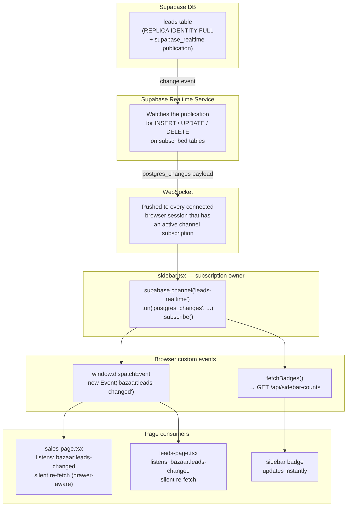

# Realtime Live Updates — Pattern Guide

How BazaarPrinting CRM implements instant UI updates without polling.
Follow this guide when adding Realtime to any new entity (orders, customers, tickets, etc.).

---

## How It Works — Full Architecture



---

## End-to-End Flow (Example: SDR routes a lead)

```
1. SDR clicks "Route to Sales"
   → PATCH /api/leads/[id] updates leads.status to "Routed to Sales"
   → DB write completes in Supabase

2. Supabase Realtime detects the UPDATE on the leads table
   → Broadcasts an event over WebSocket to every browser with an active subscription

3. sidebar.tsx receives the event (≈100–300ms after the DB write)
   → Calls fetchBadges()   → /api/sidebar-counts returns updated counts
   → Sidebar badge on /sales increments for all Sales reps instantly
   → Dispatches window event "bazaar:leads-changed"

4. sales-page.tsx hears "bazaar:leads-changed"
   → Drawer is closed: silent fetch → new lead appears in the table
   → Drawer is open: pendingLeadsRefresh.current = true (deferred)

5. leads-page.tsx hears "bazaar:leads-changed"
   → Drawer is closed: silent fetch → lead disappears from "Pending" tab
   → Drawer is open: skipped
```

Total time from DB write to badge update: **~100–500ms** over a normal connection.

---

## Layer 1 — Database Migration

Every table you want to subscribe to needs two things:

### 1a. `REPLICA IDENTITY FULL`

By default, Postgres only includes the primary key in UPDATE and DELETE WAL events.
`REPLICA IDENTITY FULL` tells Postgres to include the entire old row, which Supabase Realtime
needs to send complete payloads for UPDATE and DELETE events.

```sql
ALTER TABLE public.your_table REPLICA IDENTITY FULL;
```

> Without this, UPDATE and DELETE events will only contain the PK in the `old` record.
> INSERT events always include the full new row regardless of REPLICA IDENTITY setting.

### 1b. Add to the `supabase_realtime` publication

Supabase Realtime only broadcasts tables that are part of the `supabase_realtime` publication.

```sql
ALTER PUBLICATION supabase_realtime ADD TABLE public.your_table;
```

> **Important:** Also enable the Realtime toggle in the Supabase Dashboard:
> Table Editor → your_table → Realtime: ON
> The SQL migration handles the publication, but the dashboard toggle is also required.

### Full migration example

```sql
-- Enable Supabase Realtime on the orders table
ALTER TABLE public.orders REPLICA IDENTITY FULL;
ALTER PUBLICATION supabase_realtime ADD TABLE public.orders;
```

---

## Layer 2 — Subscription (sidebar.tsx)

The sidebar owns all Realtime subscriptions. One channel per table. The channel:
1. Fires `fetchBadges()` to update sidebar counts
2. Dispatches a custom browser event so any page on screen can react

```typescript
// components/sidebar.tsx — inside the badge useEffect

const supabase = createClient(); // browser client

// One channel = one subscription = one WebSocket message stream
const channel = supabase
  .channel("leads-realtime")           // unique channel name — use table name
  .on(
    "postgres_changes",
    {
      event: "*",                       // INSERT | UPDATE | DELETE | *
      schema: "public",
      table: "leads",                   // the table to watch
    },
    () => {
      fetchBadges();                    // update sidebar badge counts
      window.dispatchEvent(new Event("bazaar:leads-changed")); // signal pages
    }
  )
  .subscribe();

// Always clean up on unmount to avoid WebSocket leaks
return () => {
  supabase.removeChannel(channel);
};
```

### Adding a second table (e.g. orders)

Add a second `.on()` call to the same `useEffect`, OR create a second channel:

```typescript
const ordersChannel = supabase
  .channel("orders-realtime")
  .on("postgres_changes", { event: "*", schema: "public", table: "orders" }, () => {
    fetchBadges();
    window.dispatchEvent(new Event("bazaar:orders-changed"));
  })
  .subscribe();

return () => {
  supabase.removeChannel(channel);
  supabase.removeChannel(ordersChannel);
};
```

---

## Layer 3 — Page Consumer

Any page that shows data from the subscribed table listens for the custom browser event
and does a **silent re-fetch** — no loading skeleton, data swaps in place.

### Pattern A — Simple (no drawer)

```typescript
useEffect(() => {
  function onOrdersChanged() {
    // Inline fetch — don't call the main fetchOrders() that sets loading=true
    fetch("/api/orders")
      .then((r) => r.json())
      .then((d) => { setOrders(d.orders ?? []); })
      .catch(() => {});
  }
  window.addEventListener("bazaar:orders-changed", onOrdersChanged);
  return () => window.removeEventListener("bazaar:orders-changed", onOrdersChanged);
}, []);
```

### Pattern B — Drawer-aware (skip refresh if user is actively editing)

Use this when the page has a drawer or modal where the user can edit data.
Refreshing the table while the drawer is open would be disorienting.

```typescript
const pendingRefresh = useRef(false);

// Listen for changes
useEffect(() => {
  function onOrdersChanged() {
    if (drawerOrder) {
      // Drawer is open — mark pending, don't refresh yet
      pendingRefresh.current = true;
    } else {
      // Silent re-fetch
      fetch("/api/orders")
        .then((r) => r.json())
        .then((d) => { setOrders(d.orders ?? []); })
        .catch(() => {});
    }
  }
  window.addEventListener("bazaar:orders-changed", onOrdersChanged);
  return () => window.removeEventListener("bazaar:orders-changed", onOrdersChanged);
}, [drawerOrder]); // re-register when drawerOrder changes

// In drawer onClose — flush deferred refresh
function handleDrawerClose() {
  setDrawerOrder(null);
  if (pendingRefresh.current) {
    pendingRefresh.current = false;
    fetchOrders(); // full re-fetch now that drawer is closed
  }
}
```

---

## Sidebar Badge Integration

If the new entity needs a sidebar count badge, add it to `app/api/sidebar-counts/route.ts`:

```typescript
// Example: /orders badge — count of orders in "Processing" status
roleName === "sales" || roleName === "admin"
  ? admin
      .from("orders")
      .select("*", { count: "exact", head: true })
      .eq("status", "Processing")
      .then(({ count }) => { counts["/orders"] = count ?? 0; })
  : Promise.resolve(),
```

The sidebar already renders `badge={badgeCounts[page.route]}` on every nav item —
no changes needed to the sidebar UI itself.

---

## Step-by-Step Checklist for a New Entity

When adding Realtime to a new entity (copy this list):

```
[ ] 1. Create migration NNN_enable_ENTITY_realtime.sql:
       ALTER TABLE public.ENTITY REPLICA IDENTITY FULL;
       ALTER PUBLICATION supabase_realtime ADD TABLE public.ENTITY;

[ ] 2. Enable Realtime toggle in Supabase Dashboard for the ENTITY table.

[ ] 3. Add count query to app/api/sidebar-counts/route.ts for the /ENTITY route
       (if the entity needs a sidebar badge count).

[ ] 4. In sidebar.tsx — add a new Supabase channel inside the badge useEffect:
       const entityChannel = supabase
         .channel("ENTITY-realtime")
         .on("postgres_changes", { event: "*", schema: "public", table: "ENTITY" }, () => {
           fetchBadges();
           window.dispatchEvent(new Event("bazaar:ENTITY-changed"));
         })
         .subscribe();
       Add cleanup: supabase.removeChannel(entityChannel);

[ ] 5. In the entity list page — add a bazaar:ENTITY-changed listener:
       - Use Pattern A (simple) if no drawer
       - Use Pattern B (drawer-aware) if the page has a drawer/modal

[ ] 6. Update docs/CHANGELOG.md with all changed files.

[ ] 7. Update docs/realtime-live-updates.md if the pattern evolved.
```

---

## Supabase Free Tier Limits

As of 2026, the Supabase free tier includes:

| Limit | Value |
|-------|-------|
| Concurrent Realtime connections | 200 |
| Messages per second | 100 |
| Max message size | 1 MB |

For BazaarPrinting CRM's current scale (< 20 concurrent users), these limits are not a concern.
If the app scales to hundreds of concurrent users, consider upgrading to the Pro plan.

---

## Gotchas and Rules

### Always call `removeChannel` on unmount
Failing to clean up leaves an open WebSocket subscription. Each re-mount creates a new one.
Over time this exhausts the connection limit.

```typescript
return () => {
  supabase.removeChannel(channel); // always — no exceptions
};
```

### One channel per table, not per component
If multiple components subscribe to the same table, each creates its own WebSocket stream.
Instead, one component (the sidebar) owns the subscription and dispatches browser events
that other components listen to.

### `REPLICA IDENTITY FULL` is required for UPDATE/DELETE payloads
Without it, Supabase only sends `{ old: { id: "..." } }` for UPDATE/DELETE — no field values.
If you only need INSERT events, this is optional. For UPDATE/DELETE, always set FULL.

### Filter at the Realtime level when possible (advanced)
For high-traffic tables, you can filter which rows trigger events client-side:
```typescript
.on("postgres_changes", {
  event: "INSERT",
  schema: "public",
  table: "leads",
  filter: "status=eq.Routed to Sales",  // only fire for this status
}, handler)
```
This reduces noise but requires knowing the exact filter at subscription time.
For BazaarPrinting CRM, subscribing to all events (`event: "*"`, no filter) is fine.

### Silent re-fetch pattern — don't call `setLoading(true)`
When the Realtime event triggers a re-fetch, bypass the loading skeleton:
```typescript
// ✅ Silent — no skeleton flash
fetch("/api/leads/workspace")
  .then(r => r.json())
  .then(d => { setLeads(d.leads ?? []); });

// ❌ Shows skeleton while re-fetching — jarring for the user
fetchLeads(); // calls setLoading(true) internally
```

---

## Existing Implementations to Reference

| Entity | Migration | Subscription | Badge API | Page Consumer(s) |
|--------|-----------|-------------|-----------|-----------------|
| `leads` | `035_enable_leads_realtime.sql` | `sidebar.tsx` → `"leads-realtime"` channel | `sidebar-counts/route.ts` | `sales-page.tsx`, `leads-page.tsx` |
| `activities` | `036_enable_activities_realtime.sql` | `sidebar.tsx` → `"activities-realtime"` channel | — | `activity-log-section.tsx` |
