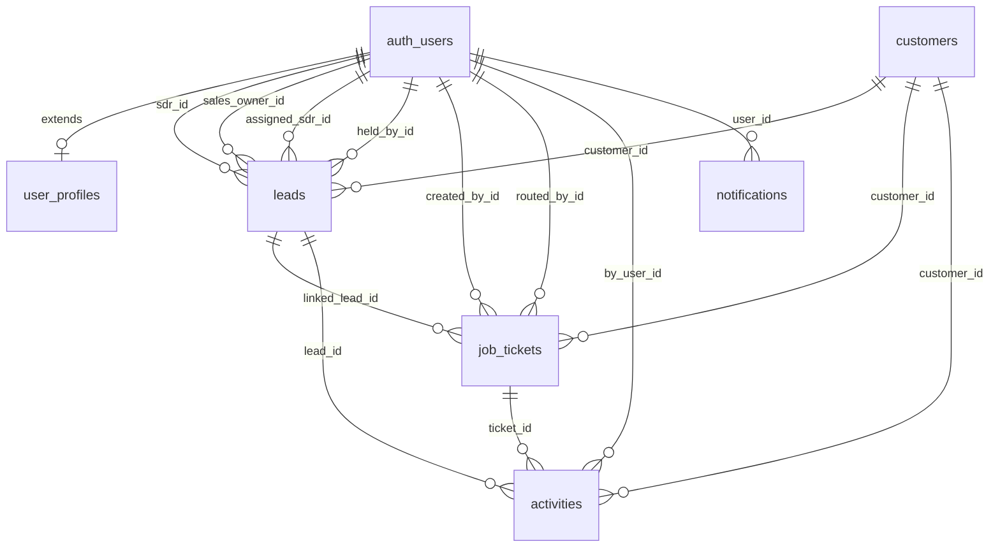

# BazarCRM — Database Schema

Supabase Postgres. All tables are in the `public` schema unless noted. Supabase Auth handles `auth.users`; we extend it with `user_profiles`.

> **Setup:** All DDL is consolidated in **`supabase/schema.sql`** (fresh projects only). Inline references to `migration NNN` below describe when columns were added historically — see [Database setup](#database-setup-supabaseschemasql) at the bottom.

---

## Entity Relationship Diagram



---

## Tables

### `roles`

Admin-manageable roles. Three system roles are seeded and cannot be deleted. Additional custom roles can be created by Admin.

| Column | Type | Notes |
|--------|------|-------|
| `id` | `uuid` PK | |
| `name` | `text` NOT NULL UNIQUE | Slug, e.g. `'sdr'`, `'sales'`, `'admin'`, `'manager'` |
| `display_name` | `text` NOT NULL | Human label, e.g. `'SDR'`, `'Sales Rep'`, `'Administrator'` |
| `is_system` | `boolean` DEFAULT `false` | System roles cannot be deleted or renamed |
| `created_at` | `timestamptz` DEFAULT `now()` | |

```sql
create table public.roles (
  id            uuid        primary key default gen_random_uuid(),
  name          text        not null unique,
  display_name  text        not null,
  is_system     boolean     not null default false,
  created_at    timestamptz not null default now()
);
```

**System roles (seeded in `011_seed_system_roles.sql`):**

| `name` | `display_name` | `is_system` |
|--------|---------------|-------------|
| `sdr` | SDR | true |
| `sales` | Sales Rep | true |
| `admin` | Administrator | true |

---

### `pages`

Registry of all navigable pages in the app. New pages are added here when built. Admin can assign page access to any role via `role_permissions`.

| Column | Type | Notes |
|--------|------|-------|
| `id` | `uuid` PK | |
| `route` | `text` NOT NULL UNIQUE | e.g. `'/leads'`, `'/crm'`, `'/admin/users'` |
| `display_name` | `text` NOT NULL | e.g. `'Leads (SDR)'`, `'CRM'` |
| `icon` | `text` | Lucide icon name, e.g. `'Inbox'`, `'BookUser'` |
| `section` | `text` | Sidebar section label: `'main'` \| `'admin'` \| `'bottom'` |
| `sort_order` | `int` DEFAULT `0` | Display order in sidebar |
| `created_at` | `timestamptz` DEFAULT `now()` | |

```sql
create table public.pages (
  id            uuid        primary key default gen_random_uuid(),
  route         text        not null unique,
  display_name  text        not null,
  icon          text,
  section       text        not null default 'main',
  sort_order    int         not null default 0,
  created_at    timestamptz not null default now()
);
```

**Seeded pages (`012_seed_pages.sql`):**

| `route` | `display_name` | `icon` | `section` | `sort_order` |
|---------|---------------|--------|-----------|-------------|
| `/dashboard` | Dashboard | `LayoutDashboard` | main | 0 |
| `/leads` | Leads | `Inbox` | main | 1 |
| `/sales` | Sales Pipeline | `Briefcase` | main | 2 |
| `/crm` | CRM | `BookUser` | main | 3 |
| `/quotes` | Quoted Requests | `MessageSquareQuote` | main | 5 |
| `/orders` | Orders | `ClipboardList` | main | 6 |
| ~~`/statistics`~~ | ~~Statistics~~ | ~~`BarChart3`~~ | ~~main~~ | — | Removed — Dashboard handles all analytics |
| `/settings` | Settings | `Settings` | bottom | 0 |
| `/admin/users` | Users | `Users` | admin | 0 |
| `/admin/settings` | System Settings | `SlidersHorizontal` | admin | 1 |
| `/admin/audit` | Audit Log | `ClipboardList` | admin | 2 |

---

### `role_permissions`

Many-to-many junction: which roles can access which pages.

| Column | Type | Notes |
|--------|------|-------|
| `role_id` | `uuid` FK → `roles` ON DELETE CASCADE PK | |
| `page_id` | `uuid` FK → `pages` ON DELETE CASCADE PK | |

```sql
create table public.role_permissions (
  role_id   uuid  not null references public.roles(id) on delete cascade,
  page_id   uuid  not null references public.pages(id) on delete cascade,
  primary key (role_id, page_id)
);
```

**Seeded default permissions (`013_seed_role_permissions.sql`):**

| Role | Allowed pages |
|------|--------------|
| `sdr` | /dashboard, /leads, /crm, /quotes, /orders, /completed |
| `sales` | /dashboard, /sales, /crm, /quotes, /orders, /settings |
| `admin` | All pages |

When Admin grants `/sales` access to a custom `'manager'` role, a new row is inserted here.

---

### `user_profiles`

Extends `auth.users` with app-level role reference and display info.

| Column | Type | Notes |
|--------|------|-------|
| `id` | `uuid` PK | References `auth.users(id)` ON DELETE CASCADE |
| `role_id` | `uuid` FK → `roles` NOT NULL | The user's assigned role |
| `full_name` | `text` | Display name |
| `avatar_url` | `text` | Optional profile image |
| `is_active` | `boolean` DEFAULT `true` | Soft-disable without deleting auth user |
| `must_change_password` | `boolean` DEFAULT `false` | Force password change on next login (set when Admin creates user with temp password) |
| `created_at` | `timestamptz` DEFAULT `now()` | |
| `updated_at` | `timestamptz` DEFAULT `now()` | |

```sql
create table public.user_profiles (
  id                    uuid        primary key references auth.users(id) on delete cascade,
  role_id               uuid        not null references public.roles(id),
  full_name             text,
  avatar_url            text,
  is_active             boolean     not null default true,
  must_change_password  boolean     not null default false,
  created_at            timestamptz not null default now(),
  updated_at            timestamptz not null default now()
);
```

**Convenience view** (used throughout the app to avoid constant joins):

```sql
create or replace view public.user_profiles_with_role as
  select
    up.*,
    r.name        as role_name,
    r.display_name as role_display_name,
    r.is_system   as role_is_system
  from public.user_profiles up
  join public.roles r on r.id = up.role_id;
```

---

### `customers`

Customer profiles. A customer is created when a lead is first added and the SDR chooses to save the contact info. **Multiple customer records can share the same phone number or email** — this is intentional. When the same phone appears again, the SDR is shown all matching profiles and picks which one to link.

**CRM page visibility:** A customer appears in the CRM contact list if at least one of the following is true:
- A linked lead has been routed to Sales (`status = 'Routed'` or `sales_status IS NOT NULL`), OR
- The customer has at least one `job_tickets` record (created via the New Quote form or quote detail page)

Customers whose leads are still Pending/On Hold/Rejected and who have no tickets are not shown in CRM.

| Column | Type | Notes |
|--------|------|-------|
| `id` | `uuid` PK | `gen_random_uuid()` |
| `first_name` | `text` | |
| `last_name` | `text` | |
| `email` | `text` | **No unique constraint** — multiple profiles may share an email |
| `phone` | `text` | **Digits only** (e.g. `8585552277`). **No unique constraint** — multiple profiles may share a phone |
| `company` | `text` | |
| `industry` | `text` | |
| `website` | `text` | Optional URL; validated/normalized via `lib/utils/website.ts` on lead create, customer PATCH, `POST /api/customers`, and `POST /api/tickets` customer upsert. User may enter without `http(s)://`; stored with `https://` prefix when omitted. |
| `authority` | `text` | Decision maker for this customer (`'yes'` \| `'no'` \| `null`) |
| `heat_tag` | `text` | `'hot'` \| `'warm'` \| `'cold'` \| `null` |
| `created_at` | `timestamptz` DEFAULT `now()` | |
| `updated_at` | `timestamptz` DEFAULT `now()` | |

```sql
create table public.customers (
  id          uuid        primary key default gen_random_uuid(),
  first_name  text,
  last_name   text,
  email       text,
  phone       text,
  company     text,
  industry    text,
  website     text,
  authority   text,
  heat_tag    text        check (heat_tag in ('hot', 'warm', 'cold')),
  created_at  timestamptz not null default now(),
  updated_at  timestamptz not null default now()
);
```

**Why no unique constraints on phone/email?**
A phone number can belong to different people at different times (e.g. a business's main line used by multiple contacts), and the same email can appear under different company relationships. The SDR decides which profile to associate — the system never auto-merges.

---

### Customer lookup deduplication rules

When SDR enters a phone number in the Add Lead modal:
1. Look up `SELECT * FROM customers WHERE phone = $1` (exact match, digits-only)
2. If results found → show **"Existing Customer" modal** (see `feature-specs/leads-sdr.md`)
3. If no phone match AND email is filled → `SELECT * FROM customers WHERE email = $1`
4. If still no match → SDR fills form fresh; on submit a new customer is created

---

### `leads`

Core lead record. A lead starts in the inbox (`is_inbox = true`) and moves to the workspace after verify. Multiple leads can share a `contact_id` (same person, multiple inquiries).

| Column | Type | Notes |
|--------|------|-------|
| `id` | `uuid` PK | |
| `customer_id` | `uuid` FK → `customers` | Linked customer profile; set when SDR chooses a customer during lead add or on first action |
| `source` | `text` | e.g. `'Website'`, `'Google'`, `'Walk-in'` |
| `brand` | `text` | |
| `authority` | `text` | **Deprecated** — use `customers.authority`; column retained for legacy rows |
| `status` | `text` NOT NULL | SDR lifecycle — see Status Enums |
| `sales_status` | `text` | Sales pipeline — see Status Enums |
| `is_inbox` | `boolean` DEFAULT `true` | `true` = AI inbox; `false` = workspace |
| `sdr_id` | `uuid` FK → `auth.users` | SDR who verified/created the lead |
| `assigned_sdr_id` | `uuid` FK → `auth.users` | Inbox assignment (future feature; nullable) |
| `sales_owner_id` | `uuid` FK → `auth.users` | Sales rep who claimed the lead |
| `interests` | `jsonb` DEFAULT `'{}'` | Map of product interest flags (`{ "Labels": true, "Boxes": true }`) |
| `quantities` | `jsonb` DEFAULT `'{}'` | Map of product quantity strings (`{ "Labels": "500", "Boxes": "200" }`) |
| `has_design` | `jsonb` DEFAULT `'{}'` | Map of per-product design flags (`{ "Labels": true, "Boxes": false }`) |
| `quote_total` | `numeric` | Last quoted amount |
| `quote_channel` | `text` | `'SMS'` \| `'WhatsApp'` \| `'Email'` \| `'In-person'` |
| `quote_destination` | `text` | **Digits only** for SMS/WhatsApp; email address for Email channel |
| `hold_reason` | `text` | Reason selected when putting on hold |
| `hold_notes` | `text` | Free-text notes |
| `hold_until` | `timestamptz` | Scheduled resume date |
| `held_at` | `timestamptz` | Timestamp when hold was set |
| `held_by_id` | `uuid` FK → `auth.users` | User who set the hold |
| `prev_status` | `text` | Status snapshot — set on **hold** (to restore on resume) and on **reject** (to identify pipeline origin: `"Routed to Sales"` = rejected from sales pipeline) |
| `prev_sales_status` | `text` | Sales status snapshot before hold |
| `rejection_reason` | `text` | Reason selected on reject |
| `urgency` | `text` | `'High'` \| `'Medium'` \| `'Low'` \| `null` — how urgently the client needs the product |
| `is_returning_customer` | `boolean` DEFAULT `false` | Existing / returning client flag |
| `sdr_comment` | `text` | SDR verification notes ("Verify Lead Comment") — internal, not visible to client |
| `rejection_notes` | `text` | Free-text |
| `sales_notes` | `text` | Internal notes entered by Sales reps (not visible to SDRs) |
| `locked_by_id` | `uuid` FK → `auth.users` | User currently working this lead (drawer open) |
| `locked_at` | `timestamptz` | Timestamp when lock was acquired |
| `created_at` | `timestamptz` NOT NULL DEFAULT `now()` | **Immutable** — never patched |
| `updated_at` | `timestamptz` DEFAULT `now()` | |

```sql
create table public.leads (
  id                uuid        primary key default gen_random_uuid(),
  customer_id       uuid        references public.customers(id),
  source            text,
  brand             text,
  authority         text,
  status            text        not null default 'Pending',
  sales_status      text,
  is_inbox          boolean     not null default true,
  sdr_id            uuid        references auth.users(id),
  assigned_sdr_id   uuid        references auth.users(id),
  sales_owner_id    uuid        references auth.users(id),
  held_by_id        uuid        references auth.users(id),
  interests         jsonb       not null default '{}',
  quantities        jsonb       not null default '{}',
  has_design        jsonb       not null default '{}',
  quote_total       numeric,
  quote_channel     text,
  quote_destination text,
  hold_reason       text,
  hold_notes        text,
  hold_until        timestamptz,
  held_at           timestamptz,
  prev_status       text,
  prev_sales_status text,
  urgency           text        check (urgency in ('High', 'Medium', 'Low')),
  is_returning_customer boolean not null default false,
  sdr_comment       text,
  rejection_reason  text,
  rejection_notes   text,
  sales_notes       text,
  locked_by_id      uuid        references auth.users(id),
  locked_at         timestamptz,
  created_at        timestamptz not null default now(),
  updated_at        timestamptz not null default now()
);
```

#### Status Enums (enforced in application layer, not DB constraint for flexibility)

**`status` (SDR lifecycle):**
- `Pending` — lead created, not yet worked by SDR
- `Validated` — **system-set, never set manually.** Auto-applied when a job ticket (order only, no quote) is created for this lead. See table below.
- `Quoted` — **system-set, never set manually.** Auto-applied when a job ticket that includes a quote is created for this lead.
- `Routed to Sales` — SDR has handed off to the Sales team
- `On Hold` — SDR-initiated hold; can return to `Pending` (or `Validated` if previously system-validated), go to `Rejected`, or `Routed to Sales`
- `Rejected` — **TERMINAL** for SDR and Sales. Only Admin can change this status.
- `Duplicate` — merged into another contact

**Auto-status rules (set by Tickets module on ticket creation):**

| Action | `status` result |
|--------|----------------|
| SDR routes lead → Sales | `Routed to Sales` (unchanged here — set by SDR action) |
| SDR or Sales creates a ticket with a quote | `Quoted` |
| SDR or Sales creates a ticket with order only (no quote) | `Validated` |
| Sales creates order + quote from a Routed lead | `Quoted` |
| Sales creates order only from a Routed lead | `Validated` |

> These transitions are implemented in `app/api/tickets/route.ts` (`POST` handler). The `Validated` and `Quoted` statuses are **never set manually** — they are always the result of ticket creation logic.

**`sales_status` (Sales pipeline):**
- `Ongoing` — Sales rep has claimed the lead and is actively working it
- `Quote Sent` — Sales has sent a formal quote
- `Won` — linked ticket released to **`in_production`** (auto-set by `markLeadWonOnProduction()` — not at order conversion)
- `On Hold` — Sales-initiated hold; can only return to `Ongoing` or go to `Rejected`
- `Rejected` — **TERMINAL** for Sales. Only Admin can change this. (Note: a Sales-rejected lead uses `sales_status = 'Rejected'`; the `status` field remains `Routed to Sales`)

**Terminal state rules:**
- Once `status = 'Rejected'` (SDR reject) — no user except Admin can change it
- Once `sales_status = 'Rejected'` (Sales reject) — no user except Admin can change it
- Once `sales_status = 'Won'` — lead is complete; Admin can change if needed
- These rules are enforced in the Route Handlers, not in DB constraints

---

### `job_tickets`

Unified model for both quotes and orders. `ticket_kind` distinguishes them. Extended in migrations 042 and 066 with all fields required by the Quotes & Orders module and per-ticket payment configuration.

> **Legacy columns** (`subtotal`, `discount_percent`, `discount_amount`, `total`, `payment_type`, `prepay_amount`, `product_lines`, `follow_up_at`) are preserved as nullable for backwards compatibility. New code uses the `quote_*` and `ticket_*` columns instead.

| Column | Type | Notes |
|--------|------|-------|
| `id` | `uuid` PK | |
| `ticket_kind` | `text` NOT NULL | `'quote'` \| `'order'` |
| `ticket_status` | `text` NOT NULL DEFAULT `'draft'` | See Ticket Status Enums |
| `customer_id` | `uuid` FK → `customers` | |
| `linked_lead_id` | `uuid` FK → `leads` | |
| `created_by_id` | `uuid` FK → `auth.users` | |
| `contact_email` | `text` | Denormalized for display |
| `contact_name` | `text` | Denormalized |
| `contact_company` | `text` | Denormalized |
| `title` | `text` | Human-readable ticket title (required on create) |
| `reference_code` | `text` UNIQUE | `ORD-YYYY-NNN` — auto-generated for orders |
| `contact_phone` | `text` | Denormalized phone for display |
| `quote_channel` | `text` | `'SMS'` \| `'WhatsApp'` \| `'Email'` \| `'In-person'` |
| `quote_destination` | `text` | Phone (digits) for SMS/WhatsApp; email address for Email |
| `quote_subtotal` | `numeric` | Sum of all line totals |
| `quote_shipping` | `numeric` DEFAULT `0` | Manual shipping charge |
| `discount_type` | `text` | `'percent'` \| `'fixed'` |
| `discount_value` | `text` | Stored as text; parsed to numeric at runtime |
| `discount_reason` | `text` | |
| `quote_pre_tax_total` | `numeric` | subtotal − discount + shipping |
| `quote_tax_rate_percent` | `numeric` | Tax rate applied (admin-configurable default, rep can override) |
| `quote_tax_amount` | `numeric` | Computed tax |
| `quote_final_total` | `numeric` | pre_tax_total + tax_amount |
| `tax_exempt` | `boolean` NOT NULL DEFAULT `false` | |
| `sales_permit_number` | `text` | Required when tax_exempt = true |
| `quote_payment_types` | `text[]` NOT NULL DEFAULT `'{}'` | `'card_default'` \| `'zelle'` \| `'offline'` *(legacy — use `ticket_*` columns for new payment config)* |
| `prepayment_type` | `text` | `'full'` \| `'percent'` \| `'fixed'` |
| `prepayment_value` | `text` | Stored as text; parsed at runtime |
| `prepayment_status` | `text` NOT NULL DEFAULT `'pending'` | `'pending'` \| `'paid'` |
| `quote_reminder_date` | `date` | First follow-up date |
| `follow_up_cycles` | `int` | Number of follow-up attempts |
| `follow_up_frequency` | `text` | `'Daily'` \| `'Every 2 days'` \| `'Weekly'` |
| `order_source` | `text` | `'quoted'` \| `'direct'` |
| `quote_source` | `text` | Lead source for **direct quotes** (Quotes page only, no linked lead). From `source` lookup. |
| `due_date` | `date` | Production due date |
| `priority` | `text` | `'Low'` \| `'Normal'` \| `'High'` |
| `special_requirements` | `text` | |
| `design_required` | `boolean` NOT NULL DEFAULT `false` | Auto-set from SKUs |
| `die_cut` | `boolean` NOT NULL DEFAULT `false` | Auto-set from SKUs |
| `quote_skus` | `jsonb` DEFAULT `'[]'` | Array of SKU rows — see QuoteSku type |
| `rush` | `boolean` DEFAULT `false` | Rush order flag |
| `follow_up_completed` | `boolean` DEFAULT `false` | |
| `client_confirmed` | `boolean` DEFAULT `false` | Client has approved quote → transitions to order |
| `quote_approval_last_requested_at` | `timestamptz` | Last time approval was requested |
| `public_token` | `uuid` NOT NULL DEFAULT `gen_random_uuid()` UNIQUE | Unguessable token for public `/q/[token]` page |
| `payment_status` | `text` NOT NULL DEFAULT `'unpaid'` | `'unpaid'` \| `'partial'` \| `'paid'` — overall order payment state |
| `routed_by_id` | `uuid` FK → `auth.users` | Set when SDR routes quote to Sales; preserved after Sales claim. Used for SDR read-only access on in-progress hand-offs — **not** for Completed list (SDR Completed uses `created_by_id` only) |
| `notes` | `text` | Internal notes |
| `created_at` | `timestamptz` DEFAULT `now()` | |
| `updated_at` | `timestamptz` DEFAULT `now()` | |

**Per-ticket payment configuration** *(added migration 066 — set from `QuotePaymentConfig` panel)*

| Column | Type | Notes |
|--------|------|-------|
| `ticket_payment_strategy` | `text` | `'partial'` \| `'full'` \| `'net'` |
| `ticket_deposit_type` | `text` | `'percent'` \| `'fixed'` |
| `ticket_deposit_value` | `numeric` | Deposit % (0–100) or fixed $ amount |
| `ticket_dep_handling` | `text` | `'cash'` (offline) \| `'gateway'` (online) |
| `ticket_receipt_id` | `text` | Receipt / reference ID for cash deposit or full cash payment |
| `ticket_partial_channels` | `text[]` | Accepted channels for balance payment when strategy is `partial` |
| `ticket_full_channels` | `text[]` | Accepted channels for full payment |
| `ticket_require_client_confirm` | `boolean` | If true, customer must confirm quote before production gate opens |
| `ticket_net_terms_label` | `text` | `'net-10'` \| `'net-15'` \| `'net-20'` \| `'net-30'` \| `'net-45'` \| `'net-60'` |
| `ticket_quote_channel` | `text` | `'sms'` \| `'email'` \| `'both'` |
| `ticket_dest_phone` | `text` | Phone number the quote was sent to |
| `ticket_dest_email` | `text` | Email address the quote was sent to |
| `ticket_follow_up_enabled` | `boolean` | Whether automated follow-up reminders are enabled |
| `ticket_follow_up_count` | `integer` | Number of follow-up reminders to send |
| `ticket_follow_up_freq` | `text` | `'daily'` \| `'every-3-days'` \| `'weekly'` |

**Payment recording** *(added migration 066 — recorded via the checkout stepper in quote-detail)*

| Column | Type | Notes |
|--------|------|-------|
| `payment_amount_received` | `numeric` | Total amount collected (deposit + balance, or full payment) |
| `payment_paid_at` | `timestamptz` | When the ticket was fully paid |
| `payment_method_used` | `text` | `'cash'` \| `'wire'` \| `'ach'` \| `'zelle'` \| `'check'` \| `'card'` |
| `deposit_amount` | `numeric` | Deposit actually collected (partial strategy) |
| `deposit_paid_at` | `timestamptz` | When the deposit was recorded |
| `deposit_receipt_id` | `text` | Receipt / reference ID for the deposit |
| `deposit_method` | `text` | Same values as `payment_method_used` |
| `balance_paid_at` | `timestamptz` | When the remaining balance was collected |
| `production_released_at` | `timestamptz` | When the order was released to production |

**Payment evidence** *(migration 068; amount 071; reviewed_at 085)*

| Column | Type | Notes |
|--------|------|-------|
| `payment_evidence_url` | `text` | Storage path in `payment-evidence` bucket |
| `payment_evidence_submitted_at` | `timestamptz` | When customer uploaded proof |
| `payment_evidence_amount` | `numeric` | Amount customer claimed while awaiting accountant review |
| `payment_evidence_reviewed_at` | `timestamptz` | When accountant confirmed evidence via `record_payment`; evidence URL is retained for audit |

When evidence is pending (`payment_evidence_url` set, `payment_evidence_reviewed_at` null), the ticket appears on `/payments` → Pending approval — excluded from `/orders` list counts. After review, it appears on `/payments` → Approved with evidence still viewable.

**Legacy columns** *(preserved as nullable for backwards compatibility — do not use in new code)*

| Column | Type |
|--------|------|
| `subtotal` | `numeric` |
| `discount_percent` | `numeric` |
| `discount_amount` | `numeric` |
| `total` | `numeric` |
| `payment_type` | `text` |
| `prepay_amount` | `numeric` |
| `product_lines` | `jsonb` |
| `follow_up_at` | `timestamptz` |

#### QuoteSku (JSONB shape)

Each element of `quote_skus` conforms to `QuoteSku` in `lib/utils/ticket-math.ts`:

| Field | Type | Notes |
|---|---|---|
| `product_type` | `string` | Product name from admin catalog |
| `description` | `string?` | Auto-derived: `productType – material – lamination` |
| `material` | `string?` | Material name |
| `lamination` | `string?` | From `lamination` lookup |
| `color_mode` | `string?` | From `color_mode` lookup |
| `sides` | `string?` | From `sides` lookup |
| `roll_direction` | `string?` | From `roll_direction` lookup |
| `width` | `number?` | inches |
| `height` | `number?` | inches |
| `quantity` | `number?` | |
| `unit_price` | `number?` | |
| `design_required` | `boolean?` | "Design on file" checkbox |
| `die_cut` | `boolean?` | |
| `spot_uv` | `boolean?` | UV Coating |
| `foil` | `boolean?` | |
| `perforation` | `boolean?` | |
| `comment` | `string?` | Per-SKU line item comment |

#### Ticket Status Enums

**`ticket_status`:**
- `draft` — in progress, not yet sent
- `sent` — quote sent to client
- `approved` — client confirmed (quote → order transition; moves to Orders page)
- `routed` — **SDR-only.** Quote total exceeded the High-Value Threshold; automatically routed to Sales for claiming. SDR cannot edit; Sales/Admin can claim (moves to `draft` with new `created_by_id`).
- `order` — confirmed production order (appears on Orders page, gets ORD-YYYY-NNN reference code)
- `rejected` — client declined
- `in_production` — order in production
- `completed` — fulfilled
- `cancelled` — cancelled (admin/owner only; only if no payment recorded)

#### RLS (updated in migration 042 + 043)

- **SELECT (rep):** `created_by_id = auth.uid()` — each rep sees only their own tickets. Exception: Sales/Admin can also SELECT tickets with `ticket_status = 'routed'` regardless of `created_by_id` (handled at API layer via admin client, not RLS).
- **SELECT (admin):** `public.current_user_role() = 'admin'` — admin sees all
- **INSERT:** any authenticated user
- **UPDATE:** `created_by_id = auth.uid() OR public.current_user_role() = 'admin'`. Exception: Sales/Admin can UPDATE a `routed` ticket to claim it (sets `ticket_status = 'draft'` and `created_by_id` to claimant) — enforced in the API route, not RLS.

---

### `order_sequence_counters`

Tracks the last-used sequence number per calendar year for `ORD-YYYY-NNN` reference codes. One row per year; incremented atomically when a new order is created.

| Column | Type | Notes |
|--------|------|-------|
| `year` | `int` PK | Calendar year, e.g. `2026` |
| `last_number` | `int` NOT NULL DEFAULT `0` | Last-issued sequence number for this year |

```sql
create table public.order_sequence_counters (
  year        int  primary key,
  last_number int  not null default 0
);
```

Only accessible via the service-role (admin) client. RLS enabled with no user-facing policies.

---

### `activities`

Append-only event log. Never updated, only inserted. Powers the `HistoryTimeline` component.

| Column | Type | Notes |
|--------|------|-------|
| `id` | `uuid` PK | |
| `customer_id` | `uuid` FK → `customers` | |
| `lead_id` | `uuid` FK → `leads` | |
| `ticket_id` | `uuid` FK → `job_tickets` | |
| `type` | `text` NOT NULL | See Activity Type Enums |
| `channel` | `text` | `'SMS'` \| `'WhatsApp'` \| `'Email'` \| `'Call'` \| `'In-person'` |
| `by_user_id` | `uuid` FK → `user_profiles` | User who triggered the event (FK re-pointed from `auth.users` to `user_profiles` so Supabase can join `full_name` inline — see migration 040) |
| `payload` | `jsonb` DEFAULT `'{}'` | Event-specific data |
| `created_at` | `timestamptz` DEFAULT `now()` | |

```sql
create table public.activities (
  id          uuid        primary key default gen_random_uuid(),
  customer_id uuid        references public.customers(id),
  lead_id     uuid        references public.leads(id),
  ticket_id   uuid        references public.job_tickets(id),
  type        text        not null,
  channel     text,
  by_user_id  uuid        references public.user_profiles(id) on delete set null,
  payload     jsonb       not null default '{}',
  created_at  timestamptz not null default now()
);
```

#### Activity Type Enums

| Type | Trigger | Key payload fields |
|------|---------|-------------------|
| `lead_verified` | SDR verifies inbox lead | — |
| `lead_manual_created` | SDR manually creates a lead | — |
| `lead_edited` | Tracked field changes without a status change | `{ fields: string[] }` |
| `lead_status_changed` | Any `status` or `sales_status` transition | `{ from, to }` |
| `lead_routed_to_sales` | SDR routes to Sales | — |
| `lead_rejected` | Lead rejected by SDR or Sales. `prev_status` on the lead row identifies origin (`"Routed to Sales"` = rejected from sales pipeline). | `{ from, reason, notes }` |
| `lead_held` | Lead placed on hold | `{ reason, notes, role }` |
| `lead_resumed` | Lead resumed from hold | — |
| `lead_merged` | Customer merge applied | — |
| `lead_sales_claimed` | Sales rep claims an unclaimed routed lead | — |
| `contact_edited` | Customer profile fields updated | — |
| `call_logged` | SDR/Sales manually logs a call | `{ channel, notes }` |
| `email_opened` | Email open tracked | — |
| `outreach_sent` | Email or SMS sent from app | `{ channel, recipient }` |
| `quote_sent` | Quote delivered to client | — |
| `quote_approval_requested` | Approval follow-up sent | — |
| `quote_follow_up_completed` | Follow-up marked done | — |
| `quote_follow_up_reset` | Follow-up reset | — |
| `order_ticket_created` | New order ticket created | — |
| `order_ticket_updated` | Order ticket patched | `{ fields: string[] }` |
| `order_ticket_status_changed` | Ticket status explicitly changed (e.g. routed → draft on claim, draft → order) | `{ from, to }` |
| `ticket_client_confirmed` | Client confirmed quote → order | — |

---

### `notifications`

Per-user notification feed. Read via Supabase Realtime on the client.

| Column | Type | Notes |
|--------|------|-------|
| `id` | `uuid` PK | |
| `user_id` | `uuid` FK → `auth.users` ON DELETE CASCADE | |
| `type` | `text` NOT NULL | See Notification Type Enums |
| `title` | `text` NOT NULL | Short heading |
| `body` | `text` | Detail text |
| `read` | `boolean` DEFAULT `false` | |
| `payload` | `jsonb` DEFAULT `'{}'` | Extra data (e.g. lead id for navigation) |
| `created_at` | `timestamptz` DEFAULT `now()` | |

```sql
create table public.notifications (
  id          uuid        primary key default gen_random_uuid(),
  user_id     uuid        not null references auth.users(id) on delete cascade,
  type        text        not null,
  title       text        not null,
  body        text,
  read        boolean     not null default false,
  payload     jsonb       not null default '{}',
  created_at  timestamptz not null default now()
);
```

#### Notification Type Enums

| Type | When |
|------|------|
| `lead_assigned` | Admin assigns inbox lead to an SDR (future) |
| `lead_routed` | SDR routes lead to Sales — Sales rep notified |
| `follow_up_due` | A ticket `follow_up_at` has passed |
| `quote_approval_requested` | Client follow-up requested on a quote |
| `lead_held_reminder` | `hold_until` date reached |
| `system` | General system message |

---

### `lookup_values`

Admin-manageable preset options for all dropdowns in the lead forms. Seeded from POC data; Admin can add, rename, reorder, or deactivate any value from Settings → Dropdown Options.

| Column | Type | Notes |
|--------|------|-------|
| `id` | `uuid` PK | |
| `category` | `text` NOT NULL | See Category Enums below |
| `value` | `text` NOT NULL | Machine key used in DB and API |
| `label` | `text` NOT NULL | Human-readable label shown in UI |
| `sort_order` | `int` DEFAULT `0` | Controls order in dropdown |
| `is_active` | `boolean` DEFAULT `true` | Inactive values hidden from new leads; historical data unaffected |
| `created_at` | `timestamptz` DEFAULT `now()` | |
| UNIQUE | `(category, value)` | Prevents duplicate keys per category |

```sql
create table public.lookup_values (
  id          uuid        primary key default gen_random_uuid(),
  category    text        not null,
  value       text        not null,
  label       text        not null,
  sort_order  int         not null default 0,
  is_active   boolean     not null default true,
  created_at  timestamptz not null default now(),
  unique (category, value)
);
```

#### Category Enums

**Lead-form categories** (seeded migration 020):

| Category key | Used in | Options |
|---|---|---|
| `source` | Add Lead, Verify Drawer, Sales Drawer | Website Form, Email, Phone Call, Walk-in, Referral, Facebook, Instagram, Google, Yelp, LinkedIn, Trade Show, Direct Mail, Manual, Manual (CRM), Manual (Sales Sourced) |
| `industry` | Add Lead, Verify Drawer, Sales Drawer, CRM | Cosmetics & Beauty, Food & Beverage, Healthcare & Medical, Cannabis & CBD, Retail & Apparel, E-Commerce, Hospitality & Events, Agencies & Marketing, Education, Real Estate, Manufacturing & Industrial, Tech & Electronics, Non-Profit, Other |
| `urgency` | Add Lead, Verify Drawer, Sales Drawer | High, Medium, Low |
| `hold_reason` | Hold sub-form (SDR + Sales) | Awaiting customer response, Awaiting artwork / files, Awaiting payment confirmation, Pricing review needed, Vacation / customer unavailable, Other |
| `reject_reason` | Reject sub-form (SDR) | Wrong Number / Fake, Spam / Bot, Budget Too Low, Existing Customer, Timing Not Right, Not a Fit / Other |
| `route_reason` | Route to Sales sub-form (SDR) | Unusually Large Volume, Complex Custom Dimensions, High-Value VIP Client, Requires Technical Support, Out of Box request, Other |
| `sales_drop_reason` | Drop deal sub-form (Sales) | Price, Ghosted, Competitor, Timeline, Other |

**Order / Quote categories** (seeded migrations 044 + 048):

| Category key | Used in | Default options |
|---|---|---|
| `lamination` | Line Items tab — Lamination select (Row 5 left) | None, Gloss, Matte, Soft Touch, Holo, Coating |
| `finishing` | Line Items tab — Add-on Finishings checkboxes | Spot UV, Foil, Perforation |
| `color_mode` | Line Items tab — Color Mode select (Row 3 left) | CMYK, Pantone, Black Only, Full Color + White |
| `sides` | Line Items tab — Sides select (Row 3 right) | Single-sided, Double-sided |
| `roll_direction` | Line Items tab — Roll Direction select (Row 5 right) | Top Off First, Bottom Off First, Right Off First, Left Off First |
| `quote_channel` | Quote tab — Send Via select | SMS, WhatsApp, Email, In-person |
| `follow_up_freq` | Quote tab — Follow-up Frequency select | Daily, Every 2 days, Weekly |
| `ticket_priority` | Info tab — Priority select | Low, Normal, High |
| `order_source` | Info tab — Order Source (internal, hardcoded) | Quoted (from lead), Direct |
| `ticket_payment` | Quote tab — Payment Methods checkboxes | Card Payment, Zelle, Offline |

All options are **admin-managed** via Admin → Dropdown Options → Order / Quote. Inactive/deleted values are re-injected as `"<label> (inactive)"` in edit mode so existing data is never silently lost.

#### RLS

- **Read**: all authenticated users (needed to populate dropdowns in lead forms and quote/order forms)
- **Insert / Update / Delete**: Admin only (managed via Admin → Dropdown Options tab)

---

### `company_settings`

Single-row configuration table (always `id = 1`). Seeded in migration 045. Extended in migration 065 with payment remittance fields. Used by quote/order forms for defaults and shown to customers on the public quote page.

| Column | Type | Notes |
|--------|------|-------|
| `id` | `int` PK | Always `1` — DB CHECK constraint enforces single row |
| `company_name` | `text` NOT NULL DEFAULT `''` | |
| `address_line1` | `text` | |
| `address_line2` | `text` | |
| `city` | `text` | |
| `state` | `text` | |
| `zip` | `text` | |
| `phone` | `text` | |
| `email` | `text` | |
| `website` | `text` | |
| `logo_url` | `text` | |
| `default_tax_rate` | `numeric` NOT NULL DEFAULT `8.25` | percent, e.g. `8.25` = 8.25% |
| `high_value_threshold` | `numeric` NOT NULL DEFAULT `5000` | SDR hard-block amount in $ |
| `rush_surcharge_percent` | `numeric` | `null` = rush is badge-only, no price impact |
| `session_idle_timeout_minutes` | `integer` NOT NULL DEFAULT `20` | Idle sign-out timer; CHECK 5–480; configurable in Admin → Company Info |
| `bank_name` | `text` | Bank name shown on Wire/ACH payment instructions (e.g. Chase Bank) |
| `bank_account_name` | `text` | Account holder name for Wire/ACH (e.g. Bazaar Printing Inc) |
| `bank_account_number` | `text` | Bank account number for Wire/ACH |
| `bank_routing_number` | `text` | Routing number for Wire/ACH |
| `zelle_phone` | `text` | Zelle phone number — shown to customers if filled |
| `zelle_email` | `text` | Zelle email address — shown to customers if filled |
| `updated_at` | `timestamptz` NOT NULL DEFAULT `now()` | |

**RLS:** All authenticated users can SELECT at the database level (forms read tax rate, threshold, remittance). **API layer:** `GET /api/admin/company` returns bank/Zelle fields to **admin only**; non-admin roles receive `default_tax_rate`, `high_value_threshold`, `rush_surcharge_percent`, `session_idle_timeout_minutes` only. Only Admin can UPDATE. No INSERT / DELETE — single seeded row.

**Payment remittance fields** (`bank_*` and `zelle_*`) are configured in **Admin → Settings → Payment**. Shown to customers on `/q/[token]` via the public quotes API. Staff see them via **admin-only** `GET /api/admin/company` (or admin settings UI).

---

### `sms_templates`

Admin-editable SMS / WhatsApp message bodies (migration `084_sms_templates.sql`). Keys match `lib/integrations/sms-template-catalog.ts`.

| Column | Type | Notes |
|--------|------|-------|
| `template_key` | `text` PK | e.g. `quote_sent`, `payment_reminder`, `order_ready_pickup` |
| `body` | `text` NOT NULL | Plain text with `{placeholder}` tokens |
| `updated_at` | `timestamptz` NOT NULL DEFAULT `now()` | |

**RLS:** Enabled; no authenticated policies — staff UI uses `GET`/`PATCH` `/api/admin/sms-templates` (service role). Outbound send path loads via `load-sms-templates.ts` with catalog defaults as fallback.

---

### `mfa_trusted_devices`

Trusted-browser tokens for skipping TOTP verify (30 days). Created by `POST /api/auth/mfa-trust` after AAL2.

| Column | Type | Notes |
|--------|------|-------|
| `id` | `uuid` PK | Embedded in cookie as device id |
| `user_id` | `uuid` FK | `auth.users` |
| `token_hash` | `text` | SHA-256 of cookie secret — never store raw token |
| `expires_at` | `timestamptz` | |
| `created_at` | `timestamptz` | |
| `last_used_at` | `timestamptz` | Updated on successful trust validation |

**RLS:** Enabled with **no user policies** — accessed only via service-role in Route Handlers and `proxy.ts`. Do not add SELECT policies in the Supabase dashboard.

Defined in `supabase/schema.sql`.

---

### `product_types`, `material_groups`, `materials`, `product_material_links`

Admin-managed product catalog for quote line items. Created and seeded in migration 041. Managed from **Admin → Products tab**.

- `product_types` — text slug PK (e.g. `labels-roll`), 15 types seeded
- `material_groups` — uuid PK, internal grouping only (hidden from admin UI), 9 groups seeded
- `materials` — text slug PK (e.g. `bopp-white`), 37 materials seeded
- `product_material_links` — junction table linking materials to product types

Text slug PKs are stable identifiers stored inside `job_tickets.quote_skus` JSONB without FK overhead. Defined in `supabase/schema.sql` (product catalog section).

**RLS:** SELECT open to all (including anon — needed by public quote page and quote forms). INSERT / UPDATE / DELETE: admin only (migration 043 `admin_all_*` policies).

---

## Indexes

```sql
-- leads
create index leads_customer_id_idx     on public.leads(customer_id);
create index leads_status_idx          on public.leads(status);
create index leads_sales_status_idx    on public.leads(sales_status);
create index leads_is_inbox_idx        on public.leads(is_inbox);
create index leads_sdr_id_idx          on public.leads(sdr_id);
create index leads_assigned_sdr_id_idx on public.leads(assigned_sdr_id);
create index leads_sales_owner_id_idx  on public.leads(sales_owner_id);
create index leads_locked_by_id_idx    on public.leads(locked_by_id);
create index leads_created_at_idx      on public.leads(created_at desc);

-- customers
create index customers_phone_idx   on public.customers(phone);
create index customers_email_idx   on public.customers(email);
create index customers_company_idx on public.customers(company);

-- job_tickets
create index tickets_customer_id_idx   on public.job_tickets(customer_id);
create index tickets_lead_id_idx       on public.job_tickets(linked_lead_id);
create index tickets_kind_idx          on public.job_tickets(ticket_kind);
create index tickets_status_idx        on public.job_tickets(ticket_status);
create index tickets_created_at_idx    on public.job_tickets(created_at desc);
-- added migration 042
create unique index tickets_reference_code_idx on public.job_tickets(reference_code)
  where reference_code is not null;
create index tickets_created_by_idx    on public.job_tickets(created_by_id);

-- added migration 073 (performance — partial indexes for list/count queries)
create index job_tickets_payment_evidence_pending_idx on public.job_tickets(ticket_status)
  where payment_evidence_url is not null and payment_evidence_reviewed_at is null;
create index job_tickets_in_production_released_idx on public.job_tickets(production_released_at desc)
  where ticket_status = 'in_production';
create index job_tickets_order_status_idx on public.job_tickets(created_at desc)
  where ticket_status in ('order', 'cancelled');

-- leads (073)
create index leads_prev_status_idx on public.leads(prev_status) where prev_status is not null;

-- activities
create index activities_customer_id_idx on public.activities(customer_id);
create index activities_lead_id_idx    on public.activities(lead_id);
create index activities_ticket_id_idx  on public.activities(ticket_id);
create index activities_created_at_idx on public.activities(created_at desc);

-- notifications
create index notifications_user_id_idx on public.notifications(user_id);
create index notifications_read_idx    on public.notifications(user_id, read);
```

---

## Row Level Security (RLS)

Enable RLS on every table. All policies use `auth.uid()` and join to `user_profiles` for role checks.

```sql
-- Helper: get current user's role name (e.g. 'sdr', 'sales', 'admin')
create or replace function public.current_user_role()
returns text
language sql stable
as $$
  select r.name
  from public.user_profiles up
  join public.roles r on r.id = up.role_id
  where up.id = auth.uid()
$$;

-- Atomic order sequence increment (migration 046)
-- Called by POST /api/tickets via service-role client to generate ORD-YYYY-NNN codes.
create or replace function public.increment_order_sequence(p_year int)
returns int language plpgsql security definer as $$
declare v_next int;
begin
  insert into public.order_sequence_counters (year, last_number) values (p_year, 1)
  on conflict (year) do update set last_number = order_sequence_counters.last_number + 1
  returning last_number into v_next;
  return v_next;
end;
$$;

-- Helper: check if current user has access to a given route
create or replace function public.user_can_access_route(route text)
returns boolean
language sql stable
as $$
  select exists (
    select 1
    from public.user_profiles up
    join public.role_permissions rp on rp.role_id = up.role_id
    join public.pages p on p.id = rp.page_id
    where up.id = auth.uid()
      and p.route = route
  )
$$;
```

### `user_profiles` policies

```sql
alter table public.user_profiles enable row level security;

-- Users can read their own profile
create policy "users_read_own_profile" on public.user_profiles
  for select using (id = auth.uid());

-- Admins can read all profiles
create policy "admin_read_all_profiles" on public.user_profiles
  for select using (public.current_user_role() = 'admin');

-- Admins can update any profile
create policy "admin_update_profiles" on public.user_profiles
  for update using (public.current_user_role() = 'admin');

-- Users can update their own profile (name, avatar only — not role)
create policy "users_update_own_profile" on public.user_profiles
  for update using (id = auth.uid());
```

### `customers` policies

```sql
alter table public.customers enable row level security;

-- All authenticated users can read customers (needed for lookup during lead creation)
create policy "authenticated_read_customers" on public.customers
  for select using (auth.uid() is not null);

-- SDR and Admin can insert/update customers
create policy "sdr_admin_write_customers" on public.customers
  for all using (public.current_user_role() in ('sdr', 'admin'));
```

### `leads` policies

```sql
alter table public.leads enable row level security;

-- SDR: sees all leads
create policy "sdr_read_all_leads" on public.leads
  for select using (public.current_user_role() = 'sdr');

-- Sales: sees leads routed to sales or where they are the owner
create policy "sales_read_routed_leads" on public.leads
  for select using (
    public.current_user_role() = 'sales'
    and (status = 'Routed to Sales' or sales_owner_id = auth.uid())
  );

-- Admin: sees all leads
create policy "admin_read_all_leads" on public.leads
  for select using (public.current_user_role() = 'admin');

-- SDR and Admin can insert leads
create policy "sdr_admin_insert_leads" on public.leads
  for insert with check (public.current_user_role() in ('sdr', 'admin'));

-- SDR, Sales, Admin can update leads they have access to
create policy "authenticated_update_leads" on public.leads
  for update using (auth.uid() is not null);

-- ⚠️ NO DELETE POLICY — intentional business rule.
-- Leads and the sales pipeline are permanent records. Close a lead by
-- setting status = 'Rejected' / sales_status = 'Dropped'. Use the
-- customer merge flow for duplicates. Never hard-delete a lead.
```

### `job_tickets` policies

```sql
alter table public.job_tickets enable row level security;

-- Reps: own tickets only (migration 042 — replaces old catch-all)
create policy "rep_read_own_tickets" on public.job_tickets
  for select using (created_by_id = auth.uid());

-- Admin: all tickets (migration 042)
create policy "admin_read_all_tickets" on public.job_tickets
  for select using (public.current_user_role() = 'admin');

-- All authenticated users can insert tickets
create policy "authenticated_insert_tickets" on public.job_tickets
  for insert with check (auth.uid() is not null);

-- Owner or admin can update tickets
create policy "owner_admin_update_tickets" on public.job_tickets
  for update using (
    created_by_id = auth.uid()
    or public.current_user_role() = 'admin'
  );

-- ⚠️ NO DELETE POLICY — intentional business rule.
-- Quotes and orders are permanent financial records and must never be deleted.
-- The only terminal action is ticket_status = 'cancelled'.
```

### `activities` policies

```sql
alter table public.activities enable row level security;

-- All authenticated users can read activities
create policy "authenticated_read_activities" on public.activities
  for select using (auth.uid() is not null);

-- All authenticated users can insert activities
create policy "authenticated_insert_activities" on public.activities
  for insert with check (auth.uid() is not null);

-- ⚠️ NO DELETE / UPDATE POLICY — intentional business rule.
-- Activities are the append-only audit trail for leads and tickets.
-- Removing entries would destroy the history of what happened. No one
-- can delete or update an activity row — not even admin.
```

### `notifications` policies

```sql
alter table public.notifications enable row level security;

-- Users can only see their own notifications
create policy "users_read_own_notifications" on public.notifications
  for select using (user_id = auth.uid());

-- Users can mark their own notifications read
create policy "users_update_own_notifications" on public.notifications
  for update using (user_id = auth.uid());

-- Admin: full access (migration 043)
create policy "admin_all_notifications" on public.notifications
  for all using (public.current_user_role() = 'admin')
  with check (public.current_user_role() = 'admin');

-- Server (service role) inserts notifications
```

### `product_types` / `materials` / `material_groups` / `product_material_links` policies

```sql
-- SELECT: open to everyone (anon + authenticated) — quote forms and public page load products without auth
create policy "product_types_select_all"          on public.product_types          for select using (true);
create policy "material_groups_select_all"        on public.material_groups        for select using (true);
create policy "materials_select_all"              on public.materials              for select using (true);
create policy "product_material_links_select_all" on public.product_material_links for select using (true);

-- INSERT / UPDATE / DELETE: admin only (migration 043 — replaces over-permissive 041 policies)
create policy "admin_all_product_types"          on public.product_types          for all using (public.current_user_role() = 'admin');
create policy "admin_all_material_groups"        on public.material_groups        for all using (public.current_user_role() = 'admin');
create policy "admin_all_materials"              on public.materials              for all using (public.current_user_role() = 'admin');
create policy "admin_all_product_material_links" on public.product_material_links for all using (public.current_user_role() = 'admin');
```

### `company_settings` policies

```sql
alter table public.company_settings enable row level security;

-- All authenticated users can read (quote forms need tax rate + threshold at runtime)
create policy "authenticated_read_company_settings" on public.company_settings
  for select using (auth.uid() is not null);

-- Admin only can update
create policy "admin_update_company_settings" on public.company_settings
  for update using (public.current_user_role() = 'admin');

-- No INSERT / DELETE — single row seeded in migration 045, never changed
```

### `order_sequence_counters` policies

```sql
alter table public.order_sequence_counters enable row level security;

-- Admin: full access for inspection / correction (migration 043)
create policy "admin_all_sequence_counters" on public.order_sequence_counters
  for all using (public.current_user_role() = 'admin');

-- No user-facing policies — written exclusively by the service-role client in POST /api/tickets
```

### `user_sessions`

One row per authenticated login session. Written by `POST /api/auth/session` (start/end). Read by admin via `GET /api/admin/sessions`.

| Column | Type | Notes |
|--------|------|-------|
| `id` | `uuid` PK | |
| `user_id` | `uuid` NOT NULL | FK → `auth.users(id)` ON DELETE CASCADE |
| `signed_in_at` | `timestamptz` NOT NULL DEFAULT `now()` | Set on session start (after MFA verify) |
| `signed_out_at` | `timestamptz` | NULL while session is active |
| `sign_out_reason` | `text` | `'manual'` \| `'auto'` \| `'deactivated'` \| `'unknown'` |
| `created_at` | `timestamptz` NOT NULL DEFAULT `now()` | |

RLS: users can select/insert/update their own rows. Admin reads all via service-role API (`/api/admin/sessions`).

Duration is computed at query time (`signed_out_at - signed_in_at`) — not stored — so it is always accurate for open sessions.

---

### Permanent-record rules (no DELETE policies — enforced at DB level)

| Table | Why no DELETE |
|---|---|
| `job_tickets` | Quotes and orders are permanent financial records. Close via `ticket_status = 'cancelled'` only. |
| `leads` | Leads and the sales pipeline are permanent. Close via `status = 'Rejected'` / `sales_status = 'Dropped'`; merge duplicates. |
| `activities` | Append-only audit trail. Removing entries would destroy lead/ticket history. |

---

## Automatic `updated_at` Trigger

```sql
create or replace function public.set_updated_at()
returns trigger language plpgsql as $$
begin
  new.updated_at = now();
  return new;
end;
$$;

create trigger set_customers_updated_at
  before update on public.customers
  for each row execute function public.set_updated_at();

create trigger set_leads_updated_at
  before update on public.leads
  for each row execute function public.set_updated_at();

create trigger set_tickets_updated_at
  before update on public.job_tickets
  for each row execute function public.set_updated_at();

create trigger set_user_profiles_updated_at
  before update on public.user_profiles
  for each row execute function public.set_updated_at();
```

---

## Supabase Realtime — Enabled Tables

Tables opted into the `supabase_realtime` publication. Any INSERT/UPDATE/DELETE on these tables is broadcast over WebSocket to subscribed browser sessions (subject to RLS filtering per session JWT).

| Table | Migration | Browser event dispatched |
|---|---|---|
| `leads` | `035_enable_leads_realtime.sql` | `bazaar:leads-changed` |
| `activities` | `036_enable_activities_realtime.sql` | `bazaar:activities-changed` |
| `job_tickets` | `047_enable_job_tickets_realtime.sql` | `bazaar:tickets-changed` |
| `customers` | `083_enable_customers_realtime.sql` | `bazaar:customers-changed` |

All three use `REPLICA IDENTITY FULL` so UPDATE/DELETE events include the full old row in the payload.

The sidebar (`components/layout/sidebar.tsx`) holds all three Supabase channel subscriptions and dispatches the corresponding `window` events. Page components listen to those events for silent re-fetches.

---

## Database setup (`supabase/schema.sql`)

All DDL is consolidated in **`supabase/schema.sql`** — a single idempotent file for **fresh Supabase projects**. Run it in the SQL Editor on an empty `public` schema.

**Includes:** final table definitions, indexes, RLS, functions (`increment_order_sequence`, `increment_quote_sequence`), triggers, views, Realtime publication, grants, and seed data (roles including `accountant`, pages, permissions, lookups, product catalog, `company_settings`).

**Not included:** dev/test seed rows, one-time backfills, and reset scripts. For local test wipes use `npm run reset-test-data` (`scripts/full-test-reset.mjs`).

**Existing production DBs:** do not re-run the full file. Apply targeted SQL for new columns/tables only, or patch via the Supabase dashboard.

See `supabase/README.md` for setup notes.
