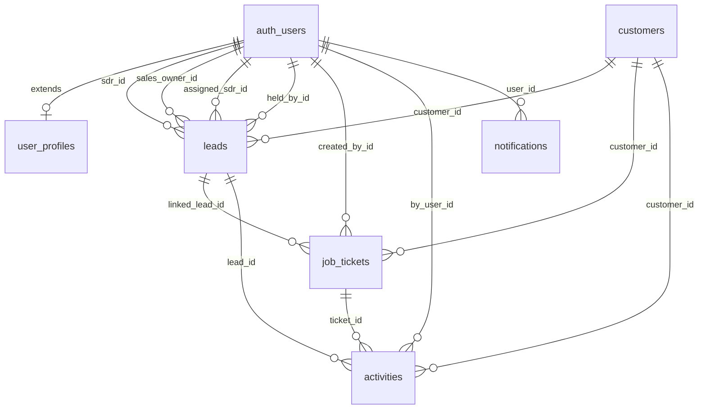

# BazarCRM — Database Schema

Supabase Postgres. All tables are in the `public` schema unless noted. Supabase Auth handles `auth.users`; we extend it with `user_profiles`.

---

## Entity Relationship Diagram



---

## Tables

### `roles`

Admin-manageable roles. Three system roles are seeded and cannot be deleted. Additional custom roles can be created by Admin.

| Column | Type | Notes |
|--------|------|-------|
| `id` | `uuid` PK | |
| `name` | `text` NOT NULL UNIQUE | Slug, e.g. `'sdr'`, `'sales'`, `'admin'`, `'manager'` |
| `display_name` | `text` NOT NULL | Human label, e.g. `'SDR'`, `'Sales Rep'`, `'Administrator'` |
| `is_system` | `boolean` DEFAULT `false` | System roles cannot be deleted or renamed |
| `created_at` | `timestamptz` DEFAULT `now()` | |

```sql
create table public.roles (
  id            uuid        primary key default gen_random_uuid(),
  name          text        not null unique,
  display_name  text        not null,
  is_system     boolean     not null default false,
  created_at    timestamptz not null default now()
);
```

**System roles (seeded in `011_seed_system_roles.sql`):**

| `name` | `display_name` | `is_system` |
|--------|---------------|-------------|
| `sdr` | SDR | true |
| `sales` | Sales Rep | true |
| `admin` | Administrator | true |

---

### `pages`

Registry of all navigable pages in the app. New pages are added here when built. Admin can assign page access to any role via `role_permissions`.

| Column | Type | Notes |
|--------|------|-------|
| `id` | `uuid` PK | |
| `route` | `text` NOT NULL UNIQUE | e.g. `'/leads'`, `'/crm'`, `'/admin/users'` |
| `display_name` | `text` NOT NULL | e.g. `'Leads (SDR)'`, `'CRM'` |
| `icon` | `text` | Lucide icon name, e.g. `'Inbox'`, `'BookUser'` |
| `section` | `text` | Sidebar section label: `'main'` \| `'admin'` \| `'bottom'` |
| `sort_order` | `int` DEFAULT `0` | Display order in sidebar |
| `created_at` | `timestamptz` DEFAULT `now()` | |

```sql
create table public.pages (
  id            uuid        primary key default gen_random_uuid(),
  route         text        not null unique,
  display_name  text        not null,
  icon          text,
  section       text        not null default 'main',
  sort_order    int         not null default 0,
  created_at    timestamptz not null default now()
);
```

**Seeded pages (`012_seed_pages.sql`):**

| `route` | `display_name` | `icon` | `section` | `sort_order` |
|---------|---------------|--------|-----------|-------------|
| `/dashboard` | Dashboard | `LayoutDashboard` | main | 0 |
| `/leads` | Leads | `Inbox` | main | 1 |
| `/sales` | Sales Pipeline | `Briefcase` | main | 2 |
| `/crm` | CRM | `BookUser` | main | 3 |
| `/tickets` | Tickets | `FileText` | main | 4 |
| `/statistics` | Statistics | `BarChart3` | main | 5 |
| `/settings` | Settings | `Settings` | bottom | 0 |
| `/admin/users` | Users | `Users` | admin | 0 |
| `/admin/settings` | System Settings | `SlidersHorizontal` | admin | 1 |
| `/admin/audit` | Audit Log | `ClipboardList` | admin | 2 |

---

### `role_permissions`

Many-to-many junction: which roles can access which pages.

| Column | Type | Notes |
|--------|------|-------|
| `role_id` | `uuid` FK → `roles` ON DELETE CASCADE PK | |
| `page_id` | `uuid` FK → `pages` ON DELETE CASCADE PK | |

```sql
create table public.role_permissions (
  role_id   uuid  not null references public.roles(id) on delete cascade,
  page_id   uuid  not null references public.pages(id) on delete cascade,
  primary key (role_id, page_id)
);
```

**Seeded default permissions (`013_seed_role_permissions.sql`):**

| Role | Allowed pages |
|------|--------------|
| `sdr` | /dashboard, /leads, /crm, /tickets, /statistics, /settings |
| `sales` | /dashboard, /sales, /crm, /tickets, /statistics, /settings |
| `admin` | All pages |

When Admin grants `/sales` access to a custom `'manager'` role, a new row is inserted here.

---

### `user_profiles`

Extends `auth.users` with app-level role reference and display info.

| Column | Type | Notes |
|--------|------|-------|
| `id` | `uuid` PK | References `auth.users(id)` ON DELETE CASCADE |
| `role_id` | `uuid` FK → `roles` NOT NULL | The user's assigned role |
| `full_name` | `text` | Display name |
| `avatar_url` | `text` | Optional profile image |
| `is_active` | `boolean` DEFAULT `true` | Soft-disable without deleting auth user |
| `must_change_password` | `boolean` DEFAULT `false` | Force password change on next login (set when Admin creates user with temp password) |
| `created_at` | `timestamptz` DEFAULT `now()` | |
| `updated_at` | `timestamptz` DEFAULT `now()` | |

```sql
create table public.user_profiles (
  id                    uuid        primary key references auth.users(id) on delete cascade,
  role_id               uuid        not null references public.roles(id),
  full_name             text,
  avatar_url            text,
  is_active             boolean     not null default true,
  must_change_password  boolean     not null default false,
  created_at            timestamptz not null default now(),
  updated_at            timestamptz not null default now()
);
```

**Convenience view** (used throughout the app to avoid constant joins):

```sql
create or replace view public.user_profiles_with_role as
  select
    up.*,
    r.name        as role_name,
    r.display_name as role_display_name,
    r.is_system   as role_is_system
  from public.user_profiles up
  join public.roles r on r.id = up.role_id;
```

---

### `customers`

Customer profiles. A customer is created when a lead is first added and the SDR chooses to save the contact info. **Multiple customer records can share the same phone number or email** — this is intentional. When the same phone appears again, the SDR is shown all matching profiles and picks which one to link.

| Column | Type | Notes |
|--------|------|-------|
| `id` | `uuid` PK | `gen_random_uuid()` |
| `first_name` | `text` | |
| `last_name` | `text` | |
| `email` | `text` | **No unique constraint** — multiple profiles may share an email |
| `phone` | `text` | **Digits only** (e.g. `8585552277`). **No unique constraint** — multiple profiles may share a phone |
| `company` | `text` | |
| `industry` | `text` | |
| `website` | `text` | |
| `heat_tag` | `text` | `'hot'` \| `'warm'` \| `'cold'` \| `null` |
| `created_at` | `timestamptz` DEFAULT `now()` | |
| `updated_at` | `timestamptz` DEFAULT `now()` | |

```sql
create table public.customers (
  id          uuid        primary key default gen_random_uuid(),
  first_name  text,
  last_name   text,
  email       text,
  phone       text,
  company     text,
  industry    text,
  website     text,
  heat_tag    text        check (heat_tag in ('hot', 'warm', 'cold')),
  created_at  timestamptz not null default now(),
  updated_at  timestamptz not null default now()
);
```

**Why no unique constraints on phone/email?**
A phone number can belong to different people at different times (e.g. a business's main line used by multiple contacts), and the same email can appear under different company relationships. The SDR decides which profile to associate — the system never auto-merges.

---

### Customer lookup deduplication rules

When SDR enters a phone number in the Add Lead modal:
1. Look up `SELECT * FROM customers WHERE phone = $1` (exact match, digits-only)
2. If results found → show **"Existing Customer" modal** (see `feature-specs/leads-sdr.md`)
3. If no phone match AND email is filled → `SELECT * FROM customers WHERE email = $1`
4. If still no match → SDR fills form fresh; on submit a new customer is created

---

### `leads`

Core lead record. A lead starts in the inbox (`is_inbox = true`) and moves to the workspace after verify. Multiple leads can share a `contact_id` (same person, multiple inquiries).

| Column | Type | Notes |
|--------|------|-------|
| `id` | `uuid` PK | |
| `customer_id` | `uuid` FK → `customers` | Linked customer profile; set when SDR chooses a customer during lead add or on first action |
| `source` | `text` | e.g. `'Website'`, `'Google'`, `'Walk-in'` |
| `brand` | `text` | |
| `authority` | `text` | Decision-maker indicator |
| `status` | `text` NOT NULL | SDR lifecycle — see Status Enums |
| `sales_status` | `text` | Sales pipeline — see Status Enums |
| `is_inbox` | `boolean` DEFAULT `true` | `true` = AI inbox; `false` = workspace |
| `sdr_id` | `uuid` FK → `auth.users` | SDR who verified/created the lead |
| `assigned_sdr_id` | `uuid` FK → `auth.users` | Inbox assignment (future feature; nullable) |
| `sales_owner_id` | `uuid` FK → `auth.users` | Sales rep who claimed the lead |
| `interests` | `jsonb` DEFAULT `'{}'` | Map of product interest flags (`{ "Labels": true, "Boxes": false }`) |
| `quantities` | `jsonb` DEFAULT `'{}'` | Map of product quantity strings |
| `quote_total` | `numeric` | Last quoted amount |
| `quote_channel` | `text` | `'SMS'` \| `'WhatsApp'` \| `'Email'` \| `'In-person'` |
| `quote_destination` | `text` | **Digits only** for SMS/WhatsApp; email address for Email channel |
| `hold_reason` | `text` | Reason selected when putting on hold |
| `hold_notes` | `text` | Free-text notes |
| `hold_until` | `timestamptz` | Scheduled resume date |
| `held_at` | `timestamptz` | Timestamp when hold was set |
| `held_by_id` | `uuid` FK → `auth.users` | User who set the hold |
| `prev_status` | `text` | Status snapshot — set on **hold** (to restore on resume) and on **reject** (to identify pipeline origin: `"Routed to Sales"` = rejected from sales pipeline) |
| `prev_sales_status` | `text` | Sales status snapshot before hold |
| `rejection_reason` | `text` | Reason selected on reject |
| `urgency` | `text` | `'High'` \| `'Medium'` \| `'Low'` \| `null` — how urgently the client needs the product |
| `is_returning_customer` | `boolean` DEFAULT `false` | Existing / returning client flag |
| `sdr_comment` | `text` | SDR verification notes ("Verify Lead Comment") — internal, not visible to client |
| `rejection_notes` | `text` | Free-text |
| `locked_by_id` | `uuid` FK → `auth.users` | User currently working this lead (drawer open) |
| `locked_at` | `timestamptz` | Timestamp when lock was acquired |
| `created_at` | `timestamptz` NOT NULL DEFAULT `now()` | **Immutable** — never patched |
| `updated_at` | `timestamptz` DEFAULT `now()` | |

```sql
create table public.leads (
  id                uuid        primary key default gen_random_uuid(),
  customer_id       uuid        references public.customers(id),
  source            text,
  brand             text,
  authority         text,
  status            text        not null default 'Pending',
  sales_status      text,
  is_inbox          boolean     not null default true,
  sdr_id            uuid        references auth.users(id),
  assigned_sdr_id   uuid        references auth.users(id),
  sales_owner_id    uuid        references auth.users(id),
  held_by_id        uuid        references auth.users(id),
  interests         jsonb       not null default '{}',
  quantities        jsonb       not null default '{}',
  quote_total       numeric,
  quote_channel     text,
  quote_destination text,
  hold_reason       text,
  hold_notes        text,
  hold_until        timestamptz,
  held_at           timestamptz,
  prev_status       text,
  prev_sales_status text,
  urgency           text        check (urgency in ('High', 'Medium', 'Low')),
  is_returning_customer boolean not null default false,
  sdr_comment       text,
  rejection_reason  text,
  rejection_notes   text,
  locked_by_id      uuid        references auth.users(id),
  locked_at         timestamptz,
  created_at        timestamptz not null default now(),
  updated_at        timestamptz not null default now()
);
```

#### Status Enums (enforced in application layer, not DB constraint for flexibility)

**`status` (SDR lifecycle):**
- `Pending` — in inbox, not yet touched by SDR
- `Validated` — SDR has opened and is actively working it
- `Quoted` — SDR has sent a quote to the client
- `Routed to Sales` — SDR has handed off to the Sales team
- `On Hold` — SDR-initiated hold; can return to `Validated`, go to `Rejected`, or `Routed to Sales`
- `Rejected` — **TERMINAL** for SDR and Sales. Only Admin can change this status.
- `Duplicate` — merged into another contact

**`sales_status` (Sales pipeline):**
- `Ongoing` — Sales rep has claimed the lead and is actively working it
- `Quote Sent` — Sales has sent a formal quote
- `Won` — converted to an order
- `On Hold` — Sales-initiated hold; can only return to `Ongoing` or go to `Rejected`
- `Rejected` — **TERMINAL** for Sales. Only Admin can change this. (Note: a Sales-rejected lead uses `sales_status = 'Rejected'`; the `status` field remains `Routed to Sales`)

**Terminal state rules:**
- Once `status = 'Rejected'` (SDR reject) — no user except Admin can change it
- Once `sales_status = 'Rejected'` (Sales reject) — no user except Admin can change it
- Once `sales_status = 'Won'` — lead is complete; Admin can change if needed
- These rules are enforced in the Route Handlers, not in DB constraints

---

### `job_tickets`

Unified model for both quotes and orders. `ticket_kind` distinguishes them.

| Column | Type | Notes |
|--------|------|-------|
| `id` | `uuid` PK | |
| `ticket_kind` | `text` NOT NULL | `'quote'` \| `'order'` |
| `ticket_status` | `text` NOT NULL DEFAULT `'draft'` | See Ticket Status Enums |
| `customer_id` | `uuid` FK → `customers` | |
| `linked_lead_id` | `uuid` FK → `leads` | |
| `created_by_id` | `uuid` FK → `auth.users` | |
| `contact_email` | `text` | Denormalized for display |
| `contact_name` | `text` | Denormalized |
| `contact_company` | `text` | Denormalized |
| `subtotal` | `numeric` | Pre-discount total |
| `discount_percent` | `numeric` | |
| `discount_amount` | `numeric` | Computed or manual override |
| `total` | `numeric` | Final amount after discount |
| `payment_type` | `text` | `'Cash'` \| `'Check'` \| `'Card'` \| `'Transfer'` |
| `prepay_amount` | `numeric` | Deposit paid upfront |
| `product_lines` | `jsonb` DEFAULT `'[]'` | Array of line items (order) |
| `quote_skus` | `jsonb` DEFAULT `'[]'` | Array of SKU rows (quote) |
| `rush` | `boolean` DEFAULT `false` | Rush order flag |
| `follow_up_at` | `timestamptz` | Scheduled follow-up |
| `follow_up_completed` | `boolean` DEFAULT `false` | |
| `client_confirmed` | `boolean` DEFAULT `false` | Client has approved quote |
| `quote_approval_last_requested_at` | `timestamptz` | Last time approval was requested |
| `notes` | `text` | Internal notes |
| `created_at` | `timestamptz` DEFAULT `now()` | |
| `updated_at` | `timestamptz` DEFAULT `now()` | |

```sql
create table public.job_tickets (
  id                                 uuid        primary key default gen_random_uuid(),
  ticket_kind                        text        not null check (ticket_kind in ('quote', 'order')),
  ticket_status                      text        not null default 'draft',
  customer_id                        uuid        references public.customers(id),
  linked_lead_id                     uuid        references public.leads(id),
  created_by_id                      uuid        references auth.users(id),
  contact_email                      text,
  contact_name                       text,
  contact_company                    text,
  subtotal                           numeric,
  discount_percent                   numeric,
  discount_amount                    numeric,
  total                              numeric,
  payment_type                       text,
  prepay_amount                      numeric,
  product_lines                      jsonb       not null default '[]',
  quote_skus                         jsonb       not null default '[]',
  rush                               boolean     not null default false,
  follow_up_at                       timestamptz,
  follow_up_completed                boolean     not null default false,
  client_confirmed                   boolean     not null default false,
  quote_approval_last_requested_at   timestamptz,
  notes                              text,
  created_at                         timestamptz not null default now(),
  updated_at                         timestamptz not null default now()
);
```

#### Ticket Status Enums

**`ticket_status`:**
- `draft` — in progress
- `sent` — quote sent to client
- `approved` — client confirmed
- `rejected` — client declined
- `in_production` — order in production
- `completed` — fulfilled
- `cancelled` — cancelled

---

### `activities`

Append-only event log. Never updated, only inserted. Powers the `HistoryTimeline` component.

| Column | Type | Notes |
|--------|------|-------|
| `id` | `uuid` PK | |
| `customer_id` | `uuid` FK → `customers` | |
| `lead_id` | `uuid` FK → `leads` | |
| `ticket_id` | `uuid` FK → `job_tickets` | |
| `type` | `text` NOT NULL | See Activity Type Enums |
| `channel` | `text` | `'SMS'` \| `'WhatsApp'` \| `'Email'` \| `'Call'` \| `'In-person'` |
| `by_user_id` | `uuid` FK → `auth.users` | User who triggered the event |
| `payload` | `jsonb` DEFAULT `'{}'` | Event-specific data |
| `created_at` | `timestamptz` DEFAULT `now()` | |

```sql
create table public.activities (
  id          uuid        primary key default gen_random_uuid(),
  customer_id uuid        references public.customers(id),
  lead_id     uuid        references public.leads(id),
  ticket_id   uuid        references public.job_tickets(id),
  type        text        not null,
  channel     text,
  by_user_id  uuid        references auth.users(id),
  payload     jsonb       not null default '{}',
  created_at  timestamptz not null default now()
);
```

#### Activity Type Enums

| Type | Trigger | Key payload fields |
|------|---------|-------------------|
| `lead_verified` | SDR verifies inbox lead | — |
| `lead_manual_created` | SDR manually creates a lead | — |
| `lead_edited` | Tracked field changes without a status change | `{ fields: string[] }` |
| `lead_status_changed` | Any `status` or `sales_status` transition | `{ from, to }` |
| `lead_routed_to_sales` | SDR routes to Sales | — |
| `lead_rejected` | Lead rejected by SDR or Sales. `prev_status` on the lead row identifies origin (`"Routed to Sales"` = rejected from sales pipeline). | `{ from, reason, notes }` |
| `lead_held` | Lead placed on hold | `{ reason, notes, role }` |
| `lead_resumed` | Lead resumed from hold | — |
| `lead_merged` | Customer merge applied | — |
| `lead_sales_claimed` | Sales rep claims an unclaimed routed lead | — |
| `contact_edited` | Customer profile fields updated | — |
| `call_logged` | SDR/Sales manually logs a call | `{ channel, notes }` |
| `email_opened` | Email open tracked | — |
| `outreach_sent` | Email or SMS sent from app | `{ channel, recipient }` |
| `quote_sent` | Quote delivered to client | — |
| `quote_approval_requested` | Approval follow-up sent | — |
| `quote_follow_up_completed` | Follow-up marked done | — |
| `quote_follow_up_reset` | Follow-up reset | — |
| `order_ticket_created` | New order ticket created | — |
| `order_ticket_updated` | Order ticket patched | `{ fields: string[] }` |
| `ticket_client_confirmed` | Client confirmed quote → order | — |

---

### `notifications`

Per-user notification feed. Read via Supabase Realtime on the client.

| Column | Type | Notes |
|--------|------|-------|
| `id` | `uuid` PK | |
| `user_id` | `uuid` FK → `auth.users` ON DELETE CASCADE | |
| `type` | `text` NOT NULL | See Notification Type Enums |
| `title` | `text` NOT NULL | Short heading |
| `body` | `text` | Detail text |
| `read` | `boolean` DEFAULT `false` | |
| `payload` | `jsonb` DEFAULT `'{}'` | Extra data (e.g. lead id for navigation) |
| `created_at` | `timestamptz` DEFAULT `now()` | |

```sql
create table public.notifications (
  id          uuid        primary key default gen_random_uuid(),
  user_id     uuid        not null references auth.users(id) on delete cascade,
  type        text        not null,
  title       text        not null,
  body        text,
  read        boolean     not null default false,
  payload     jsonb       not null default '{}',
  created_at  timestamptz not null default now()
);
```

#### Notification Type Enums

| Type | When |
|------|------|
| `lead_assigned` | Admin assigns inbox lead to an SDR (future) |
| `lead_routed` | SDR routes lead to Sales — Sales rep notified |
| `follow_up_due` | A ticket `follow_up_at` has passed |
| `quote_approval_requested` | Client follow-up requested on a quote |
| `lead_held_reminder` | `hold_until` date reached |
| `system` | General system message |

---

### `lookup_values`

Admin-manageable preset options for all dropdowns in the lead forms. Seeded from POC data; Admin can add, rename, reorder, or deactivate any value from Settings → Dropdown Options.

| Column | Type | Notes |
|--------|------|-------|
| `id` | `uuid` PK | |
| `category` | `text` NOT NULL | See Category Enums below |
| `value` | `text` NOT NULL | Machine key used in DB and API |
| `label` | `text` NOT NULL | Human-readable label shown in UI |
| `sort_order` | `int` DEFAULT `0` | Controls order in dropdown |
| `is_active` | `boolean` DEFAULT `true` | Inactive values hidden from new leads; historical data unaffected |
| `created_at` | `timestamptz` DEFAULT `now()` | |
| UNIQUE | `(category, value)` | Prevents duplicate keys per category |

```sql
create table public.lookup_values (
  id          uuid        primary key default gen_random_uuid(),
  category    text        not null,
  value       text        not null,
  label       text        not null,
  sort_order  int         not null default 0,
  is_active   boolean     not null default true,
  created_at  timestamptz not null default now(),
  unique (category, value)
);
```

#### Category Enums

| Category key | Used in | Options (seeded from POC) |
|---|---|---|
| `source` | Add Lead, Verify Drawer, Sales Drawer | Website Form, Email, Phone Call, Walk-in, Referral, Facebook, Instagram, Google, Yelp, LinkedIn, Trade Show, Direct Mail, Manual, Manual (CRM), Manual (Sales Sourced) |
| `industry` | Add Lead, Verify Drawer, Sales Drawer, CRM | Cosmetics & Beauty, Food & Beverage, Healthcare & Medical, Cannabis & CBD, Retail & Apparel, E-Commerce, Hospitality & Events, Agencies & Marketing, Education, Real Estate, Manufacturing & Industrial, Tech & Electronics, Non-Profit, Other |
| `urgency` | Add Lead, Verify Drawer, Sales Drawer | High, Medium, Low |
| `hold_reason` | Hold sub-form (SDR + Sales) | Awaiting customer response, Awaiting artwork / files, Awaiting payment confirmation, Pricing review needed, Vacation / customer unavailable, Other |
| `reject_reason` | Reject sub-form (SDR) | Wrong Number / Fake, Spam / Bot, Budget Too Low, Existing Customer, Timing Not Right, Not a Fit / Other |
| `route_reason` | Route to Sales sub-form (SDR) | Unusually Large Volume, Complex Custom Dimensions, High-Value VIP Client, Requires Technical Support, Out of Box request, Other |
| `sales_drop_reason` | Drop deal sub-form (Sales) | Price, Ghosted, Competitor, Timeline, Other |

#### RLS

- **Read**: all authenticated users (needed to populate dropdowns)
- **Insert / Update / Delete**: Admin only

---

## Indexes

```sql
-- leads
create index leads_customer_id_idx     on public.leads(customer_id);
create index leads_status_idx          on public.leads(status);
create index leads_sales_status_idx    on public.leads(sales_status);
create index leads_is_inbox_idx        on public.leads(is_inbox);
create index leads_sdr_id_idx          on public.leads(sdr_id);
create index leads_assigned_sdr_id_idx on public.leads(assigned_sdr_id);
create index leads_sales_owner_id_idx  on public.leads(sales_owner_id);
create index leads_locked_by_id_idx    on public.leads(locked_by_id);
create index leads_created_at_idx      on public.leads(created_at desc);

-- customers
create index customers_phone_idx   on public.customers(phone);
create index customers_email_idx   on public.customers(email);
create index customers_company_idx on public.customers(company);

-- job_tickets
create index tickets_contact_id_idx    on public.job_tickets(contact_id);
create index tickets_lead_id_idx       on public.job_tickets(linked_lead_id);
create index tickets_kind_idx          on public.job_tickets(ticket_kind);
create index tickets_status_idx        on public.job_tickets(ticket_status);
create index tickets_created_at_idx    on public.job_tickets(created_at desc);

-- activities
create index activities_contact_id_idx on public.activities(contact_id);
create index activities_lead_id_idx    on public.activities(lead_id);
create index activities_ticket_id_idx  on public.activities(ticket_id);
create index activities_created_at_idx on public.activities(created_at desc);

-- notifications
create index notifications_user_id_idx on public.notifications(user_id);
create index notifications_read_idx    on public.notifications(user_id, read);
```

---

## Row Level Security (RLS)

Enable RLS on every table. All policies use `auth.uid()` and join to `user_profiles` for role checks.

```sql
-- Helper: get current user's role name (e.g. 'sdr', 'sales', 'admin')
create or replace function public.current_user_role()
returns text
language sql stable
as $$
  select r.name
  from public.user_profiles up
  join public.roles r on r.id = up.role_id
  where up.id = auth.uid()
$$;

-- Helper: check if current user has access to a given route
create or replace function public.user_can_access_route(route text)
returns boolean
language sql stable
as $$
  select exists (
    select 1
    from public.user_profiles up
    join public.role_permissions rp on rp.role_id = up.role_id
    join public.pages p on p.id = rp.page_id
    where up.id = auth.uid()
      and p.route = route
  )
$$;
```

### `user_profiles` policies

```sql
alter table public.user_profiles enable row level security;

-- Users can read their own profile
create policy "users_read_own_profile" on public.user_profiles
  for select using (id = auth.uid());

-- Admins can read all profiles
create policy "admin_read_all_profiles" on public.user_profiles
  for select using (public.current_user_role() = 'admin');

-- Admins can update any profile
create policy "admin_update_profiles" on public.user_profiles
  for update using (public.current_user_role() = 'admin');

-- Users can update their own profile (name, avatar only — not role)
create policy "users_update_own_profile" on public.user_profiles
  for update using (id = auth.uid());
```

### `customers` policies

```sql
alter table public.customers enable row level security;

-- All authenticated users can read customers (needed for lookup during lead creation)
create policy "authenticated_read_customers" on public.customers
  for select using (auth.uid() is not null);

-- SDR and Admin can insert/update customers
create policy "sdr_admin_write_customers" on public.customers
  for all using (public.current_user_role() in ('sdr', 'admin'));
```

### `leads` policies

```sql
alter table public.leads enable row level security;

-- SDR: sees all leads
create policy "sdr_read_all_leads" on public.leads
  for select using (public.current_user_role() = 'sdr');

-- Sales: sees leads routed to sales or where they are the owner
create policy "sales_read_routed_leads" on public.leads
  for select using (
    public.current_user_role() = 'sales'
    and (status = 'Routed to Sales' or sales_owner_id = auth.uid())
  );

-- Admin: sees all leads
create policy "admin_read_all_leads" on public.leads
  for select using (public.current_user_role() = 'admin');

-- SDR and Admin can insert leads
create policy "sdr_admin_insert_leads" on public.leads
  for insert with check (public.current_user_role() in ('sdr', 'admin'));

-- SDR, Sales, Admin can update leads they have access to
create policy "authenticated_update_leads" on public.leads
  for update using (auth.uid() is not null);
```

### `job_tickets` policies

```sql
alter table public.job_tickets enable row level security;

-- All authenticated users can read tickets
create policy "authenticated_read_tickets" on public.job_tickets
  for select using (auth.uid() is not null);

-- All authenticated users can insert tickets
create policy "authenticated_insert_tickets" on public.job_tickets
  for insert with check (auth.uid() is not null);

-- Owner or admin can update tickets
create policy "owner_admin_update_tickets" on public.job_tickets
  for update using (
    created_by_id = auth.uid()
    or public.current_user_role() = 'admin'
  );
```

### `activities` policies

```sql
alter table public.activities enable row level security;

-- All authenticated users can read activities
create policy "authenticated_read_activities" on public.activities
  for select using (auth.uid() is not null);

-- All authenticated users can insert activities
create policy "authenticated_insert_activities" on public.activities
  for insert with check (auth.uid() is not null);
```

### `notifications` policies

```sql
alter table public.notifications enable row level security;

-- Users can only see their own notifications
create policy "users_read_own_notifications" on public.notifications
  for select using (user_id = auth.uid());

-- Users can mark their own notifications read
create policy "users_update_own_notifications" on public.notifications
  for update using (user_id = auth.uid());

-- Server (service role) inserts notifications
```

---

## Automatic `updated_at` Trigger

```sql
create or replace function public.set_updated_at()
returns trigger language plpgsql as $$
begin
  new.updated_at = now();
  return new;
end;
$$;

create trigger set_customers_updated_at
  before update on public.customers
  for each row execute function public.set_updated_at();

create trigger set_leads_updated_at
  before update on public.leads
  for each row execute function public.set_updated_at();

create trigger set_tickets_updated_at
  before update on public.job_tickets
  for each row execute function public.set_updated_at();

create trigger set_user_profiles_updated_at
  before update on public.user_profiles
  for each row execute function public.set_updated_at();
```

---

## Migration File Order

When creating Supabase migrations under `supabase/migrations/`:

```
001_create_roles.sql
002_create_pages.sql
003_create_role_permissions.sql
004_create_user_profiles.sql
005_create_customers.sql
006_create_leads.sql
007_create_job_tickets.sql
008_create_activities.sql
009_create_notifications.sql
010_create_lookup_values.sql
011_create_indexes.sql
012_enable_rls.sql
013_rls_policies.sql
014_triggers.sql
015_views.sql                        ← user_profiles_with_role view
016_functions.sql                    ← current_user_role(), user_can_access_route()
017_seed_system_roles.sql            ← sdr, sales, admin roles
018_seed_pages.sql                   ← all app pages
019_seed_role_permissions.sql        ← default permissions per system role
020_seed_lookup_values.sql           ← all dropdown options from POC
021_seed_dev.sql                     ← dev only (test users, sample leads)
```
